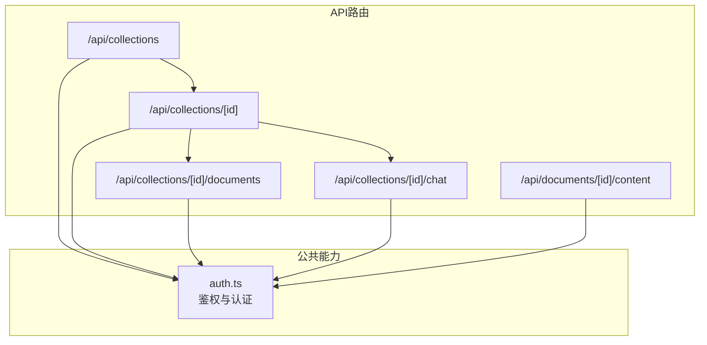
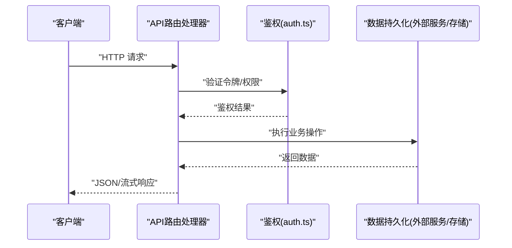
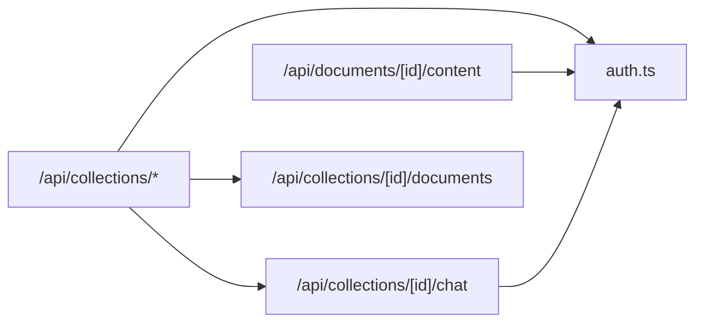

# API参考文档

<cite>
**本文引用的文件**   
- [app/api/collections/route.ts](file://app/api/collections/route.ts)
- [app/api/collections/[id]/route.ts](file://app/api/collections/[id]/route.ts)
- [app/api/collections/[id]/documents/route.ts](file://app/api/collections/[id]/documents/route.ts)
- [app/api/collections/[id]/chat/route.ts](file://app/api/collections/[id]/chat/route.ts)
- [app/api/documents/[id]/content/route.ts](file://app/api/documents/[id]/content/route.ts)
- [app/lib/auth.ts](file://app/lib/auth.ts)
- [README.md](file://README.md)
</cite>

## 目录
1. [简介](#简介)
2. [项目结构](#项目结构)
3. [核心组件](#核心组件)
4. [架构总览](#架构总览)
5. [详细接口分析](#详细接口分析)
6. [依赖关系分析](#依赖关系分析)
7. [性能考虑](#性能考虑)
8. [故障排查指南](#故障排查指南)
9. [结论](#结论)
10. [附录](#附录)

## 简介
本参考文档面向RAG_Front的RESTful API，覆盖集合管理（collections）、文档管理（documents）与对话管理（chat）三大模块。文档提供每个端点的HTTP方法、URL模式、请求头与认证方式、请求/响应示例、错误码与异常处理策略，并给出调用示例与最佳实践建议，帮助开发者快速集成与排错。

## 项目结构
RAG_Front采用Next.js App Router组织API路由，按功能域划分：
- app/api/collections：集合相关接口，含子资源documents与chat
- app/api/documents：文档内容获取接口
- app/lib/auth：鉴权与认证逻辑

图表来源
- [app/api/collections/route.ts](file://app/api/collections/route.ts)
- [app/api/collections/[id]/route.ts](file://app/api/collections/[id]/route.ts)
- [app/api/collections/[id]/documents/route.ts](file://app/api/collections/[id]/documents/route.ts)
- [app/api/collections/[id]/chat/route.ts](file://app/api/collections/[id]/chat/route.ts)
- [app/api/documents/[id]/content/route.ts](file://app/api/documents/[id]/content/route.ts)
- [app/lib/auth.ts](file://app/lib/auth.ts)

章节来源
- [README.md](file://README.md)

## 核心组件
- 集合管理（Collections）
  - 列表与创建：GET/POST /api/collections
  - 单集合操作：GET/PUT/DELETE /api/collections/[id]
- 文档管理（Documents）
  - 集合内文档：POST /api/collections/[id]/documents（上传/新增）
  - 文档内容：GET /api/documents/[id]/content（下载/预览）
- 对话管理（Chat）
  - 会话消息：POST /api/collections/[id]/chat（发送消息）
  - 历史记录：GET /api/collections/[id]/chat（查询历史）

章节来源
- [app/api/collections/route.ts](file://app/api/collections/route.ts)
- [app/api/collections/[id]/route.ts](file://app/api/collections/[id]/route.ts)
- [app/api/collections/[id]/documents/route.ts](file://app/api/collections/[id]/documents/route.ts)
- [app/api/collections/[id]/chat/route.ts](file://app/api/collections/[id]/chat/route.ts)
- [app/api/documents/[id]/content/route.ts](file://app/api/documents/[id]/content/route.ts)

## 架构总览
API层基于Next.js Route Handlers实现，统一通过鉴权中间件进行身份校验；业务逻辑根据路由分派到对应处理器，返回JSON或流式响应（如文档内容）。

图表来源
- [app/lib/auth.ts](file://app/lib/auth.ts)
- [app/api/collections/route.ts](file://app/api/collections/route.ts)
- [app/api/collections/[id]/route.ts](file://app/api/collections/[id]/route.ts)
- [app/api/collections/[id]/documents/route.ts](file://app/api/collections/[id]/documents/route.ts)
- [app/api/collections/[id]/chat/route.ts](file://app/api/collections/[id]/chat/route.ts)
- [app/api/documents/[id]/content/route.ts](file://app/api/documents/[id]/content/route.ts)

## 详细接口分析

### 集合管理（Collections）
- GET /api/collections
  - 功能：列出当前用户可见的集合列表
  - 请求头：Authorization: Bearer <token>
  - 响应体：集合数组，包含id、name、描述、创建时间等字段
  - 状态码：200成功；401未授权；500服务器错误

- POST /api/collections
  - 功能：创建新集合
  - 请求头：Authorization: Bearer <token>, Content-Type: application/json
  - 请求体：{ name, description }
  - 响应体：新建集合对象
  - 状态码：201创建成功；400参数错误；401未授权；409重复名称；500服务器错误

- GET /api/collections/[id]
  - 功能：获取指定集合详情
  - 请求头：Authorization: Bearer <token>
  - 路径参数：id（字符串）
  - 响应体：集合对象
  - 状态码：200成功；404不存在；401未授权；500服务器错误

- PUT /api/collections/[id]
  - 功能：更新集合信息
  - 请求头：Authorization: Bearer <token>, Content-Type: application/json
  - 路径参数：id（字符串）
  - 请求体：{ name?, description? }
  - 响应体：更新后的集合对象
  - 状态码：200成功；400参数错误；401未授权；404不存在；500服务器错误

- DELETE /api/collections/[id]
  - 功能：删除集合
  - 请求头：Authorization: Bearer <token>
  - 路径参数：id（字符串）
  - 响应体：空或确认信息
  - 状态码：204无内容；401未授权；404不存在；500服务器错误

章节来源
- [app/api/collections/route.ts](file://app/api/collections/route.ts)
- [app/api/collections/[id]/route.ts](file://app/api/collections/[id]/route.ts)

### 文档管理（Documents）
- POST /api/collections/[id]/documents
  - 功能：向指定集合上传/新增文档
  - 请求头：Authorization: Bearer <token>, Content-Type: multipart/form-data
  - 路径参数：id（集合ID）
  - 表单字段：file（二进制文件），title（可选标题），metadata（可选元数据）
  - 响应体：文档对象（包含id、title、size、version、createdAt等）
  - 状态码：201创建成功；400参数错误；401未授权；404集合不存在；500服务器错误

- GET /api/documents/[id]/content
  - 功能：获取文档内容（支持流式下载）
  - 请求头：Authorization: Bearer <token>
  - 路径参数：id（文档ID）
  - 响应体：二进制内容或文本内容（Content-Type由后端决定）
  - 状态码：200成功；401未授权；404不存在；500服务器错误

版本控制说明
- 每次上传同名文档将生成新版本号，服务端维护版本链
- 可通过查询参数选择特定版本（若实现）

章节来源
- [app/api/collections/[id]/documents/route.ts](file://app/api/collections/[id]/documents/route.ts)
- [app/api/documents/[id]/content/route.ts](file://app/api/documents/[id]/content/route.ts)

### 对话管理（Chat）
- POST /api/collections/[id]/chat
  - 功能：向集合关联的对话上下文发送消息，触发检索增强生成流程
  - 请求头：Authorization: Bearer <token>, Content-Type: application/json
  - 路径参数：id（集合ID）
  - 请求体：{ message, history? }
    - message：当前用户消息
    - history：历史消息数组（可选，用于上下文延续）
  - 响应体：{ answer, sources?, conversationId? }
    - answer：模型回答
    - sources：引用来源列表（可选）
    - conversationId：会话标识（可选）
  - 状态码：200成功；400参数错误；401未授权；404集合不存在；500服务器错误

- GET /api/collections/[id]/chat
  - 功能：查询集合相关的对话历史
  - 请求头：Authorization: Bearer <token>
  - 路径参数：id（集合ID）
  - 查询参数：limit（可选，默认值由后端定义）
  - 响应体：{ messages: [{ role, content, timestamp }] }
  - 状态码：200成功；401未授权；404集合不存在；500服务器错误

章节来源
- [app/api/collections/[id]/chat/route.ts](file://app/api/collections/[id]/chat/route.ts)

### 认证与鉴权（Auth）
- 所有受保护端点均需携带Authorization: Bearer <token>
- token格式与签发/校验逻辑见鉴权模块
- 未携带或无效token将返回401

章节来源
- [app/lib/auth.ts](file://app/lib/auth.ts)

## 依赖关系分析
- API路由依赖鉴权模块进行访问控制
- 文档与对话接口依赖集合存在性校验
- 文档内容接口可能依赖存储服务或文件系统

图表来源
- [app/api/collections/route.ts](file://app/api/collections/route.ts)
- [app/api/collections/[id]/route.ts](file://app/api/collections/[id]/route.ts)
- [app/api/collections/[id]/documents/route.ts](file://app/api/collections/[id]/documents/route.ts)
- [app/api/collections/[id]/chat/route.ts](file://app/api/collections/[id]/chat/route.ts)
- [app/api/documents/[id]/content/route.ts](file://app/api/documents/[id]/content/route.ts)
- [app/lib/auth.ts](file://app/lib/auth.ts)

## 性能考虑
- 大文件上传建议使用分片上传与断点续传（前端实现）
- 文档内容下载启用流式传输，避免内存峰值
- 对话历史分页加载，限制单次返回条数
- 缓存热点集合与常用问答对，降低后端压力

## 故障排查指南
- 401未授权：检查Authorization头是否包含有效Bearer token
- 400参数错误：核对请求体字段类型与必填项
- 404不存在：确认集合/文档ID是否正确且已存在
- 500服务器错误：查看服务端日志定位具体异常
- 网络超时：优化请求大小与网络环境，必要时重试机制

## 结论
本参考文档系统化梳理了RAG_Front的集合、文档与对话三大API模块，涵盖端点定义、认证方式、请求/响应结构与错误处理策略。遵循本文档的规范与最佳实践，可显著提升集成效率与系统稳定性。

## 附录

### 通用错误码与含义
- 200：成功
- 201：创建成功
- 204：删除成功（无内容）
- 400：请求参数错误
- 401：未授权或缺少认证信息
- 404：资源不存在
- 409：资源冲突（如重复名称）
- 500：服务器内部错误

### 请求/响应示例（JSON）
- 创建集合
  - 请求体：{ "name": "知识库A", "description": "技术文档集合" }
  - 响应体：{ "id": "c1", "name": "知识库A", "description": "技术文档集合", "createdAt": "2024-01-01T00:00:00Z" }
- 上传文档
  - 请求体：multipart/form-data，字段：file、title、metadata
  - 响应体：{ "id": "d1", "title": "手册.pdf", "size": 102400, "version": 1, "createdAt": "2024-01-01T00:00:00Z" }
- 发送对话消息
  - 请求体：{ "message": "如何配置环境变量？", "history": [] }
  - 响应体：{ "answer": "请参考...","sources": ["doc1"], "conversationId": "conv1" }
- 查询对话历史
  - 响应体：{ "messages": [{"role":"user","content":"你好","timestamp":"2024-01-01T00:00:00Z"}] }

### 最佳实践建议
- 始终在请求头中携带有效的Authorization: Bearer token
- 对敏感字段进行最小化暴露，按需返回
- 使用幂等键处理重复提交（如上传与创建）
- 合理设置超时与重试策略，提升用户体验
- 对大文件与长对话进行分页与流式处理