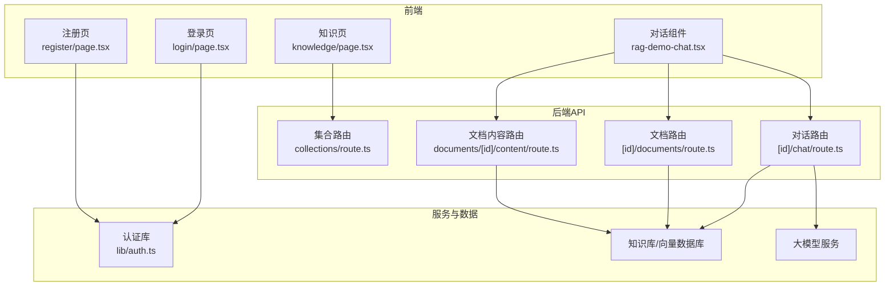
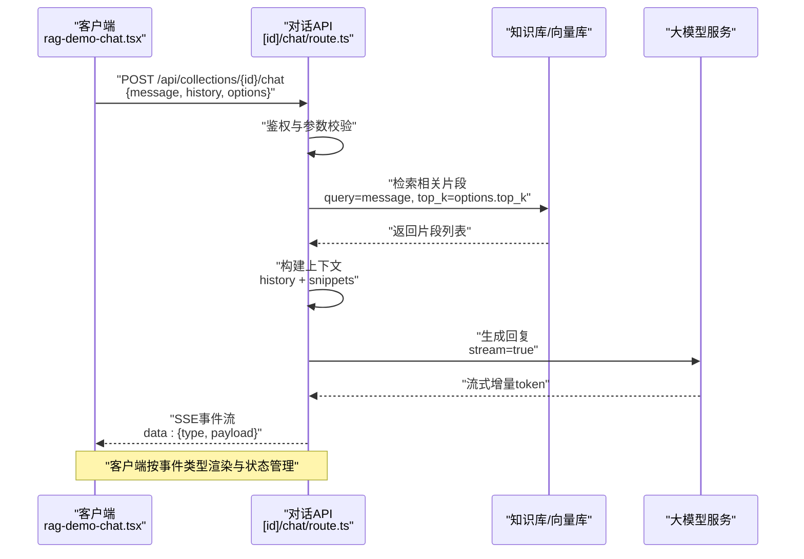
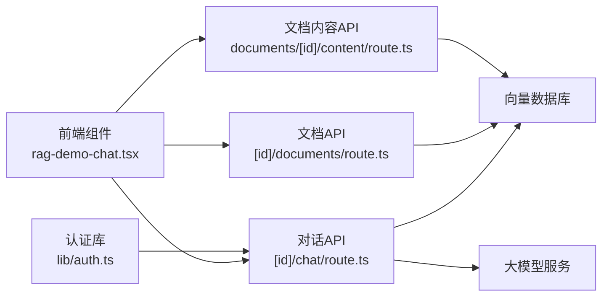

# 对话管理API

<cite>
**本文引用的文件**   
- [app/api/collections/[id]/chat/route.ts](file://app/api/collections/%5Bid%5D/chat/route.ts)
- [app/api/collections/[id]/documents/route.ts](file://app/api/collections/%5Bid%5D/documents/route.ts)
- [app/api/collections/route.ts](file://app/api/collections/route.ts)
- [app/api/documents/[id]/content/route.ts](file://app/api/documents/%5Bid%5D/content/route.ts)
- [app/components/rag-demo-chat.tsx](file://app/components/rag-demo-chat.tsx)
- [app/knowledge/page.tsx](file://app/knowledge/page.tsx)
- [app/login/page.tsx](file://app/login/page.tsx)
- [app/register/page.tsx](file://app/register/page.tsx)
- [app/lib/auth.ts](file://app/lib/auth.ts)
- [package.json](file://package.json)
</cite>

## 目录
1. [简介](#简介)
2. [项目结构](#项目结构)
3. [核心组件](#核心组件)
4. [架构总览](#架构总览)
5. [详细组件分析](#详细组件分析)
6. [依赖分析](#依赖分析)
7. [性能考虑](#性能考虑)
8. [故障排查指南](#故障排查指南)
9. [结论](#结论)
10. [附录](#附录)

## 简介
本参考文档面向RAG_Front项目的“对话管理API”，聚焦于对话会话的创建、消息发送、历史记录查询与上下文管理，并详细说明RAG（检索增强生成）集成的对话流程：知识库检索、上下文构建与智能回复生成。文档涵盖流式响应处理、实时通信协议、错误恢复策略，提供完整的API端点规范（请求参数、响应格式、事件类型），以及最佳实践、性能优化建议、调试方法与常见问题解决方案。

## 项目结构
RAG_Front采用Next.js应用结构，对话相关能力主要分布在以下位置：
- API路由层：用于暴露REST接口与流式输出
- 前端组件：封装对话交互、消息渲染与流式接收
- 认证模块：用户登录注册与会话鉴权
- 知识页面：展示知识库与对话入口

图表来源
- [app/components/rag-demo-chat.tsx](file://app/components/rag-demo-chat.tsx)
- [app/knowledge/page.tsx](file://app/knowledge/page.tsx)
- [app/api/collections/route.ts](file://app/api/collections/route.ts)
- [app/api/collections/[id]/chat/route.ts](file://app/api/collections/%5Bid%5D/chat/route.ts)
- [app/api/collections/[id]/documents/route.ts](file://app/api/collections/%5Bid%5D/documents/route.ts)
- [app/api/documents/[id]/content/route.ts](file://app/api/documents/%5Bid%5D/content/route.ts)
- [app/lib/auth.ts](file://app/lib/auth.ts)

章节来源
- [package.json](file://package.json)

## 核心组件
- 对话组件（rag-demo-chat.tsx）：负责用户输入、消息列表渲染、调用对话API、处理流式增量更新、错误提示与重试。
- 对话API路由（[id]/chat/route.ts）：接收消息、构造检索查询、拉取知识库片段、组装上下文、调用大模型并返回流式响应。
- 文档与集合API（[id]/documents/route.ts、collections/route.ts、documents/[id]/content/route.ts）：提供知识库文档的增删改查与内容获取，支撑RAG检索。
- 认证模块（lib/auth.ts）：提供登录注册与会话校验，确保对话操作具备权限控制。

章节来源
- [app/components/rag-demo-chat.tsx](file://app/components/rag-demo-chat.tsx)
- [app/api/collections/[id]/chat/route.ts](file://app/api/collections/%5Bid%5D/chat/route.ts)
- [app/api/collections/[id]/documents/route.ts](file://app/api/collections/%5Bid%5D/documents/route.ts)
- [app/api/collections/route.ts](file://app/api/collections/route.ts)
- [app/api/documents/[id]/content/route.ts](file://app/api/documents/%5Bid%5D/content/route.ts)
- [app/lib/auth.ts](file://app/lib/auth.ts)

## 架构总览
对话管理的整体流程如下：
- 客户端通过对话组件发起消息请求
- 服务端对话路由进行鉴权与参数校验
- 根据问题检索知识库片段（向量相似度或关键词匹配）
- 将检索结果与历史消息组装为上下文
- 调用大模型生成回复，并以流式方式推送增量文本
- 客户端按事件类型渲染增量内容，处理完成与错误状态

图表来源
- [app/components/rag-demo-chat.tsx](file://app/components/rag-demo-chat.tsx)
- [app/api/collections/[id]/chat/route.ts](file://app/api/collections/%5Bid%5D/chat/route.ts)

## 详细组件分析

### 对话API端点规范
- 端点：POST /api/collections/{id}/chat
- 功能：在指定集合（知识库）下创建或续写对话，支持流式回复
- 请求体字段
  - message: string，用户当前输入
  - history: array，历史消息数组，元素包含角色与内容
  - options: object，可选配置
    - top_k: number，检索片段数量
    - temperature: number，生成随机性
    - max_tokens: number，最大生成长度
    - stream: boolean，是否启用流式响应
- 响应
  - 非流式：返回完整回复对象
  - 流式：SSE事件流，事件类型包括：
    - start：开始生成
    - token：增量文本片段
    - context：上下文片段（可选）
    - done：生成结束
    - error：错误信息
- 状态码
  - 200：成功
  - 400：参数错误
  - 401：未授权
  - 500：服务器内部错误

章节来源
- [app/api/collections/[id]/chat/route.ts](file://app/api/collections/%5Bid%5D/chat/route.ts)

### 文档与集合API端点规范
- 集合路由：GET/POST /api/collections
  - GET：列出集合
  - POST：创建集合
- 文档路由：GET/POST /api/collections/{id}/documents
  - GET：列出集合下的文档
  - POST：上传或索引新文档
- 文档内容路由：GET /api/documents/{id}/content
  - 获取文档原始内容或摘要

章节来源
- [app/api/collections/route.ts](file://app/api/collections/route.ts)
- [app/api/collections/[id]/documents/route.ts](file://app/api/collections/%5Bid%5D/documents/route.ts)
- [app/api/documents/[id]/content/route.ts](file://app/api/documents/%5Bid%5D/content/route.ts)

### 前端对话组件
- 职责
  - 维护消息列表与会话状态
  - 调用对话API并处理流式事件
  - 渲染增量内容与错误提示
  - 支持重试与取消
- 关键行为
  - 使用Fetch或EventSource建立SSE连接
  - 解析事件类型并更新UI
  - 本地缓存历史消息，避免重复传输

章节来源
- [app/components/rag-demo-chat.tsx](file://app/components/rag-demo-chat.tsx)

### 认证与会话管理
- 登录/注册：提供用户身份验证与会话令牌
- 鉴权：对话API需校验令牌有效性，防止未授权访问
- 会话状态：前端维护登录态，后端校验请求头中的认证信息

章节来源
- [app/login/page.tsx](file://app/login/page.tsx)
- [app/register/page.tsx](file://app/register/page.tsx)
- [app/lib/auth.ts](file://app/lib/auth.ts)

## 依赖分析
- 前端依赖Next.js与React生态，使用组件化开发
- 后端API基于Next.js Route Handlers，直接暴露HTTP接口
- 外部依赖包括向量数据库与大模型服务，用于RAG检索与生成
- 认证模块提供统一的鉴权逻辑

图表来源
- [app/components/rag-demo-chat.tsx](file://app/components/rag-demo-chat.tsx)
- [app/api/collections/[id]/chat/route.ts](file://app/api/collections/%5Bid%5D/chat/route.ts)
- [app/api/collections/[id]/documents/route.ts](file://app/api/collections/%5Bid%5D/documents/route.ts)
- [app/api/documents/[id]/content/route.ts](file://app/api/documents/%5Bid%5D/content/route.ts)
- [app/lib/auth.ts](file://app/lib/auth.ts)

章节来源
- [package.json](file://package.json)

## 性能考虑
- 流式响应：优先使用SSE减少首字节延迟，提升用户体验
- 检索优化：合理设置top_k与阈值，平衡召回率与延迟
- 上下文裁剪：限制历史消息长度与片段数量，降低Token消耗
- 缓存策略：对热点查询结果进行短期缓存，减少重复计算
- 并发控制：限制同时进行的对话请求数，避免资源争用

## 故障排查指南
- 常见错误
  - 401未授权：检查令牌是否有效且已正确传递
  - 400参数错误：确认请求体字段类型与必填项
  - 500服务器错误：查看日志定位向量库或大模型调用失败原因
- 调试方法
  - 使用浏览器开发者工具观察SSE事件流
  - 在后端打印检索结果与上下文构建过程
  - 逐步关闭流式选项以定位问题范围
- 恢复策略
  - 自动重试机制：指数退避与上限次数
  - 降级模式：当大模型不可用时返回缓存答案或友好提示

## 结论
RAG_Front的对话管理API通过清晰的端点设计与流式响应机制，实现了高效的检索增强生成对话体验。结合完善的认证与错误处理，系统具备良好的可扩展性与稳定性。遵循本文的最佳实践与优化建议，可进一步提升性能与可靠性。

## 附录
- 集成示例
  - 前端调用：使用fetch或EventSource建立SSE连接，解析start/token/done/error事件
  - 后端实现：在对话路由中完成鉴权、检索、上下文构建与流式输出
- 术语表
  - RAG：检索增强生成
  - SSE：Server-Sent Events
  - 向量库：存储与检索语义向量的数据库
  - 上下文：由历史消息与检索片段组成的提示输入