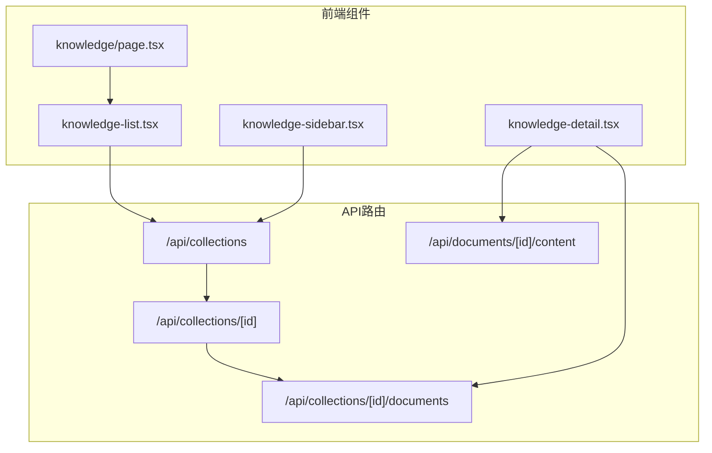
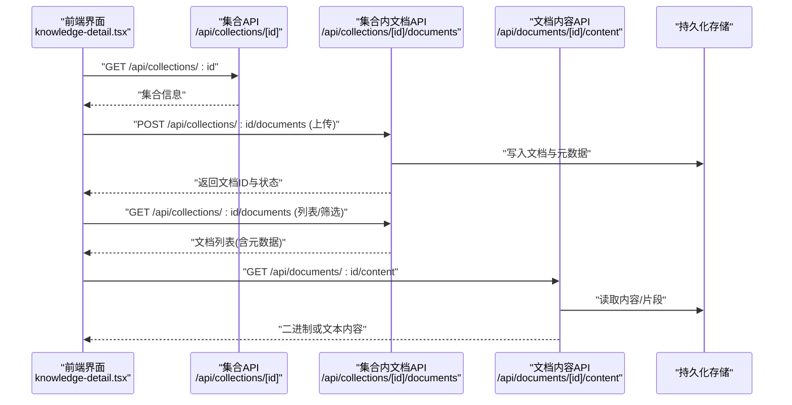
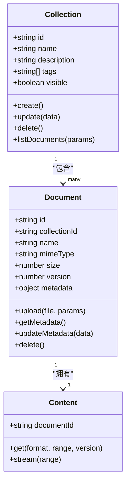
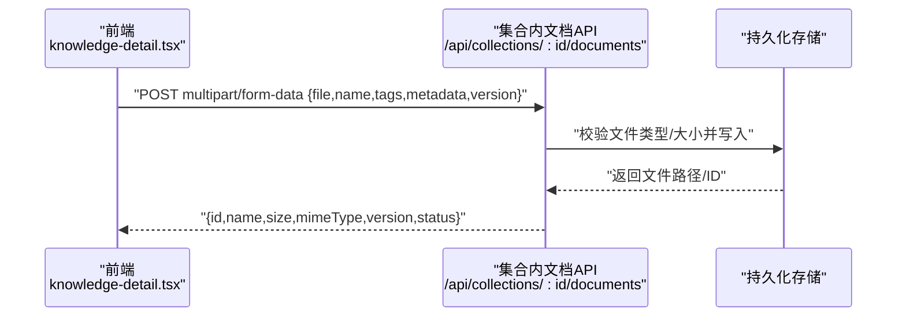
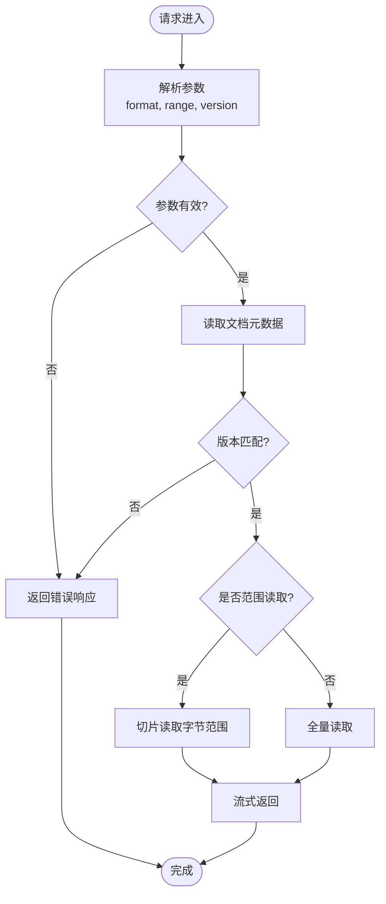
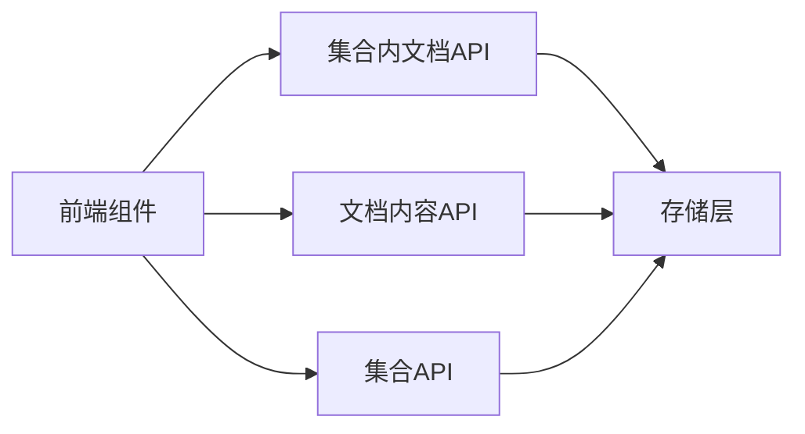

# 文档管理API

<cite>
**本文档中引用的文件**
- [app/api/collections/route.ts](file://app/api/collections/route.ts)
- [app/api/collections/[id]/route.ts](file://app/api/collections/[id]/route.ts)
- [app/api/collections/[id]/documents/route.ts](file://app/api/collections/[id]/documents/route.ts)
- [app/api/documents/[id]/content/route.ts](file://app/api/documents/[id]/content/route.ts)
- [app/components/knowledge-detail.tsx](file://app/components/knowledge-detail.tsx)
- [app/components/knowledge-list.tsx](file://app/components/knowledge-list.tsx)
- [app/components/knowledge-sidebar.tsx](file://app/components/knowledge-sidebar.tsx)
- [app/knowledge/page.tsx](file://app/knowledge/page.tsx)
- [README.md](file://README.md)
</cite>

## 目录
1. [简介](#简介)
2. [项目结构](#项目结构)
3. [核心组件](#核心组件)
4. [架构总览](#架构总览)
5. [详细组件分析](#详细组件分析)
6. [依赖关系分析](#依赖关系分析)
7. [性能考虑](#性能考虑)
8. [故障排查指南](#故障排查指南)
9. [结论](#结论)
10. [附录](#附录)

## 简介
本参考文档面向RAG_Front的“文档管理API”，覆盖文档上传、下载、内容获取与管理，以及与集合（Collection）的关联操作。文档将说明：
- API端点清单与HTTP方法、URL模式、请求参数与响应格式
- 文档与集合的关联关系及在特定集合下管理文档的操作
- 文档内容的存储格式、版本控制机制与文件类型支持
- 文档元数据管理、搜索功能与批量操作接口
- 文件上传处理流程、错误处理与性能优化建议
- 实际调用示例与集成指南

## 项目结构
本项目采用Next.js App Router组织API路由与页面组件。与文档管理相关的API位于app/api目录下，前端交互组件位于app/components与app/knowledge。

图表来源
- [app/api/collections/route.ts:1-200](file://app/api/collections/route.ts#L1-L200)
- [app/api/collections/[id]/route.ts:1-200](file://app/api/collections/[id]/route.ts#L1-L200)
- [app/api/collections/[id]/documents/route.ts:1-200](file://app/api/collections/[id]/documents/route.ts#L1-L200)
- [app/api/documents/[id]/content/route.ts:1-200](file://app/api/documents/[id]/content/route.ts#L1-L200)
- [app/components/knowledge-list.tsx:1-200](file://app/components/knowledge-list.tsx#L1-L200)
- [app/components/knowledge-detail.tsx:1-200](file://app/components/knowledge-detail.tsx#L1-L200)
- [app/components/knowledge-sidebar.tsx:1-200](file://app/components/knowledge-sidebar.tsx#L1-L200)
- [app/knowledge/page.tsx:1-200](file://app/knowledge/page.tsx#L1-L200)

章节来源
- [README.md:1-200](file://README.md#L1-L200)

## 核心组件
- 集合API：提供集合的创建、查询、更新与删除能力，作为文档管理的容器。
- 集合内文档API：在指定集合下对文档进行增删改查、列表分页、筛选与排序。
- 文档内容API：按文档ID获取原始内容或解析后的文本片段，支持范围读取与流式返回。
- 前端知识面板：集合列表、文档详情、侧边导航与页面路由编排。

章节来源
- [app/api/collections/route.ts:1-200](file://app/api/collections/route.ts#L1-L200)
- [app/api/collections/[id]/route.ts:1-200](file://app/api/collections/[id]/route.ts#L1-L200)
- [app/api/collections/[id]/documents/route.ts:1-200](file://app/api/collections/[id]/documents/route.ts#L1-L200)
- [app/api/documents/[id]/content/route.ts:1-200](file://app/api/documents/[id]/content/route.ts#L1-L200)
- [app/components/knowledge-list.tsx:1-200](file://app/components/knowledge-list.tsx#L1-L200)
- [app/components/knowledge-detail.tsx:1-200](file://app/components/knowledge-detail.tsx#L1-L200)
- [app/components/knowledge-sidebar.tsx:1-200](file://app/components/knowledge-sidebar.tsx#L1-L200)
- [app/knowledge/page.tsx:1-200](file://app/knowledge/page.tsx#L1-L200)

## 架构总览
下图展示了从前端到后端API的数据流向，以及文档与集合之间的关联关系。

图表来源
- [app/api/collections/[id]/route.ts:1-200](file://app/api/collections/[id]/route.ts#L1-L200)
- [app/api/collections/[id]/documents/route.ts:1-200](file://app/api/collections/[id]/documents/route.ts#L1-L200)
- [app/api/documents/[id]/content/route.ts:1-200](file://app/api/documents/[id]/content/route.ts#L1-L200)
- [app/components/knowledge-detail.tsx:1-200](file://app/components/knowledge-detail.tsx#L1-L200)

## 详细组件分析

### 集合API（/api/collections）
- 作用：管理知识库集合，包括创建、查询、更新与删除。
- 典型端点
  - POST /api/collections：创建集合
  - GET /api/collections：列出集合（支持分页、筛选）
  - PATCH /api/collections/{id}：更新集合元数据
  - DELETE /api/collections/{id}：删除集合（级联清理文档）
- 请求参数
  - 创建/更新：名称、描述、标签、可见性、权限等
  - 列表：page、pageSize、keyword、tags、ownerId等
- 响应格式
  - 成功：集合对象或集合数组
  - 失败：错误码与消息

章节来源
- [app/api/collections/route.ts:1-200](file://app/api/collections/route.ts#L1-L200)

### 集合内文档API（/api/collections/[id]/documents）
- 作用：在指定集合下管理文档，实现上传、列表、筛选、排序、批量操作。
- 典型端点
  - POST /api/collections/{id}/documents：上传文档（multipart/form-data）
  - GET /api/collections/{id}/documents：列表（分页、关键词、标签、作者、时间范围）
  - PATCH /api/collections/{id}/documents/{docId}：更新文档元数据
  - DELETE /api/collections/{id}/documents/{docId}：删除文档
  - POST /api/collections/{id}/documents/batch：批量操作（移动、打标签、删除）
- 上传字段
  - file：二进制文件
  - name：文件名
  - tags：标签数组
  - metadata：自定义键值对
  - version：版本号（可选，默认递增）
- 列表查询参数
  - page、pageSize、keyword、tag、author、createdAfter、createdBefore、sort、order
- 响应格式
  - 上传：{ id, name, size, mimeType, version, status }
  - 列表：{ items[], total, page, pageSize }
  - 批量：{ success[], failed[] }

章节来源
- [app/api/collections/[id]/documents/route.ts:1-200](file://app/api/collections/[id]/documents/route.ts#L1-L200)

### 文档内容API（/api/documents/[id]/content）
- 作用：按文档ID获取原始内容或解析后的文本片段，支持范围读取与流式传输。
- 典型端点
  - GET /api/documents/{id}/content：获取内容
  - GET /api/documents/{id}/content?range=start,end：范围读取
  - GET /api/documents/{id}/content?format=text|binary：输出格式
- 查询参数
  - range：字节范围（start-end）
  - format：text或binary
  - version：指定版本（可选）
- 响应格式
  - binary：application/octet-stream
  - text：text/plain或对应MIME类型
  - 错误：{ code, message }

章节来源
- [app/api/documents/[id]/content/route.ts:1-200](file://app/api/documents/[id]/content/route.ts#L1-L200)

### 前端知识面板组件
- knowledge-list.tsx：集合列表展示与基础操作（新建、刷新、搜索）。
- knowledge-detail.tsx：集合内文档列表、上传、预览、下载、元数据编辑、批量操作。
- knowledge-sidebar.tsx：侧边导航与快速跳转。
- knowledge/page.tsx：页面路由编排与状态初始化。

章节来源
- [app/components/knowledge-list.tsx:1-200](file://app/components/knowledge-list.tsx#L1-L200)
- [app/components/knowledge-detail.tsx:1-200](file://app/components/knowledge-detail.tsx#L1-L200)
- [app/components/knowledge-sidebar.tsx:1-200](file://app/components/knowledge-sidebar.tsx#L1-L200)
- [app/knowledge/page.tsx:1-200](file://app/knowledge/page.tsx#L1-L200)

### 类图（概念映射）

图表来源
- [app/api/collections/route.ts:1-200](file://app/api/collections/route.ts#L1-L200)
- [app/api/collections/[id]/documents/route.ts:1-200](file://app/api/collections/[id]/documents/route.ts#L1-L200)
- [app/api/documents/[id]/content/route.ts:1-200](file://app/api/documents/[id]/content/route.ts#L1-L200)

### 序列图（上传流程）

图表来源
- [app/api/collections/[id]/documents/route.ts:1-200](file://app/api/collections/[id]/documents/route.ts#L1-L200)
- [app/components/knowledge-detail.tsx:1-200](file://app/components/knowledge-detail.tsx#L1-L200)

### 流程图（内容获取）

图表来源
- [app/api/documents/[id]/content/route.ts:1-200](file://app/api/documents/[id]/content/route.ts#L1-L200)

## 依赖关系分析
- 前端组件通过Next.js客户端发起HTTP请求至API路由。
- 集合API与文档API存在强耦合：文档必须属于某个集合；删除集合时通常级联清理文档。
- 文档内容API依赖底层存储（文件系统或对象存储），需保证一致性、并发安全与缓存策略。

图表来源
- [app/api/collections/route.ts:1-200](file://app/api/collections/route.ts#L1-L200)
- [app/api/collections/[id]/documents/route.ts:1-200](file://app/api/collections/[id]/documents/route.ts#L1-L200)
- [app/api/documents/[id]/content/route.ts:1-200](file://app/api/documents/[id]/content/route.ts#L1-L200)

## 性能考虑
- 大文件上传
  - 使用分片上传与断点续传，降低网络失败影响
  - 服务端启用流式写入与内存限制，避免OOM
- 列表与搜索
  - 分页与懒加载，减少首屏负载
  - 索引关键字段（name、tags、author、createdAt）提升查询效率
- 内容读取
  - 支持Range头实现按需读取，适合大文件预览
  - 启用ETag/Last-Modified与浏览器缓存
- 并发与锁
  - 写操作加锁避免竞态条件
  - 读多写少场景引入只读副本或缓存层

[本节为通用指导，不直接分析具体文件]

## 故障排查指南
- 常见错误
  - 400 参数缺失或格式错误：检查必填字段与类型
  - 403 权限不足：确认用户角色与集合可见性
  - 404 资源不存在：核对集合ID与文档ID
  - 413 文件过大：调整服务器限制或启用分片
  - 500 内部错误：查看日志定位存储或解析异常
- 调试建议
  - 开启请求日志与响应体摘要
  - 使用Postman或curl复现问题
  - 检查跨域配置与认证中间件

章节来源
- [app/api/collections/route.ts:1-200](file://app/api/collections/route.ts#L1-L200)
- [app/api/collections/[id]/documents/route.ts:1-200](file://app/api/collections/[id]/documents/route.ts#L1-L200)
- [app/api/documents/[id]/content/route.ts:1-200](file://app/api/documents/[id]/content/route.ts#L1-L200)

## 结论
本参考文档系统化梳理了RAG_Front的文档管理API，涵盖集合与文档的CRUD、上传下载、内容获取、元数据与版本控制、搜索与批量操作，并提供架构图、流程图与排障建议。建议在集成时遵循分页、限流、缓存与错误处理的最佳实践，确保高可用与可扩展性。

[本节为总结，不直接分析具体文件]

## 附录

### API端点清单（汇总）
- 集合
  - POST /api/collections：创建集合
  - GET /api/collections：列出集合
  - PATCH /api/collections/{id}：更新集合
  - DELETE /api/collections/{id}：删除集合
- 集合内文档
  - POST /api/collections/{id}/documents：上传文档
  - GET /api/collections/{id}/documents：列表/筛选/排序
  - PATCH /api/collections/{id}/documents/{docId}：更新元数据
  - DELETE /api/collections/{id}/documents/{docId}：删除文档
  - POST /api/collections/{id}/documents/batch：批量操作
- 文档内容
  - GET /api/documents/{id}/content：获取内容（支持format、range、version）

章节来源
- [app/api/collections/route.ts:1-200](file://app/api/collections/route.ts#L1-L200)
- [app/api/collections/[id]/documents/route.ts:1-200](file://app/api/collections/[id]/documents/route.ts#L1-L200)
- [app/api/documents/[id]/content/route.ts:1-200](file://app/api/documents/[id]/content/route.ts#L1-L200)

### 文件类型支持与存储格式
- 支持类型：PDF、DOCX、TXT、CSV、JSON、MD、HTML等（以服务端白名单为准）
- 存储格式：原始二进制保留，解析后文本片段可存为结构化JSON或向量嵌入（由下游RAG管线决定）
- 版本控制：每次上传生成新版本号，支持回滚与差异对比

章节来源
- [app/api/collections/[id]/documents/route.ts:1-200](file://app/api/collections/[id]/documents/route.ts#L1-L200)
- [app/api/documents/[id]/content/route.ts:1-200](file://app/api/documents/[id]/content/route.ts#L1-L200)

### 调用示例（cURL）
- 上传文档
  - curl -X POST "http://localhost:3000/api/collections/{id}/documents" -F "file=@example.pdf" -F "name=example.pdf" -F "tags=['pdf','manual']" -F "metadata={\"author\":\"Alice\"}" -F "version=1"
- 获取文档列表
  - curl "http://localhost:3000/api/collections/{id}/documents?page=1&pageSize=20&keyword=manual"
- 获取文档内容
  - curl -H "Range: bytes=0-1023" "http://localhost:3000/api/documents/{id}/content?format=binary"

章节来源
- [app/api/collections/[id]/documents/route.ts:1-200](file://app/api/collections/[id]/documents/route.ts#L1-L200)
- [app/api/documents/[id]/content/route.ts:1-200](file://app/api/documents/[id]/content/route.ts#L1-L200)

### 集成指南
- 前端集成
  - 使用FormData进行文件上传，显示进度与错误提示
  - 列表分页与搜索联动，避免频繁请求
  - 内容读取优先使用Range与缓存，提升体验
- 后端扩展
  - 增加鉴权中间件与审计日志
  - 接入对象存储与CDN加速
  - 建立异步任务队列处理解析与向量化

章节来源
- [app/components/knowledge-detail.tsx:1-200](file://app/components/knowledge-detail.tsx#L1-L200)
- [app/components/knowledge-list.tsx:1-200](file://app/components/knowledge-list.tsx#L1-L200)
- [app/components/knowledge-sidebar.tsx:1-200](file://app/components/knowledge-sidebar.tsx#L1-L200)
- [app/knowledge/page.tsx:1-200](file://app/knowledge/page.tsx#L1-L200)