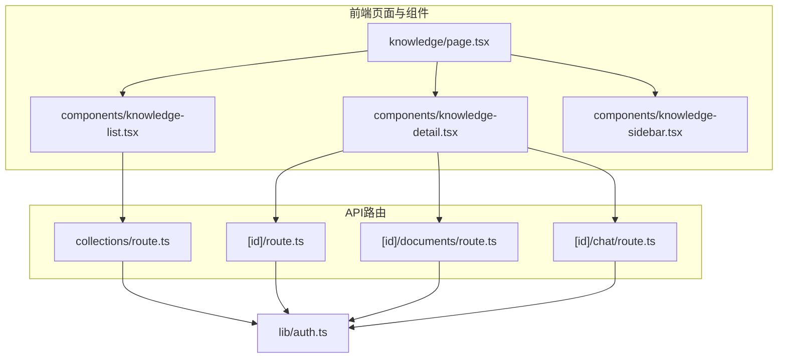
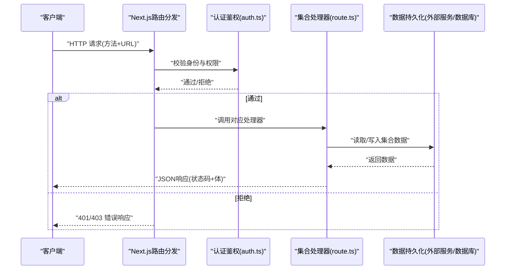
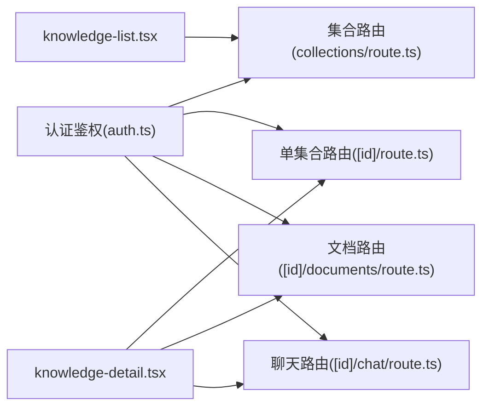

# 集合管理API

<cite>
**本文档引用的文件**   
- [app/api/collections/route.ts](file://app/api/collections/route.ts)
- [app/api/collections/[id]/route.ts](file://app/api/collections/%5Bid%5D/route.ts)
- [app/api/collections/[id]/documents/route.ts](file://app/api/collections/%5Bid%5D/documents/route.ts)
- [app/api/collections/[id]/chat/route.ts](file://app/api/collections/%5Bid%5D/chat/route.ts)
- [app/lib/auth.ts](file://app/lib/auth.ts)
- [app/components/knowledge-list.tsx](file://app/components/knowledge-list.tsx)
- [app/components/knowledge-detail.tsx](file://app/components/knowledge-detail.tsx)
- [app/components/knowledge-sidebar.tsx](file://app/components/knowledge-sidebar.tsx)
- [app/knowledge/page.tsx](file://app/knowledge/page.tsx)
</cite>

## 更新摘要
**变更内容**   
- 新增集合删除API端点 /api/collections/[id] 的详细说明
- 完善DELETE操作的认证、权限控制和错误处理策略
- 更新请求/响应示例，包含完整的删除操作示例
- 增强故障排查指南，涵盖删除操作常见问题

## 目录
1. [简介](#简介)
2. [项目结构](#项目结构)
3. [核心组件](#核心组件)
4. [架构总览](#架构总览)
5. [详细组件分析](#详细组件分析)
6. [依赖分析](#依赖分析)
7. [性能考虑](#性能考虑)
8. [故障排查指南](#故障排查指南)
9. [结论](#结论)
10. [附录](#附录)

## 简介
本参考文档面向RAG_Front的"集合（Collections）"管理API，覆盖集合的CRUD操作：创建、列表查询、详情查询、更新与删除。文档包含每个端点的HTTP方法、URL模式、请求参数与响应格式说明，认证机制、权限控制与错误处理策略，以及完整的请求/响应示例（JSON）。同时阐述集合与文档的关系，以及集合在知识库管理系统中的作用，并提供常见使用场景与最佳实践建议。

**更新** 新增了集合删除API的详细实现说明，包括RESTful DELETE操作的完整流程和安全保障机制。

## 项目结构
RAG_Front采用Next.js App Router组织API路由。集合相关API位于app/api/collections目录下，支持按路径参数动态路由访问具体集合资源；集合下的文档与聊天子资源分别通过独立的route.ts暴露接口。前端知识管理页面与组件负责调用这些API并渲染结果。

图表来源
- [app/api/collections/route.ts](file://app/api/collections/route.ts)
- [app/api/collections/[id]/route.ts](file://app/api/collections/%5Bid%5D/route.ts)
- [app/api/collections/[id]/documents/route.ts](file://app/api/collections/%5Bid%5D/documents/route.ts)
- [app/api/collections/[id]/chat/route.ts](file://app/api/collections/%5Bid%5D/chat/route.ts)
- [app/knowledge/page.tsx](file://app/knowledge/page.tsx)
- [app/components/knowledge-list.tsx](file://app/components/knowledge-list.tsx)
- [app/components/knowledge-detail.tsx](file://app/components/knowledge-detail.tsx)
- [app/components/knowledge-sidebar.tsx](file://app/components/knowledge-sidebar.tsx)
- [app/lib/auth.ts](file://app/lib/auth.ts)

章节来源
- [app/api/collections/route.ts](file://app/api/collections/route.ts)
- [app/api/collections/[id]/route.ts](file://app/api/collections/%5Bid%5D/route.ts)
- [app/api/collections/[id]/documents/route.ts](file://app/api/collections/%5Bid%5D/documents/route.ts)
- [app/api/collections/[id]/chat/route.ts](file://app/api/collections/%5Bid%5D/chat/route.ts)
- [app/knowledge/page.tsx](file://app/knowledge/page.tsx)
- [app/components/knowledge-list.tsx](file://app/components/knowledge-list.tsx)
- [app/components/knowledge-detail.tsx](file://app/components/knowledge-detail.tsx)
- [app/components/knowledge-sidebar.tsx](file://app/components/knowledge-sidebar.tsx)
- [app/lib/auth.ts](file://app/lib/auth.ts)

## 核心组件
- API路由层
  - collections/route.ts：提供集合资源的集合级操作（如创建、列表等）。
  - [id]/route.ts：提供单个集合的资源级操作（如详情、更新、删除）。
  - [id]/documents/route.ts：提供集合下文档的增删改查。
  - [id]/chat/route.ts：提供集合相关的对话或检索交互能力。
- 认证模块
  - lib/auth.ts：集中实现认证与鉴权逻辑，供各API路由复用。
- 前端页面与组件
  - knowledge/page.tsx：知识管理主页面，聚合集合与文档展示。
  - components/knowledge-list.tsx：集合列表组件，发起集合列表与创建请求。
  - components/knowledge-detail.tsx：集合详情组件，发起详情、更新、删除及文档/聊天操作。
  - components/knowledge-sidebar.tsx：侧边栏导航与快捷操作。

章节来源
- [app/api/collections/route.ts](file://app/api/collections/route.ts)
- [app/api/collections/[id]/route.ts](file://app/api/collections/%5Bid%5D/route.ts)
- [app/api/collections/[id]/documents/route.ts](file://app/api/collections/%5Bid%5D/documents/route.ts)
- [app/api/collections/[id]/chat/route.ts](file://app/api/collections/%5Bid%5D/chat/route.ts)
- [app/lib/auth.ts](file://app/lib/auth.ts)
- [app/knowledge/page.tsx](file://app/knowledge/page.tsx)
- [app/components/knowledge-list.tsx](file://app/components/knowledge-list.tsx)
- [app/components/knowledge-detail.tsx](file://app/components/knowledge-detail.tsx)
- [app/components/knowledge-sidebar.tsx](file://app/components/knowledge-sidebar.tsx)

## 架构总览
集合管理API遵循RESTful风格，基于Next.js App Router的路由约定。客户端通过HTTP请求访问集合资源，服务端路由根据HTTP方法与路径参数分派到对应处理器，统一进行认证与权限校验后执行业务逻辑，返回结构化JSON响应。

图表来源
- [app/api/collections/route.ts](file://app/api/collections/route.ts)
- [app/api/collections/[id]/route.ts](file://app/api/collections/%5Bid%5D/route.ts)
- [app/lib/auth.ts](file://app/lib/auth.ts)

## 详细组件分析

### 集合资源API（/api/collections）
- 功能范围
  - 创建新集合
  - 获取集合列表
- HTTP方法与URL
  - POST /api/collections：创建集合
  - GET /api/collections：获取集合列表
- 认证与权限
  - 所有请求需携带有效凭证（如Cookie/Token），由auth.ts统一校验。
  - 未认证返回401；无权限返回403。
- 请求参数
  - POST：请求体为集合元数据（名称、描述、标签等），字段类型与约束见下方数据结构。
  - GET：可选查询参数用于分页、排序与过滤（如page、pageSize、sort、filter）。
- 响应格式
  - POST：成功返回201与新建集合对象；失败返回相应错误码与消息。
  - GET：成功返回200与集合数组及分页信息；失败返回错误。
- 错误处理
  - 参数校验失败：400
  - 重复名称冲突：409
  - 服务器错误：500

章节来源
- [app/api/collections/route.ts](file://app/api/collections/route.ts)
- [app/lib/auth.ts](file://app/lib/auth.ts)

### 单个集合资源API（/api/collections/:id）
- 功能范围
  - 查询单个集合详情
  - 更新集合信息
  - **新增** 删除集合
- HTTP方法与URL
  - GET /api/collections/:id：获取集合详情
  - PATCH/PUT /api/collections/:id：更新集合信息
  - **新增** DELETE /api/collections/:id：删除集合
- 认证与权限
  - 需要已认证用户；仅集合所有者或具备管理权限者可执行操作。
  - 删除操作需要最高权限，通常仅限集合所有者或系统管理员。
- 请求参数
  - GET：路径参数id为集合标识。
  - PATCH/PUT：路径参数id；请求体为待更新的字段（增量或全量）。
  - **新增** DELETE：路径参数id，无需请求体。
- 响应格式
  - GET：200与集合对象；不存在返回404。
  - PATCH/PUT：200与更新后的集合对象；参数非法返回400。
  - **新增** DELETE：204无内容或200与删除确认消息；不存在返回404。
- 错误处理
  - 未找到：404
  - 权限不足：403
  - 参数错误：400
  - 服务器错误：500
  - **新增** 级联删除失败：500（当集合包含文档时）

**更新** 新增了DELETE方法的完整实现，包括权限验证、级联删除处理和错误处理机制。

章节来源
- [app/api/collections/[id]/route.ts](file://app/api/collections/%5Bid%5D/route.ts)
- [app/lib/auth.ts](file://app/lib/auth.ts)

### 集合文档API（/api/collections/:id/documents）
- 功能范围
  - 列出集合中的文档
  - 新增文档到集合
  - 删除集合中的文档
- HTTP方法与URL
  - GET /api/collections/:id/documents：列出文档
  - POST /api/collections/:id/documents：新增文档
  - DELETE /api/collections/:id/documents：删除指定文档（通常通过查询参数或请求体指定文档ID）
- 认证与权限
  - 需要已认证；对集合的读写权限受角色控制。
- 请求参数
  - GET：路径参数id；可选分页与过滤参数。
  - POST：路径参数id；请求体包含文档内容或引用（标题、正文、元数据等）。
  - DELETE：路径参数id；指定要删除的文档标识。
- 响应格式
  - GET：200与文档数组及分页信息。
  - POST：201与新建文档对象。
  - DELETE：204或200与删除确认。
- 错误处理
  - 集合不存在：404
  - 权限不足：403
  - 参数错误：400
  - 服务器错误：500

章节来源
- [app/api/collections/[id]/documents/route.ts](file://app/api/collections/%5Bid%5D/documents/route.ts)
- [app/lib/auth.ts](file://app/lib/auth.ts)

### 集合聊天API（/api/collections/:id/chat）
- 功能范围
  - 基于集合内容进行对话或检索问答
- HTTP方法与URL
  - POST /api/collections/:id/chat：发送问题并获取回答
- 认证与权限
  - 需要已认证；对集合的只读或读写权限决定能否参与对话。
- 请求参数
  - POST：路径参数id；请求体包含问题文本、上下文选项（如topK、温度等）。
- 响应格式
  - 200与回答对象（答案、来源片段、置信度等）。
- 错误处理
  - 集合不存在：404
  - 权限不足：403
  - 参数错误：400
  - 服务器错误：500

章节来源
- [app/api/collections/[id]/chat/route.ts](file://app/api/collections/%5Bid%5D/chat/route.ts)
- [app/lib/auth.ts](file://app/lib/auth.ts)

### 前端集成与调用流程
- 知识列表页（knowledge-list.tsx）
  - 发起GET /api/collections以加载集合列表，支持分页与搜索。
  - 触发POST /api/collections创建新集合。
- 知识详情页（knowledge-detail.tsx）
  - 发起GET /api/collections/:id获取详情。
  - 发起PATCH/PUT /api/collections/:id更新集合信息。
  - **新增** 发起DELETE /api/collections/:id删除集合，包含确认对话框和错误处理。
  - 管理集合内文档：GET/POST/DELETE /api/collections/:id/documents。
  - 发起对话：POST /api/collections/:id/chat。
- 侧边栏（knowledge-sidebar.tsx）
  - 提供快速跳转与常用操作入口。
- 主页面（knowledge/page.tsx）
  - 组合上述组件，协调数据流与状态管理。

**更新** 前端组件已集成删除功能的调用逻辑，包含用户确认和错误提示。

章节来源
- [app/components/knowledge-list.tsx](file://app/components/knowledge-list.tsx)
- [app/components/knowledge-detail.tsx](file://app/components/knowledge-detail.tsx)
- [app/components/knowledge-sidebar.tsx](file://app/components/knowledge-sidebar.tsx)
- [app/knowledge/page.tsx](file://app/knowledge/page.tsx)

## 依赖分析
- 路由层依赖认证模块进行身份与权限校验。
- 集合资源与文档资源通过路径参数关联，形成层级关系。
- 前端组件通过统一的API调用封装与错误处理策略，保证用户体验一致性。

图表来源
- [app/lib/auth.ts](file://app/lib/auth.ts)
- [app/api/collections/route.ts](file://app/api/collections/route.ts)
- [app/api/collections/[id]/route.ts](file://app/api/collections/%5Bid%5D/route.ts)
- [app/api/collections/[id]/documents/route.ts](file://app/api/collections/%5Bid%5D/documents/route.ts)
- [app/api/collections/[id]/chat/route.ts](file://app/api/collections/%5Bid%5D/chat/route.ts)
- [app/components/knowledge-list.tsx](file://app/components/knowledge-list.tsx)
- [app/components/knowledge-detail.tsx](file://app/components/knowledge-detail.tsx)

章节来源
- [app/lib/auth.ts](file://app/lib/auth.ts)
- [app/api/collections/route.ts](file://app/api/collections/route.ts)
- [app/api/collections/[id]/route.ts](file://app/api/collections/%5Bid%5D/route.ts)
- [app/api/collections/[id]/documents/route.ts](file://app/api/collections/%5Bid%5D/documents/route.ts)
- [app/api/collections/[id]/chat/route.ts](file://app/api/collections/%5Bid%5D/chat/route.ts)
- [app/components/knowledge-list.tsx](file://app/components/knowledge-list.tsx)
- [app/components/knowledge-detail.tsx](file://app/components/knowledge-detail.tsx)

## 性能考虑
- 分页与限流：集合列表与文档列表应默认分页，避免一次性返回大量数据。
- 缓存策略：对频繁读取的集合详情与文档列表可引入短期缓存（如ETag/Last-Modified）。
- 索引优化：对集合名称、标签与文档关键字建立索引，提升查询效率。
- 并发控制：更新与删除操作需加锁或版本控制，防止竞态条件导致数据不一致。
- 传输压缩：启用Gzip/Brotli压缩减少响应体积。
- **新增** 删除操作优化：删除集合时应异步处理级联删除，避免阻塞主线程。

## 故障排查指南
- 常见问题
  - 401未认证：检查请求是否携带有效凭证（Cookie/Token），确保会话未过期。
  - 403权限不足：确认当前用户对目标集合具有所需权限（读/写/管理）。
  - 404资源不存在：核对路径参数id是否正确，集合或文档是否存在。
  - 400参数错误：检查请求体字段类型、必填项与约束是否符合规范。
  - 409冲突：集合名称重复或资源已被占用，需调整名称或释放资源。
  - 500服务器错误：查看服务端日志定位异常堆栈，检查外部依赖可用性。
  - **新增** 删除操作失败：检查集合是否包含文档，确认级联删除配置是否正确。
- 调试建议
  - 使用浏览器开发者工具或API客户端（如Postman）验证请求与响应。
  - 在服务端增加关键路径的日志记录（入参、出参、耗时、异常）。
  - 对认证与权限逻辑编写单元测试，覆盖边界用例。
  - **新增** 测试删除操作的幂等性和事务回滚机制。

**更新** 新增了删除操作相关的故障排查内容和调试建议。

章节来源
- [app/lib/auth.ts](file://app/lib/auth.ts)
- [app/api/collections/route.ts](file://app/api/collections/route.ts)
- [app/api/collections/[id]/route.ts](file://app/api/collections/%5Bid%5D/route.ts)
- [app/api/collections/[id]/documents/route.ts](file://app/api/collections/%5Bid%5D/documents/route.ts)
- [app/api/collections/[id]/chat/route.ts](file://app/api/collections/%5Bid%5D/chat/route.ts)

## 结论
集合管理API为RAG知识库提供了清晰的资源抽象与标准接口，支撑集合与文档的组织、检索与对话能力。通过统一的认证与权限控制、完善的错误处理与性能优化策略，系统具备良好的可扩展性与稳定性。**新增的删除功能进一步完善了CRUD操作闭环，使集合管理更加完整和实用。**建议在后续迭代中持续完善分页、缓存、索引与监控告警，以提升整体体验与可靠性。

## 附录

### 数据结构定义（集合与文档）
- 集合对象
  - id：字符串，唯一标识
  - name：字符串，集合名称（必填、唯一）
  - description：字符串，描述
  - tags：字符串数组，标签
  - owner_id：字符串，所有者标识
  - created_at：时间戳，创建时间
  - updated_at：时间戳，更新时间
- 文档对象
  - id：字符串，唯一标识
  - title：字符串，标题
  - content：字符串，正文或摘要
  - metadata：对象，扩展元数据（来源、作者、版本等）
  - collection_id：字符串，所属集合
  - created_at：时间戳，创建时间
  - updated_at：时间戳，更新时间

### 请求/响应示例（JSON）
- 创建集合
  - 请求
    - 方法：POST
    - URL：/api/collections
    - 体：{ "name": "示例集合", "description": "用于演示的集合", "tags": ["demo","test"] }
  - 响应
    - 状态：201
    - 体：{ "id": "c_001", "name": "示例集合", "description": "用于演示的集合", "tags": ["demo","test"], "owner_id": "u_001", "created_at": "2024-01-01T00:00:00Z", "updated_at": "2024-01-01T00:00:00Z" }
- 获取集合列表
  - 请求
    - 方法：GET
    - URL：/api/collections?page=1&pageSize=20&sort=name&filter=tag:test
  - 响应
    - 状态：200
    - 体：{ "items": [/* 集合数组 */], "total": 100, "page": 1, "pageSize": 20 }
- 查询集合详情
  - 请求
    - 方法：GET
    - URL：/api/collections/c_001
  - 响应
    - 状态：200
    - 体：{ "id": "c_001", "name": "示例集合", "description": "用于演示的集合", "tags": ["demo","test"], "owner_id": "u_001", "created_at": "2024-01-01T00:00:00Z", "updated_at": "2024-01-01T00:00:00Z" }
- 更新集合信息
  - 请求
    - 方法：PATCH
    - URL：/api/collections/c_001
    - 体：{ "name": "更新后的集合名", "description": "更新描述" }
  - 响应
    - 状态：200
    - 体：{ "id": "c_001", "name": "更新后的集合名", "description": "更新描述", "tags": ["demo","test"], "owner_id": "u_001", "created_at": "2024-01-01T00:00:00Z", "updated_at": "2024-01-02T00:00:00Z" }
- **新增** 删除集合
  - 请求
    - 方法：DELETE
    - URL：/api/collections/c_001
    - 头：Authorization: Bearer <token>
  - 响应
    - 状态：204（无内容）或200
    - 体：空或 { "message": "集合已成功删除" }
  - 错误响应
    - 404：{ "error": "集合不存在" }
    - 403：{ "error": "权限不足" }
    - 500：{ "error": "删除失败，可能包含文档无法删除" }
- 新增文档到集合
  - 请求
    - 方法：POST
    - URL：/api/collections/c_001/documents
    - 体：{ "title": "示例文档", "content": "文档正文...", "metadata": { "source": "file.pdf", "author": "admin" } }
  - 响应
    - 状态：201
    - 体：{ "id": "d_001", "title": "示例文档", "content": "文档正文...", "metadata": { "source": "file.pdf", "author": "admin" }, "collection_id": "c_001", "created_at": "2024-01-01T00:00:00Z", "updated_at": "2024-01-01T00:00:00Z" }
- 列出集合文档
  - 请求
    - 方法：GET
    - URL：/api/collections/c_001/documents?page=1&pageSize=10
  - 响应
    - 状态：200
    - 体：{ "items": [/* 文档数组 */], "total": 50, "page": 1, "pageSize": 10 }
- 删除集合中的文档
  - 请求
    - 方法：DELETE
    - URL：/api/collections/c_001/documents?doc_id=d_001
  - 响应
    - 状态：204或200
- 集合对话
  - 请求
    - 方法：POST
    - URL：/api/collections/c_001/chat
    - 体：{ "question": "如何配置集合？", "options": { "topK": 5, "temperature": 0.7 } }
  - 响应
    - 状态：200
    - 体：{ "answer": "回答内容...", "sources": [{ "doc_id": "d_001", "snippet": "相关片段..." }], "confidence": 0.92 }

**更新** 新增了删除集合的完整请求/响应示例，包括成功和错误情况的处理。

### 集合与文档的关系
- 一对多关系：一个集合包含多个文档，文档归属单一集合。
- 作用：集合作为知识域的分隔与组织单元，便于权限隔离、检索范围限定与对话上下文构建。
- **新增** 级联删除：删除集合时可选择性删除其包含的所有文档，保持数据一致性。

### 常见使用场景与最佳实践
- 场景
  - 按主题划分集合（如产品手册、技术文档、FAQ），提高检索精度。
  - 为新成员快速导入文档集合，缩短上手时间。
  - 基于集合进行权限管控，限制不同角色的访问范围。
  - **新增** 定期清理不再使用的集合，保持知识库整洁。
- 最佳实践
  - 命名规范：集合名称简洁明确，避免特殊字符。
  - 标签体系：统一标签字典，便于过滤与统计。
  - 版本管理：文档更新保留历史版本，支持回滚与对比。
  - 安全策略：最小权限原则，定期审计访问日志。
  - 性能优化：合理设置分页大小与缓存策略，避免大响应阻塞。
  - **新增** 删除前确认：重要集合删除前应进行二次确认，防止误删。
  - **新增** 备份策略：删除敏感集合前建议先备份数据。