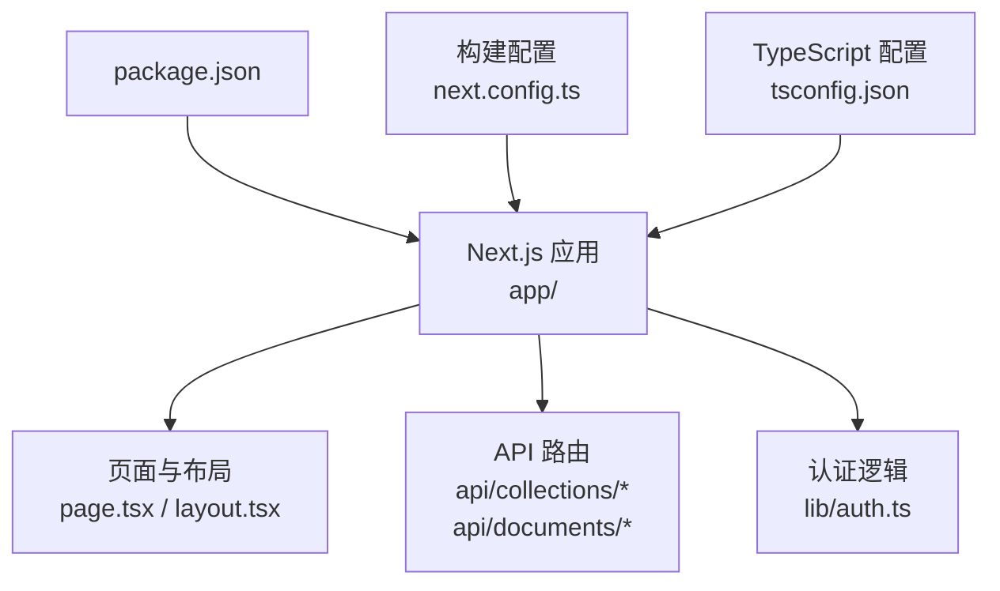
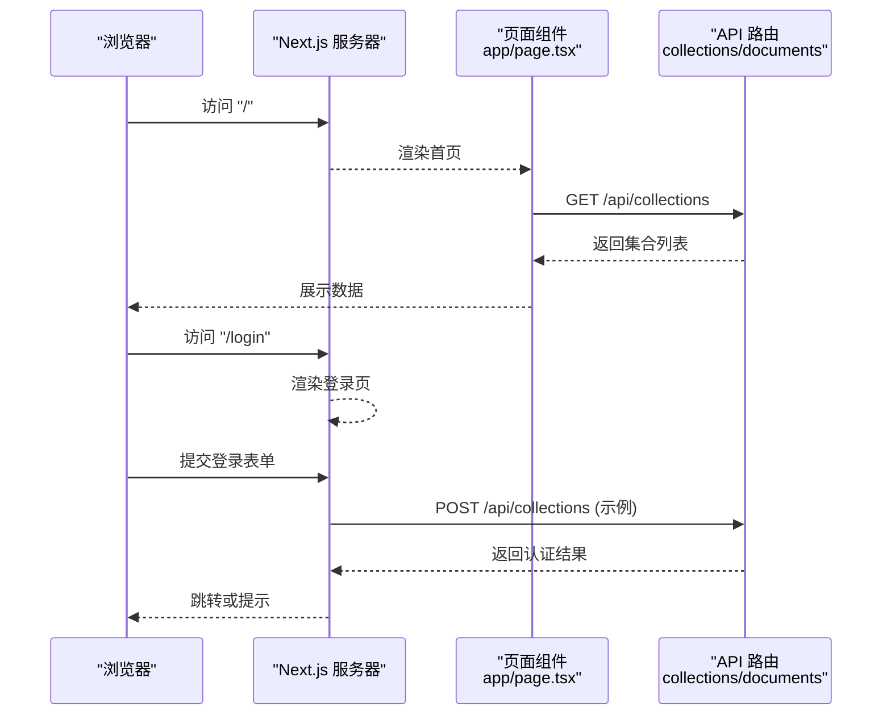
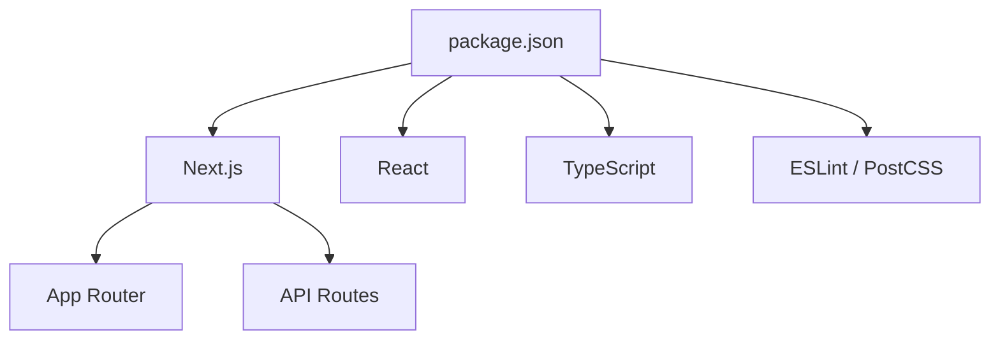

# 快速开始

<cite>
**本文引用的文件**   
- [package.json](file://package.json)
- [next.config.ts](file://next.config.ts)
- [tsconfig.json](file://tsconfig.json)
- [README.md](file://README.md)
- [app/layout.tsx](file://app/layout.tsx)
- [app/page.tsx](file://app/page.tsx)
- [app/login/page.tsx](file://app/login/page.tsx)
- [app/register/page.tsx](file://app/register/page.tsx)
- [app/lib/auth.ts](file://app/lib/auth.ts)
- [app/api/collections/route.ts](file://app/api/collections/route.ts)
- [app/api/collections/[id]/route.ts](file://app/api/collections/[id]/route.ts)
- [app/api/documents/[id]/content/route.ts](file://app/api/documents/[id]/content/route.ts)
</cite>

## 目录
1. [简介](#简介)
2. [项目结构](#项目结构)
3. [核心组件](#核心组件)
4. [架构总览](#架构总览)
5. [详细组件分析](#详细组件分析)
6. [依赖分析](#依赖分析)
7. [性能注意事项](#性能注意事项)
8. [故障排除指南](#故障排除指南)
9. [结论](#结论)
10. [附录](#附录)

## 简介
本指南面向首次接触 RAG_Front 的开发者与使用者，提供从零到一的环境准备、安装、配置、启动与验证流程。RAG_Front 是基于 Next.js 的前端应用，包含知识库展示、登录注册页面以及若干 API 路由（集合与文档内容）。通过本指南，你将能在本地快速运行项目并验证基本功能。

## 项目结构
RAG_Front 采用 Next.js App Router 组织代码：
- app/ 目录为应用主体，包含页面、布局、API 路由与公共组件
- public/ 用于静态资源
- 根目录包含构建与运行时配置文件（如 package.json、next.config.ts、tsconfig.json）

图表来源
- [package.json:1-200](file://package.json#L1-L200)
- [next.config.ts:1-200](file://next.config.ts#L1-L200)
- [tsconfig.json:1-200](file://tsconfig.json#L1-L200)
- [app/layout.tsx:1-200](file://app/layout.tsx#L1-L200)
- [app/page.tsx:1-200](file://app/page.tsx#L1-L200)

章节来源
- [package.json:1-200](file://package.json#L1-L200)
- [next.config.ts:1-200](file://next.config.ts#L1-L200)
- [tsconfig.json:1-200](file://tsconfig.json#L1-L200)
- [README.md:1-200](file://README.md#L1-L200)

## 核心组件
- 入口页面与布局
  - 应用根布局与首页分别位于 app/layout.tsx 与 app/page.tsx，负责全局样式与默认渲染。
- 认证相关页面
  - 登录与注册页面位于 app/login/page.tsx 与 app/register/page.tsx，配合 app/lib/auth.ts 中的认证逻辑。
- API 路由
  - 集合接口：app/api/collections/route.ts 与 app/api/collections/[id]/route.ts
  - 文档内容接口：app/api/documents/[id]/content/route.ts

章节来源
- [app/layout.tsx:1-200](file://app/layout.tsx#L1-L200)
- [app/page.tsx:1-200](file://app/page.tsx#L1-L200)
- [app/login/page.tsx:1-200](file://app/login/page.tsx#L1-L200)
- [app/register/page.tsx:1-200](file://app/register/page.tsx#L1-L200)
- [app/lib/auth.ts:1-200](file://app/lib/auth.ts#L1-L200)
- [app/api/collections/route.ts:1-200](file://app/api/collections/route.ts#L1-L200)
- [app/api/collections/[id]/route.ts:1-200](file://app/api/collections/[id]/route.ts#L1-L200)
- [app/api/documents/[id]/content/route.ts:1-200](file://app/api/documents/[id]/content/route.ts#L1-L200)

## 架构总览
RAG_Front 作为前端应用，通过 Next.js 提供页面渲染与 API 路由能力。典型请求路径如下：
- 浏览器访问首页或登录/注册页，由 Next.js 渲染对应页面
- 页面发起 API 请求至 /api/collections 或 /api/documents/[id]/content
- 后端逻辑（当前为前端内嵌 API 路由）返回数据供页面使用

图表来源
- [app/page.tsx:1-200](file://app/page.tsx#L1-L200)
- [app/api/collections/route.ts:1-200](file://app/api/collections/route.ts#L1-L200)
- [app/api/collections/[id]/route.ts:1-200](file://app/api/collections/[id]/route.ts#L1-L200)
- [app/api/documents/[id]/content/route.ts:1-200](file://app/api/documents/[id]/content/route.ts#L1-L200)

## 详细组件分析

### 环境要求与安装步骤
- 环境要求
  - Node.js：建议使用 LTS 版本（参考包管理器与构建脚本兼容性）
  - 包管理器：npm（也可使用 pnpm/yarn，但需确保与 lock 文件一致）
- 安装依赖
  - 在项目根目录执行包管理器安装命令（例如 npm install）
- 启动开发服务器
  - 执行开发模式命令（例如 npm run dev），随后在浏览器访问 http://localhost:3000

章节来源
- [package.json:1-200](file://package.json#L1-L200)

### 基本配置说明
- 环境变量
  - 如需连接外部服务（数据库、第三方 API），请在根目录创建 .env.local 文件并添加所需变量（例如数据库连接串、密钥等）
  - 注意：.env.local 不应提交到版本库
- Next.js 配置
  - next.config.ts 中可调整构建选项、代理、安全策略等
- TypeScript 配置
  - tsconfig.json 控制编译选项与模块解析行为

章节来源
- [next.config.ts:1-200](file://next.config.ts#L1-L200)
- [tsconfig.json:1-200](file://tsconfig.json#L1-L200)

### 首次运行验证
- 启动后打开浏览器访问 http://localhost:3000
- 验证首页是否正常加载
- 进入登录/注册页面，确认页面渲染正常
- 若涉及 API 调用，检查浏览器控制台是否有错误，并在终端查看 Next.js 输出日志

章节来源
- [app/page.tsx:1-200](file://app/page.tsx#L1-L200)
- [app/login/page.tsx:1-200](file://app/login/page.tsx#L1-L200)
- [app/register/page.tsx:1-200](file://app/register/page.tsx#L1-L200)

### 常见安装问题与解决方案
- 端口占用
  - 现象：启动时报端口被占用
  - 解决：更换端口或关闭占用进程；可在环境变量中指定端口
- 依赖安装失败
  - 现象：npm install 报错
  - 解决：清理缓存与 node_modules 后重试；检查网络与镜像源
- 环境变量未生效
  - 现象：运行时读取不到变量
  - 解决：确认 .env.local 存在且命名正确；重启开发服务器
- 类型错误或编译失败
  - 现象：TypeScript 报错导致无法启动
  - 解决：根据错误信息修复类型定义或依赖版本；必要时降级/升级依赖

章节来源
- [package.json:1-200](file://package.json#L1-L200)
- [next.config.ts:1-200](file://next.config.ts#L1-L200)

## 依赖分析
RAG_Front 的依赖主要由 Next.js 生态构成，包括 React、TypeScript、构建工具与可选插件。关键依赖与脚本定义位于 package.json。

图表来源
- [package.json:1-200](file://package.json#L1-L200)

章节来源
- [package.json:1-200](file://package.json#L1-L200)

## 性能注意事项
- 首屏优化：合理使用客户端/服务端渲染，避免不必要的重渲染
- 资源加载：静态资源放入 public/，按需引入组件与样式
- API 调用：对频繁请求的数据进行缓存或分页处理
- 构建产物：生产构建前开启压缩与 Tree Shaking（Next.js 默认启用）

[本节为通用建议，不直接分析具体文件]

## 故障排除指南
- 启动失败
  - 检查 Node.js 版本与包管理器是否匹配
  - 查看终端错误堆栈，定位具体模块或配置问题
- 页面空白或白屏
  - 检查浏览器控制台错误，确认资源加载状态
  - 排查环境变量与 API 地址是否正确
- API 请求失败
  - 检查请求方法与路径是否与路由定义一致
  - 查看服务端日志与响应体，定位业务逻辑错误

章节来源
- [app/api/collections/route.ts:1-200](file://app/api/collections/route.ts#L1-L200)
- [app/api/collections/[id]/route.ts:1-200](file://app/api/collections/[id]/route.ts#L1-L200)
- [app/api/documents/[id]/content/route.ts:1-200](file://app/api/documents/[id]/content/route.ts#L1-L200)

## 结论
通过本指南，你已完成 RAG_Front 的环境准备、依赖安装、基础配置与首次运行验证。后续可根据业务需求扩展 API 路由、接入数据库与第三方服务，并持续优化性能与用户体验。

[本节为总结性内容，不直接分析具体文件]

## 附录
- 常用命令
  - 安装依赖：npm install
  - 启动开发服务器：npm run dev
  - 构建生产版本：npm run build
  - 启动生产服务器：npm start
- 参考文档
  - README.md 提供项目背景与使用说明

章节来源
- [package.json:1-200](file://package.json#L1-L200)
- [README.md:1-200](file://README.md#L1-L200)