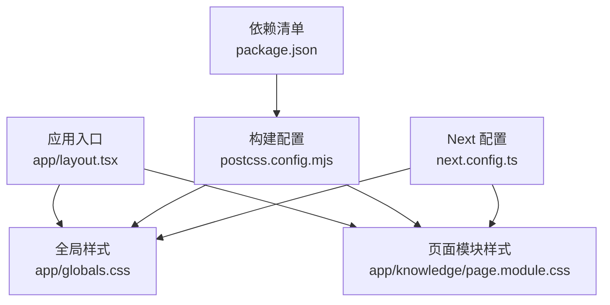
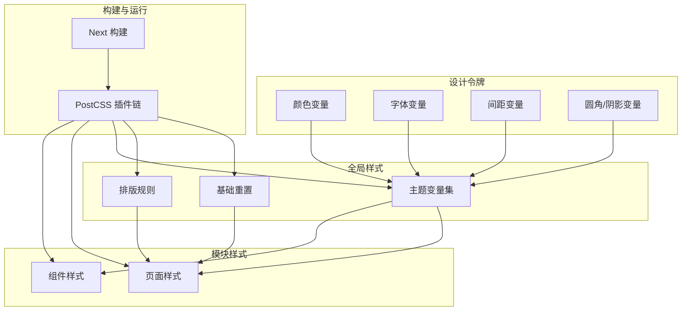
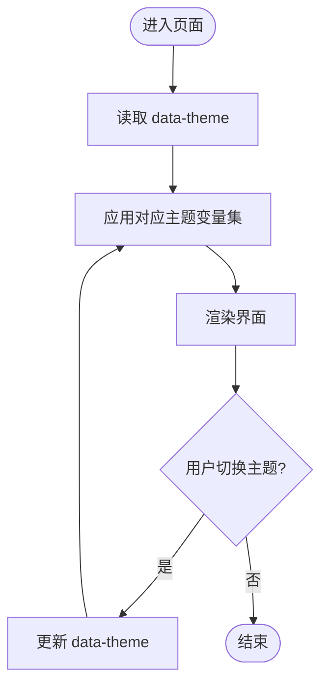
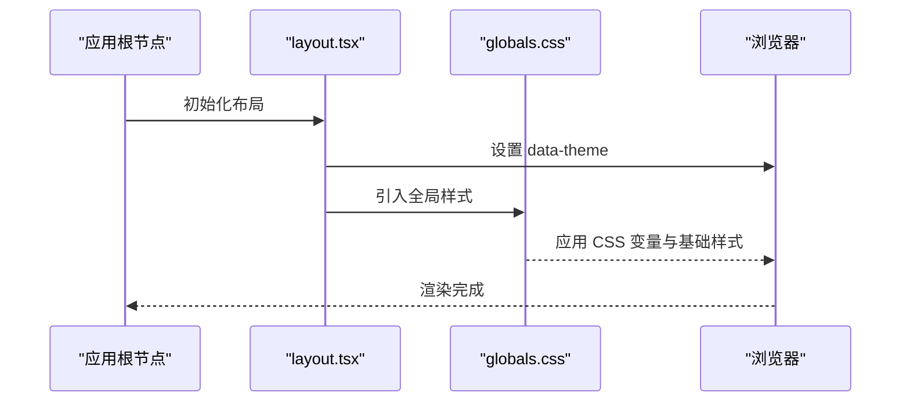
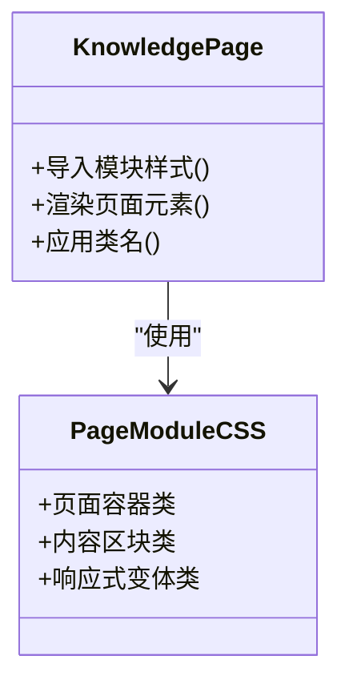
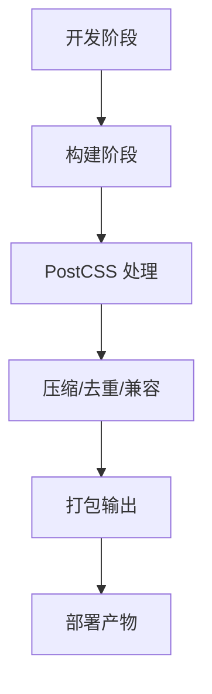
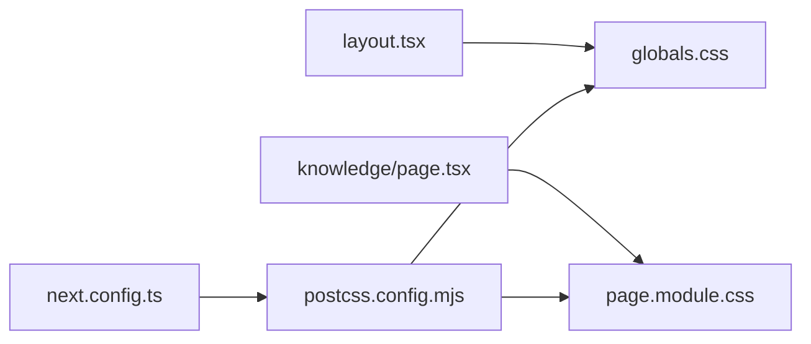

# 样式与主题

<cite>
**本文引用的文件**   
- [globals.css](file://app/globals.css)
- [layout.tsx](file://app/layout.tsx)
- [page.module.css](file://app/knowledge/page.module.css)
- [postcss.config.mjs](file://postcss.config.mjs)
- [next.config.ts](file://next.config.ts)
- [package.json](file://package.json)
</cite>

## 目录
1. [简介](#简介)
2. [项目结构](#项目结构)
3. [核心组件](#核心组件)
4. [架构总览](#架构总览)
5. [详细组件分析](#详细组件分析)
6. [依赖关系分析](#依赖关系分析)
7. [性能考虑](#性能考虑)
8. [故障排查指南](#故障排查指南)
9. [结论](#结论)
10. [附录](#附录)

## 简介
本文件面向 RAG_Front 的样式系统与主题定制，系统性说明全局样式组织、CSS 变量与设计令牌管理、模块化 CSS 使用规范、响应式策略、颜色与字体体系、间距系统、样式覆盖与自定义最佳实践、主题切换与动态样式加载、性能优化、浏览器兼容性与调试工具。目标是帮助开发者快速理解并高效扩展项目的样式能力。

## 项目结构
RAG_Front 采用 Next.js App Router 工程结构，样式相关的关键位置如下：
- 全局样式入口：app/globals.css（站点级样式、CSS 变量、基础重置）
- 布局注入：app/layout.tsx（引入全局样式，提供主题根节点）
- 页面级模块样式：app/knowledge/page.module.css（按页面/组件隔离的样式）
- PostCSS 配置：postcss.config.mjs（构建期样式处理链）
- Next.js 配置：next.config.ts（静态资源与构建行为）
- 依赖声明：package.json（Tailwind/PostCSS 等插件版本）

图表来源
- [layout.tsx:1-200](file://app/layout.tsx#L1-L200)
- [globals.css:1-200](file://app/globals.css#L1-L200)
- [page.module.css:1-200](file://app/knowledge/page.module.css#L1-L200)
- [postcss.config.mjs:1-200](file://postcss.config.mjs#L1-L200)
- [next.config.ts:1-200](file://next.config.ts#L1-L200)
- [package.json:1-200](file://package.json#L1-L200)

章节来源
- [layout.tsx:1-200](file://app/layout.tsx#L1-L200)
- [globals.css:1-200](file://app/globals.css#L1-L200)
- [page.module.css:1-200](file://app/knowledge/page.module.css#L1-L200)
- [postcss.config.mjs:1-200](file://postcss.config.mjs#L1-L200)
- [next.config.ts:1-200](file://next.config.ts#L1-L200)
- [package.json:1-200](file://package.json#L1-L200)

## 核心组件
- 全局样式层（globals.css）
  - 作用：定义 CSS 变量（颜色、字体、间距、圆角、阴影等）、基础重置、通用排版与布局规则、暗色/亮色主题变量集合。
  - 建议：将设计令牌集中放在 :root 或 data-theme 选择器下，便于通过 JS 切换主题。
- 布局层（layout.tsx）
  - 作用：在应用根节点挂载全局样式，设置 HTML/CSS 根属性（如 data-theme），确保主题变量在整棵 DOM 树生效。
- 页面模块样式（page.module.css）
  - 作用：为特定页面或组件提供局部样式，避免全局污染；配合 CSS Modules 生成唯一类名。
- 构建与运行时（postcss.config.mjs、next.config.ts、package.json）
  - 作用：PostCSS 插件链（如 Tailwind、autoprefixer、cssnano 等）与 Next 构建行为；依赖版本影响样式特性与兼容性。

章节来源
- [globals.css:1-200](file://app/globals.css#L1-L200)
- [layout.tsx:1-200](file://app/layout.tsx#L1-L200)
- [page.module.css:1-200](file://app/knowledge/page.module.css#L1-L200)
- [postcss.config.mjs:1-200](file://postcss.config.mjs#L1-L200)
- [next.config.ts:1-200](file://next.config.ts#L1-L200)
- [package.json:1-200](file://package.json#L1-L200)

## 架构总览
样式架构遵循“全局设计令牌 + 模块化组件样式 + 构建期优化”的分层模式：
- 设计令牌层：CSS 变量统一管理颜色、字体、间距、动效等。
- 全局层：基础重置、排版、布局容器、主题变量集。
- 模块层：页面/组件级样式，通过 CSS Modules 隔离命名空间。
- 构建层：PostCSS 与 Next 构建流程负责转换、压缩、兼容性处理。

图表来源
- [globals.css:1-200](file://app/globals.css#L1-L200)
- [page.module.css:1-200](file://app/knowledge/page.module.css#L1-L200)
- [postcss.config.mjs:1-200](file://postcss.config.mjs#L1-L200)
- [next.config.ts:1-200](file://next.config.ts#L1-L200)

## 详细组件分析

### 全局样式与主题变量（globals.css）
- 职责
  - 定义 CSS 变量作为设计令牌（颜色、字体、间距、圆角、阴影等）。
  - 提供默认主题与可选主题（如暗色/亮色）的变量集合。
  - 统一基础重置、排版、布局容器与通用 UI 规则。
- 主题切换机制
  - 通过根节点 data-theme 属性切换主题变量集。
  - 在 layout.tsx 中设置 data-theme，或在用户交互时动态更新该属性。
- 响应式与布局
  - 使用媒体查询适配不同屏幕尺寸。
  - 结合 Flexbox/Grid 实现弹性布局与移动端优先策略。
- 可访问性
  - 保证对比度与可读性，提供高对比度主题选项。
- 最佳实践
  - 将语义化变量集中在 :root 或 data-theme 选择器下。
  - 避免硬编码颜色/字号/间距，全部走变量。
  - 对第三方库样式进行最小化覆盖，保持可维护性。

图表来源
- [globals.css:1-200](file://app/globals.css#L1-L200)
- [layout.tsx:1-200](file://app/layout.tsx#L1-L200)

章节来源
- [globals.css:1-200](file://app/globals.css#L1-L200)
- [layout.tsx:1-200](file://app/layout.tsx#L1-L200)

### 布局与主题注入（layout.tsx）
- 职责
  - 引入全局样式，确保主题变量在应用根节点可用。
  - 设置 data-theme 初始值（可从本地存储或系统偏好推断）。
  - 提供页面级元数据（标题、字符集、视口等）。
- 主题初始化
  - 首次渲染时根据用户偏好或系统主题设置 data-theme。
  - 监听系统主题变化，同步更新 data-theme。
- 性能要点
  - 避免在每次渲染中重复计算主题逻辑。
  - 将主题状态提升到合适的层级，减少重渲染。

图表来源
- [layout.tsx:1-200](file://app/layout.tsx#L1-L200)
- [globals.css:1-200](file://app/globals.css#L1-L200)

章节来源
- [layout.tsx:1-200](file://app/layout.tsx#L1-L200)

### 页面模块样式（page.module.css）
- 职责
  - 为 knowledge 页面提供独立样式，避免与全局样式冲突。
  - 使用 CSS Modules 生成唯一类名，提升可维护性。
- 使用方式
  - 在页面组件中导入模块样式对象，按需引用类名。
  - 通过变量继承全局设计令牌，保持风格一致。
- 命名规范
  - 使用语义化类名，避免缩写与无意义前缀。
  - 组件内样式与作用域严格绑定，避免泄漏到全局。

图表来源
- [page.module.css:1-200](file://app/knowledge/page.module.css#L1-L200)

章节来源
- [page.module.css:1-200](file://app/knowledge/page.module.css#L1-L200)

### 构建与样式处理（postcss.config.mjs、next.config.ts、package.json）
- PostCSS 插件链
  - 常见插件：Tailwind、Autoprefixer、cssnano、PurgeCSS 等。
  - 作用：语法转换、自动补全、压缩与死代码剔除。
- Next 构建
  - 控制静态资源处理、CSS 提取与懒加载策略。
  - 与 PostCSS 协作，确保生产环境样式体积最小化。
- 依赖管理
  - package.json 中声明样式相关依赖版本，确保团队一致性。

图表来源
- [postcss.config.mjs:1-200](file://postcss.config.mjs#L1-L200)
- [next.config.ts:1-200](file://next.config.ts#L1-L200)
- [package.json:1-200](file://package.json#L1-L200)

章节来源
- [postcss.config.mjs:1-200](file://postcss.config.mjs#L1-L200)
- [next.config.ts:1-200](file://next.config.ts#L1-L200)
- [package.json:1-200](file://package.json#L1-L200)

## 依赖关系分析
- 样式依赖层次
  - globals.css 被 layout.tsx 引入，作为全站基础样式。
  - page.module.css 被具体页面组件引入，提供局部样式。
  - postcss.config.mjs 作用于所有 .css/.module.css 文件。
  - next.config.ts 协调构建流程与资源处理。
- 外部依赖
  - Tailwind/Autoprefixer/cssnano 等插件影响样式特性与兼容性。
  - 版本升级需关注破坏性变更与浏览器支持矩阵。

图表来源
- [layout.tsx:1-200](file://app/layout.tsx#L1-L200)
- [globals.css:1-200](file://app/globals.css#L1-L200)
- [page.module.css:1-200](file://app/knowledge/page.module.css#L1-L200)
- [postcss.config.mjs:1-200](file://postcss.config.mjs#L1-L200)
- [next.config.ts:1-200](file://next.config.ts#L1-L200)

章节来源
- [layout.tsx:1-200](file://app/layout.tsx#L1-L200)
- [globals.css:1-200](file://app/globals.css#L1-L200)
- [page.module.css:1-200](file://app/knowledge/page.module.css#L1-L200)
- [postcss.config.mjs:1-200](file://postcss.config.mjs#L1-L200)
- [next.config.ts:1-200](file://next.config.ts#L1-L200)

## 性能考虑
- CSS 压缩与去重
  - 启用 cssnano 在生产环境压缩样式，移除冗余规则。
  - 使用 PurgeCSS 剔除未使用的样式，减小包体。
- 懒加载与按需加载
  - 利用 Next 的 CSS 提取与路由级代码分割，延迟加载非首屏样式。
  - 将重型组件样式拆分为独立模块，按需引入。
- 缓存策略
  - 为静态 CSS 资源设置长期缓存与版本号，提升加载速度。
  - 使用 HTTP 缓存头与 CDN 加速。
- 构建优化
  - 合理配置 PostCSS 插件顺序，避免重复处理。
  - 关闭开发环境的非必要插件以提升构建速度。

[本节为通用指导，不直接分析具体文件]

## 故障排查指南
- 主题未生效
  - 检查 layout.tsx 是否正确设置 data-theme。
  - 确认 globals.css 中主题变量是否被正确覆盖。
- 样式冲突
  - 使用浏览器开发者工具检查类名与作用域。
  - 避免在全局样式中过度覆盖，优先使用模块样式。
- 构建异常
  - 检查 postcss.config.mjs 插件配置与版本兼容性。
  - 清理 node_modules 与缓存后重试构建。
- 性能问题
  - 使用 Lighthouse 分析样式体积与渲染路径。
  - 定位未使用的 CSS 与重复规则，进行精简。

章节来源
- [layout.tsx:1-200](file://app/layout.tsx#L1-L200)
- [globals.css:1-200](file://app/globals.css#L1-L200)
- [postcss.config.mjs:1-200](file://postcss.config.mjs#L1-L200)

## 结论
RAG_Front 的样式系统以 CSS 变量为核心，结合模块化样式与 PostCSS 构建流程，实现了清晰的主题管理与良好的可维护性。通过合理的分层与规范，开发者可以高效扩展样式能力，同时保证性能与兼容性。建议在团队协作中统一命名规范与主题变量字典，持续优化样式体积与渲染性能。

[本节为总结性内容，不直接分析具体文件]

## 附录
- 主题切换实现要点
  - 在 layout.tsx 中初始化 data-theme，并在用户交互时更新。
  - 将主题状态持久化至本地存储，提升用户体验。
- 响应式设计策略
  - 采用移动端优先，使用媒体查询逐步增强桌面端体验。
  - 使用 Flexbox/Grid 实现自适应布局，避免固定宽度。
- 设计令牌管理
  - 将颜色、字体、间距、圆角、阴影等抽象为变量，集中管理。
  - 建立命名约定，确保跨组件一致性。
- 样式覆盖最佳实践
  - 优先使用模块样式与变量覆盖，避免 !important。
  - 对第三方库样式进行最小化覆盖，保持可维护性。
- 调试工具
  - 使用浏览器开发者工具检查样式计算与性能。
  - 借助 Lighthouse 与 Source Maps 定位问题。

[本节为补充信息，不直接分析具体文件]