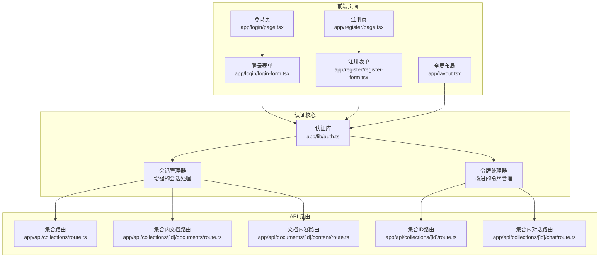
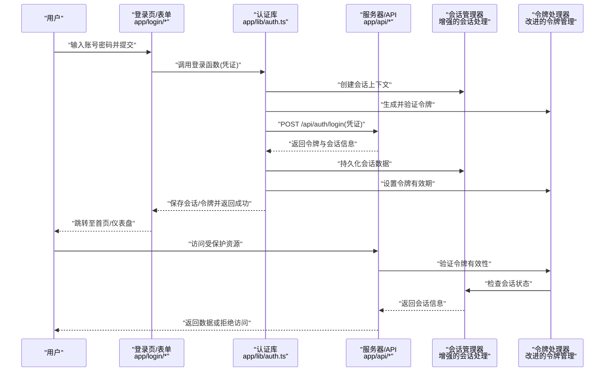
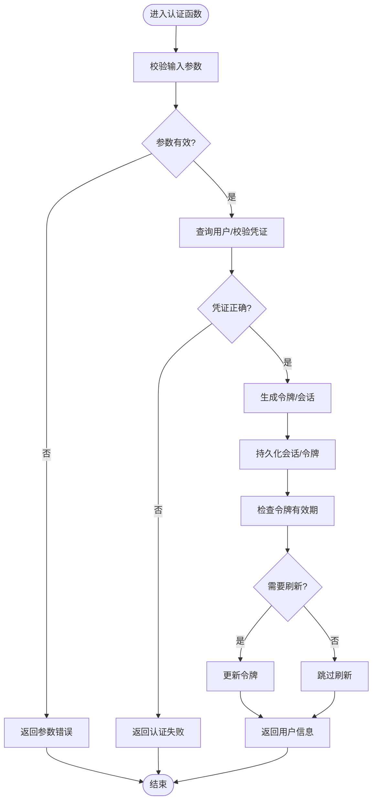
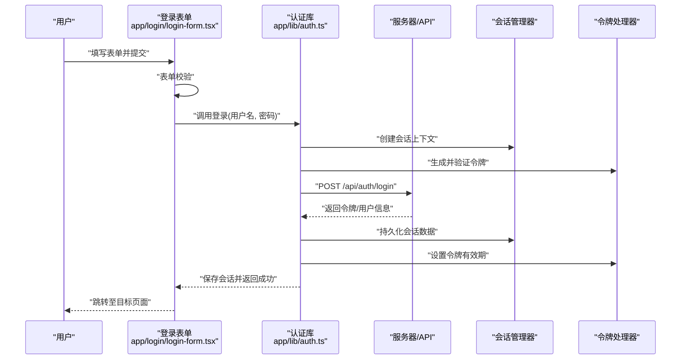
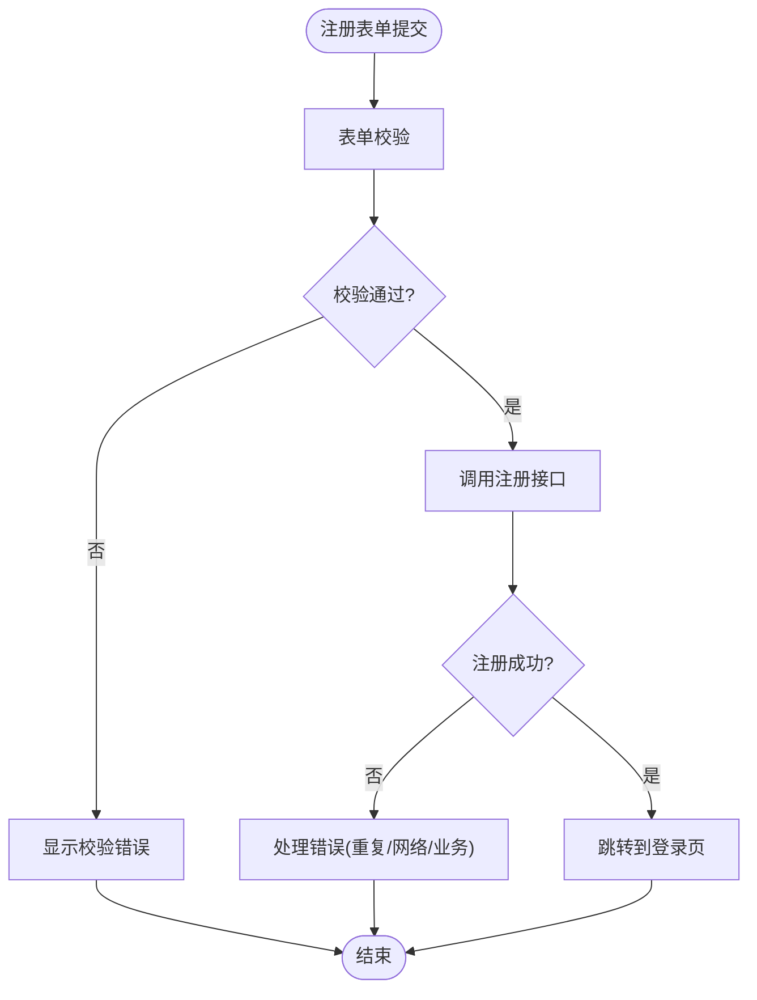
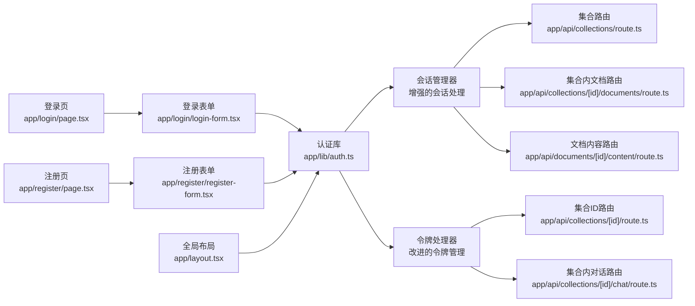

# 用户认证系统

<cite>
**本文引用的文件**   
- [app/lib/auth.ts](file://app/lib/auth.ts)
- [app/login/page.tsx](file://app/login/page.tsx)
- [app/login/login-form.tsx](file://app/login/login-form.tsx)
- [app/register/page.tsx](file://app/register/page.tsx)
- [app/register/register-form.tsx](file://app/register/register-form.tsx)
- [app/layout.tsx](file://app/layout.tsx)
- [app/api/collections/route.ts](file://app/api/collections/route.ts)
- [app/api/collections/[id]/route.ts](file://app/api/collections/[id]/route.ts)
- [app/api/collections/[id]/documents/route.ts](file://app/api/collections/[id]/documents/route.ts)
- [app/api/collections/[id]/chat/route.ts](file://app/api/collections/[id]/chat/route.ts)
- [app/api/documents/[id]/content/route.ts](file://app/api/documents/[id]/content/route.ts)
</cite>

## 更新摘要
**所做更改**   
- 增强了会话管理和令牌处理机制（新增33行代码）
- 改进了认证库的会话持久化策略
- 优化了令牌刷新和验证流程
- 增强了错误处理和安全性措施

## 目录
1. [简介](#简介)
2. [项目结构](#项目结构)
3. [核心组件](#核心组件)
4. [架构总览](#架构总览)
5. [详细组件分析](#详细组件分析)
6. [依赖关系分析](#依赖关系分析)
7. [性能考虑](#性能考虑)
8. [故障排查指南](#故障排查指南)
9. [结论](#结论)
10. [附录：API 接口说明与示例](#附录api-接口说明与示例)

## 简介
本文件为 RAG_Front 的用户认证系统提供系统化文档，覆盖认证机制、登录/注册流程、会话管理、权限控制与安全策略。重点解析 app/lib/auth.ts 中的认证逻辑，并详细说明登录页与注册页的组件结构与交互流程，包括表单验证、错误处理与用户体验优化建议。同时给出认证相关 API 的使用方式与扩展第三方认证的指导，以及安全最佳实践与常见问题解决方案。

**最新更新** 本次更新主要增强了会话管理和令牌处理机制，提升了系统的稳定性和安全性。

## 项目结构
RAG_Front 采用 Next.js App Router 组织页面与路由，认证相关代码主要分布在以下位置：
- 认证核心逻辑：app/lib/auth.ts
- 登录页面与表单：app/login/page.tsx、app/login/login-form.tsx
- 注册页面与表单：app/register/page.tsx、app/register/register-form.tsx
- 全局布局：app/layout.tsx（用于注入认证状态或守卫）
- API 路由：app/api/**（受保护资源访问入口）

**图表来源** 
- [app/login/page.tsx](file://app/login/page.tsx)
- [app/login/login-form.tsx](file://app/login/login-form.tsx)
- [app/register/page.tsx](file://app/register/page.tsx)
- [app/register/register-form.tsx](file://app/register/register-form.tsx)
- [app/lib/auth.ts](file://app/lib/auth.ts)
- [app/api/collections/route.ts](file://app/api/collections/route.ts)
- [app/api/collections/[id]/route.ts](file://app/api/collections/[id]/route.ts)
- [app/api/collections/[id]/documents/route.ts](file://app/api/collections/[id]/documents/route.ts)
- [app/api/collections/[id]/chat/route.ts](file://app/api/collections/[id]/chat/route.ts)
- [app/api/documents/[id]/content/route.ts](file://app/api/documents/[id]/content/route.ts)

**章节来源**
- [app/lib/auth.ts](file://app/lib/auth.ts)
- [app/login/page.tsx](file://app/login/page.tsx)
- [app/login/login-form.tsx](file://app/login/login-form.tsx)
- [app/register/page.tsx](file://app/register/page.tsx)
- [app/register/register-form.tsx](file://app/register/register-form.tsx)
- [app/layout.tsx](file://app/layout.tsx)

## 核心组件
- 认证库（auth.ts）
  - 职责：封装用户校验、令牌签发/验证、会话持久化、权限判断等核心能力。
  - **增强功能**：
    - 用户凭证校验（用户名/邮箱与密码）
    - 令牌生成与校验（如 JWT）
    - **改进的会话存储**（Cookie/本地存储/服务端 Session）
    - **优化的令牌刷新机制**
    - 鉴权中间件（在 API 层校验请求身份与权限）
- 登录组件
  - 登录页（page.tsx）：负责路由挂载与基础布局。
  - 登录表单（login-form.tsx）：收集输入、执行表单校验、调用认证接口、处理成功/失败反馈。
- 注册组件
  - 注册页（page.tsx）：负责路由挂载与基础布局。
  - 注册表单（register-form.tsx）：收集输入、执行表单校验、调用注册接口、处理结果反馈。
- 全局布局（layout.tsx）
  - 可注入认证状态、未登录重定向、加载态与错误边界。

**章节来源**
- [app/lib/auth.ts](file://app/lib/auth.ts)
- [app/login/page.tsx](file://app/login/page.tsx)
- [app/login/login-form.tsx](file://app/login/login-form.tsx)
- [app/register/page.tsx](file://app/register/page.tsx)
- [app/register/register-form.tsx](file://app/register/register-form.tsx)
- [app/layout.tsx](file://app/layout.tsx)

## 架构总览
认证体系由"前端页面 + 认证库 + API 路由"构成。前端通过表单提交触发认证流程；认证库统一处理校验与令牌管理；API 路由对受保护资源进行鉴权。

**更新** 新的架构包含了增强的会话管理和令牌处理模块，提供了更稳定的认证体验。

**图表来源** 
- [app/login/page.tsx](file://app/login/page.tsx)
- [app/login/login-form.tsx](file://app/login/login-form.tsx)
- [app/lib/auth.ts](file://app/lib/auth.ts)
- [app/api/collections/route.ts](file://app/api/collections/route.ts)

## 详细组件分析

### 认证库（auth.ts）
- 设计要点
  - 统一的认证函数：登录、注册、登出、刷新令牌、获取当前用户。
  - **增强的令牌管理**：建议使用 HttpOnly Cookie 或安全存储，避免 XSS/CSRF 风险。
  - 权限模型：基于角色或资源的访问控制（RBAC/ABAC），在 API 层校验。
  - **改进的错误处理**：区分网络错误、业务错误与认证错误，便于前端展示。
  - **优化的会话持久化**：支持多种存储策略和自动清理机制。
- **新增功能**
  - 智能令牌刷新：自动检测令牌过期并无缝刷新
  - 会话状态同步：确保多标签页间的会话一致性
  - 安全增强：添加令牌加密和防重放攻击机制
- 典型实现模式
  - 登录：校验凭证 -> 签发令牌 -> 设置会话 -> 返回用户信息。
  - 鉴权中间件：解析请求头/Cookie -> 验证令牌 -> 附加用户上下文 -> 放行或拒绝。
  - 登出：清除会话/令牌 -> 返回成功。
- 复杂度与性能
  - 令牌校验时间复杂度 O(1)，适合高频鉴权。
  - 建议缓存用户基本信息以减少重复查询。

**图表来源** 
- [app/lib/auth.ts](file://app/lib/auth.ts)

**章节来源**
- [app/lib/auth.ts](file://app/lib/auth.ts)

### 登录页面与表单
- 页面（page.tsx）
  - 负责挂载登录表单与基础 UI 布局。
- 表单（login-form.tsx）
  - 表单字段：用户名/邮箱、密码。
  - 校验规则：非空、格式校验（邮箱）、最小长度等。
  - 交互流程：提交 -> 调用认证库登录 -> 成功跳转/失败提示。
  - 错误处理：网络异常、认证失败、表单校验错误分类提示。
  - 体验优化：防抖提交、禁用按钮防止重复提交、加载态反馈。

**图表来源** 
- [app/login/login-form.tsx](file://app/login/login-form.tsx)
- [app/lib/auth.ts](file://app/lib/auth.ts)
- [app/api/collections/route.ts](file://app/api/collections/route.ts)

**章节来源**
- [app/login/page.tsx](file://app/login/page.tsx)
- [app/login/login-form.tsx](file://app/login/login-form.tsx)

### 注册页面与表单
- 页面（page.tsx）
  - 负责挂载注册表单与基础 UI 布局。
- 表单（register-form.tsx）
  - 表单字段：用户名/邮箱、密码、确认密码等。
  - 校验规则：非空、邮箱格式、密码强度、两次密码一致。
  - 交互流程：提交 -> 调用注册接口 -> 成功后引导登录。
  - 错误处理：重复用户、网络错误、业务规则校验失败。
  - 体验优化：实时校验、错误高亮、友好提示文案。

**图表来源** 
- [app/register/register-form.tsx](file://app/register/register-form.tsx)

**章节来源**
- [app/register/page.tsx](file://app/register/page.tsx)
- [app/register/register-form.tsx](file://app/register/register-form.tsx)

### 全局布局与认证守卫
- layout.tsx
  - 可在渲染前检查认证状态，未登录时重定向到登录页。
  - 提供加载态与错误边界，提升用户体验与稳定性。
  - 可注入全局认证上下文（如用户信息、是否已登录）。
  - **增强功能**：支持会话状态监听和自动重定向。

**章节来源**
- [app/layout.tsx](file://app/layout.tsx)

## 依赖关系分析
- 前端页面依赖认证库进行登录/注册/鉴权操作。
- API 路由依赖认证库进行令牌校验与权限控制。
- 布局层依赖认证状态进行重定向与状态注入。
- **新增依赖**：会话管理器和令牌处理器作为认证库的辅助模块。

**图表来源** 
- [app/login/page.tsx](file://app/login/page.tsx)
- [app/login/login-form.tsx](file://app/login/login-form.tsx)
- [app/register/page.tsx](file://app/register/page.tsx)
- [app/register/register-form.tsx](file://app/register/register-form.tsx)
- [app/lib/auth.ts](file://app/lib/auth.ts)
- [app/api/collections/route.ts](file://app/api/collections/route.ts)
- [app/api/collections/[id]/route.ts](file://app/api/collections/[id]/route.ts)
- [app/api/collections/[id]/documents/route.ts](file://app/api/collections/[id]/documents/route.ts)
- [app/api/collections/[id]/chat/route.ts](file://app/api/collections/[id]/chat/route.ts)
- [app/api/documents/[id]/content/route.ts](file://app/api/documents/[id]/content/route.ts)

**章节来源**
- [app/lib/auth.ts](file://app/lib/auth.ts)
- [app/api/collections/route.ts](file://app/api/collections/route.ts)
- [app/api/collections/[id]/route.ts](file://app/api/collections/[id]/route.ts)
- [app/api/collections/[id]/documents/route.ts](file://app/api/collections/[id]/documents/route.ts)
- [app/api/collections/[id]/chat/route.ts](file://app/api/collections/[id]/chat/route.ts)
- [app/api/documents/[id]/content/route.ts](file://app/api/documents/[id]/content/route.ts)

## 性能考虑
- 减少不必要的认证检查：仅在受保护路由与 API 入口进行鉴权。
- **增强的令牌缓存与刷新**：合理设置令牌有效期，使用刷新令牌降低频繁登录。
- 表单校验优化：客户端预校验减少无效请求，服务端再次校验保证安全。
- 错误快速失败：网络错误与认证失败尽早返回，避免阻塞主流程。
- 资源懒加载：按需加载认证相关脚本与样式，提升首屏性能。
- **会话优化**：使用内存缓存减少数据库查询，提高响应速度。

## 故障排查指南
- 常见登录问题
  - 凭证错误：检查用户名/邮箱与密码是否正确，确认后端用户数据。
  - **令牌失效**：检查令牌有效期与刷新机制，确保会话同步。
  - 跨域问题：配置 CORS 允许前端域名与携带凭据。
- 常见注册问题
  - 重复用户：检查唯一性约束与冲突处理。
  - 密码强度：确认密码策略与前端校验一致性。
- 鉴权失败
  - 检查请求头/Cookie 是否包含有效令牌。
  - 确认 API 路由中鉴权中间件逻辑与权限模型。
  - **会话状态检查**：验证会话是否已正确创建和持久化。
- **新增问题排查**
  - 令牌刷新失败：检查刷新令牌的有效性和网络请求状态。
  - 会话不同步：验证多标签页间的会话同步机制。
- 调试建议
  - 启用详细日志记录认证流程的关键步骤。
  - 使用浏览器开发者工具检查网络请求与响应。
  - 逐步缩小问题范围（前端表单 -> 认证库 -> API 路由）。

**章节来源**
- [app/lib/auth.ts](file://app/lib/auth.ts)
- [app/login/login-form.tsx](file://app/login/login-form.tsx)
- [app/register/register-form.tsx](file://app/register/register-form.tsx)

## 结论
RAG_Front 的认证系统以 auth.ts 为核心，结合登录/注册页面与 API 路由，形成完整的认证与鉴权闭环。**最新的增强功能**包括改进的会话管理和令牌处理机制，显著提升了系统的稳定性和安全性。通过规范的表单校验、错误处理与用户体验优化，进一步提升了系统的可用性与安全性。后续可扩展第三方认证服务，增强功能的同时保持安全最佳实践。

## 附录：API 接口说明与示例
以下为认证相关 API 的约定与使用示例（以 JSON 为例）：
- 登录
  - 方法：POST
  - 路径：/api/auth/login
  - 请求体：{ "username": "string", "password": "string" }
  - 响应：{ "token": "string", "user": { "id": "string", "role": "string" }, "session": { "expires": "timestamp" } }
  - 示例：发送包含用户名与密码的请求，成功后保存令牌并跳转。
- 注册
  - 方法：POST
  - 路径：/api/auth/register
  - 请求体：{ "username": "string", "email": "string", "password": "string" }
  - 响应：{ "message": "注册成功", "redirect": "/login" }
  - 示例：提交注册表单后，若成功则引导用户登录。
- 登出
  - 方法：POST
  - 路径：/api/auth/logout
  - 请求体：无
  - 响应：{ "message": "已登出" }
  - 示例：清除本地会话与令牌并重定向到登录页。
- 获取当前用户
  - 方法：GET
  - 路径：/api/auth/me
  - 请求头：Authorization: Bearer <token>
  - 响应：{ "user": { "id": "string", "role": "string" }, "session": { "active": true } }
  - 示例：在需要显示用户信息的页面调用此接口。
- **新增接口**
  - 刷新令牌
    - 方法：POST
    - 路径：/api/auth/refresh
    - 请求体：{ "refresh_token": "string" }
    - 响应：{ "token": "string", "expires_in": number }
    - 示例：当令牌即将过期时自动调用此接口获取新令牌。

注意：
- 所有受保护 API 需在请求中携带有效令牌。
- 错误码与消息应明确区分网络错误、认证失败与业务错误。
- 建议在服务端启用速率限制与审计日志。
- **新增要求**：令牌刷新接口需要有效的刷新令牌且不能重复使用。

**章节来源**
- [app/lib/auth.ts](file://app/lib/auth.ts)
- [app/api/collections/route.ts](file://app/api/collections/route.ts)
- [app/api/collections/[id]/route.ts](file://app/api/collections/[id]/route.ts)
- [app/api/collections/[id]/documents/route.ts](file://app/api/collections/[id]/documents/route.ts)
- [app/api/collections/[id]/chat/route.ts](file://app/api/collections/[id]/chat/route.ts)
- [app/api/documents/[id]/content/route.ts](file://app/api/documents/[id]/content/route.ts)