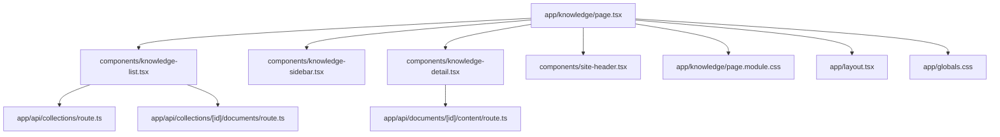
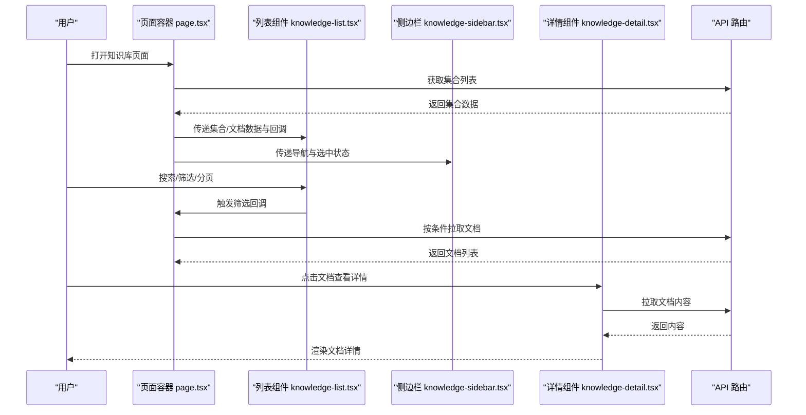
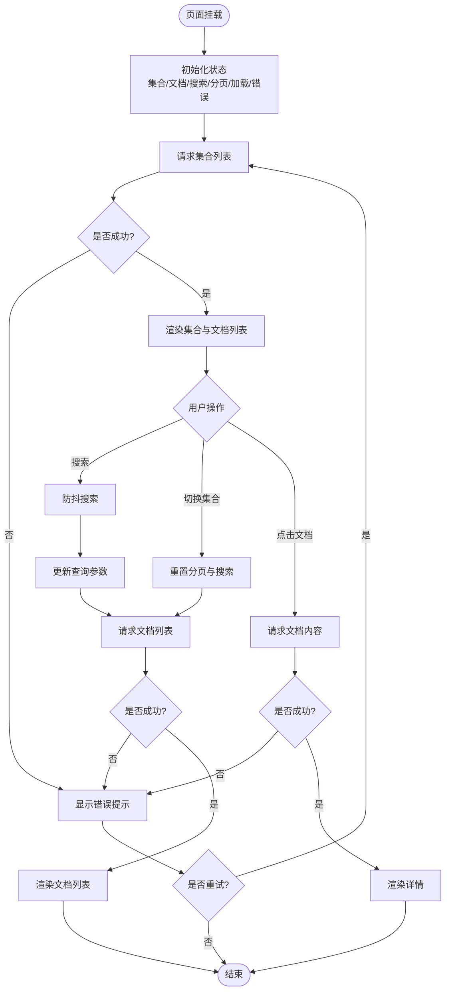
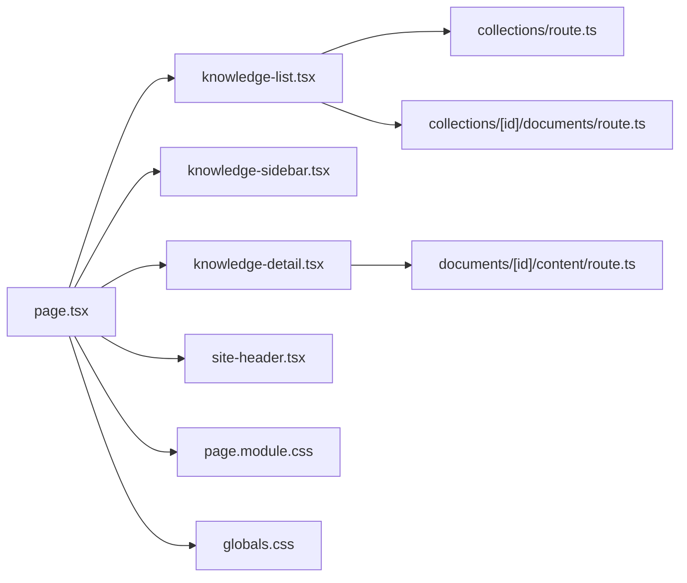

# 知识库主页面

<cite>
**本文引用的文件**   
- [page.tsx](file://app/knowledge/page.tsx)
- [page.module.css](file://app/knowledge/page.module.css)
- [knowledge-list.tsx](file://app/components/knowledge-list.tsx)
- [knowledge-sidebar.tsx](file://app/components/knowledge-sidebar.tsx)
- [knowledge-detail.tsx](file://app/components/knowledge-detail.tsx)
- [site-header.tsx](file://app/components/site-header.tsx)
- [layout.tsx](file://app/layout.tsx)
- [globals.css](file://app/globals.css)
- [route.ts](file://app/api/collections/route.ts)
- [route.ts](file://app/api/collections/[id]/documents/route.ts)
- [route.ts](file://app/api/documents/[id]/content/route.ts)
</cite>

## 目录
1. [简介](#简介)
2. [项目结构](#项目结构)
3. [核心组件](#核心组件)
4. [架构总览](#架构总览)
5. [详细组件分析](#详细组件分析)
6. [依赖关系分析](#依赖关系分析)
7. [性能考虑](#性能考虑)
8. [故障排查指南](#故障排查指南)
9. [结论](#结论)
10. [附录](#附录)

## 简介
本文件为 RAG_Front 的知识库主页面提供系统化、可操作的文档。重点围绕 app/knowledge/page.tsx 的实现逻辑，涵盖页面初始化、数据获取流程、状态管理、用户交互处理；同时说明布局结构与路由配置、CSS 模块化样式组织（含响应式与主题定制）、性能优化建议与最佳实践，以及错误处理与加载状态的实现方案。读者无需深入前端框架细节即可理解并维护该页面。

## 项目结构
知识库主页面采用 Next.js App Router 的目录路由约定：
- 路由入口：app/knowledge/page.tsx
- 样式模块：app/knowledge/page.module.css
- 页面级布局：app/layout.tsx
- 全局样式：app/globals.css
- 子组件：components 下的知识列表、侧边栏、详情等
- API 路由：api 下集合与文档相关接口

图表来源
- [page.tsx](file://app/knowledge/page.tsx)
- [knowledge-list.tsx](file://app/components/knowledge-list.tsx)
- [knowledge-sidebar.tsx](file://app/components/knowledge-sidebar.tsx)
- [knowledge-detail.tsx](file://app/components/knowledge-detail.tsx)
- [site-header.tsx](file://app/components/site-header.tsx)
- [page.module.css](file://app/knowledge/page.module.css)
- [layout.tsx](file://app/layout.tsx)
- [globals.css](file://app/globals.css)
- [route.ts](file://app/api/collections/route.ts)
- [route.ts](file://app/api/collections/[id]/documents/route.ts)
- [route.ts](file://app/api/documents/[id]/content/route.ts)

章节来源
- [page.tsx](file://app/knowledge/page.tsx)
- [layout.tsx](file://app/layout.tsx)
- [globals.css](file://app/globals.css)

## 核心组件
- 页面容器（knowledge/page.tsx）
  - 职责：聚合子组件、管理页面级状态（如选中集合、搜索过滤、分页/排序、加载与错误态）、发起数据请求、渲染布局与内容区。
  - 关键流程：初始化时拉取集合列表；用户操作触发筛选或选择集合；根据选择拉取文档列表；点击文档进入详情。
- 知识列表（knowledge-list.tsx）
  - 职责：展示集合/文档列表、支持搜索与分页、触发选择事件、显示加载与空状态。
- 侧边栏（knowledge-sidebar.tsx）
  - 职责：展示导航/分类、快捷操作、当前选中项高亮。
- 详情（knowledge-detail.tsx）
  - 职责：渲染文档内容、支持内容检索、返回与分享等操作。
- 站点头（site-header.tsx）
  - 职责：全局头部导航、品牌与用户入口。

章节来源
- [knowledge-list.tsx](file://app/components/knowledge-list.tsx)
- [knowledge-sidebar.tsx](file://app/components/knowledge-sidebar.tsx)
- [knowledge-detail.tsx](file://app/components/knowledge-detail.tsx)
- [site-header.tsx](file://app/components/site-header.tsx)

## 架构总览
页面采用“容器 + 展示”的分层模式：
- 容器层（page.tsx）负责状态与副作用（数据获取、路由跳转），通过 props 将数据与回调传递给展示组件。
- 展示组件（knowledge-list/sidebar/detail/header）专注 UI 渲染与本地交互，不直接访问 API。
- 数据流遵循单向数据流：用户交互 → 容器更新状态 → 重新渲染 → 必要时调用 API → 更新状态 → 刷新 UI。

图表来源
- [page.tsx](file://app/knowledge/page.tsx)
- [knowledge-list.tsx](file://app/components/knowledge-list.tsx)
- [knowledge-sidebar.tsx](file://app/components/knowledge-sidebar.tsx)
- [knowledge-detail.tsx](file://app/components/knowledge-detail.tsx)
- [route.ts](file://app/api/collections/route.ts)
- [route.ts](file://app/api/collections/[id]/documents/route.ts)
- [route.ts](file://app/api/documents/[id]/content/route.ts)

## 详细组件分析

### 页面容器（app/knowledge/page.tsx）
- 页面初始化
  - 在首次渲染时发起集合列表请求，设置初始加载态与错误态。
  - 从 URL 查询参数恢复上次选择的集合与搜索条件（可选）。
- 数据获取流程
  - 集合列表：调用集合 API，缓存结果并在切换集合时复用。
  - 文档列表：根据选中的集合 ID 与搜索/分页参数拉取文档。
  - 文档详情：点击文档后拉取内容并渲染。
- 状态管理
  - 使用 React 状态保存：集合列表、文档列表、当前选中集合、搜索关键字、分页信息、加载与错误标志。
  - 通过受控组件方式同步输入框与搜索关键字，防抖触发搜索。
- 用户交互处理
  - 搜索：输入变化触发防抖，更新查询参数并重拉取文档。
  - 选择集合：切换集合时重置分页与搜索，拉取对应文档。
  - 分页/排序：更新分页参数并请求新数据。
  - 跳转详情：基于路由或状态切换至详情视图。
- 错误与加载
  - 加载中：显示骨架屏或占位符，避免闪烁。
  - 错误：捕获网络/服务端异常，展示友好提示并提供重试按钮。
  - 空数据：展示空状态引导（创建集合/上传文档）。

图表来源
- [page.tsx](file://app/knowledge/page.tsx)
- [route.ts](file://app/api/collections/route.ts)
- [route.ts](file://app/api/collections/[id]/documents/route.ts)
- [route.ts](file://app/api/documents/[id]/content/route.ts)

章节来源
- [page.tsx](file://app/knowledge/page.tsx)

### 样式与布局（app/knowledge/page.module.css 与 app/globals.css）
- CSS 模块化
  - 使用 module.css 对页面样式进行隔离，避免类名冲突。
  - 通过变量与组合类名实现主题化与复用。
- 响应式设计
  - 基于媒体查询适配移动端与桌面端布局（如侧边栏折叠、列表网格切换）。
  - 使用弹性布局与栅格思想保证不同屏幕尺寸下的可读性。
- 主题定制
  - 通过 CSS 自定义属性定义颜色、字号、间距等，便于一键换肤。
  - 结合全局样式 globals.css 统一基础样式与重置。

章节来源
- [page.module.css](file://app/knowledge/page.module.css)
- [globals.css](file://app/globals.css)

### 子组件协作
- knowledge-list.tsx
  - 接收集合/文档数据与回调，渲染表格或卡片列表。
  - 内置搜索框与分页控件，触发父级回调更新状态。
- knowledge-sidebar.tsx
  - 渲染集合导航与快捷操作，高亮当前选中项。
- knowledge-detail.tsx
  - 渲染文档内容与元数据，支持返回与复制等操作。
- site-header.tsx
  - 渲染顶部导航与品牌标识，保持全局一致性。

章节来源
- [knowledge-list.tsx](file://app/components/knowledge-list.tsx)
- [knowledge-sidebar.tsx](file://app/components/knowledge-sidebar.tsx)
- [knowledge-detail.tsx](file://app/components/knowledge-detail.tsx)
- [site-header.tsx](file://app/components/site-header.tsx)

## 依赖关系分析
- 组件依赖
  - 页面容器依赖三个展示组件与站点头，并通过 props 通信。
  - 详情组件依赖文档内容 API。
- API 依赖
  - 集合列表与文档列表分别由对应的 API 路由提供。
  - 文档内容通过独立路由获取。
- 样式依赖
  - 页面样式来自模块 CSS，全局样式来自 globals.css。

图表来源
- [page.tsx](file://app/knowledge/page.tsx)
- [knowledge-list.tsx](file://app/components/knowledge-list.tsx)
- [knowledge-sidebar.tsx](file://app/components/knowledge-sidebar.tsx)
- [knowledge-detail.tsx](file://app/components/knowledge-detail.tsx)
- [site-header.tsx](file://app/components/site-header.tsx)
- [page.module.css](file://app/knowledge/page.module.css)
- [globals.css](file://app/globals.css)
- [route.ts](file://app/api/collections/route.ts)
- [route.ts](file://app/api/collections/[id]/documents/route.ts)
- [route.ts](file://app/api/documents/[id]/content/route.ts)

章节来源
- [page.tsx](file://app/knowledge/page.tsx)
- [route.ts](file://app/api/collections/route.ts)
- [route.ts](file://app/api/collections/[id]/documents/route.ts)
- [route.ts](file://app/api/documents/[id]/content/route.ts)

## 性能考虑
- 数据请求优化
  - 使用防抖减少频繁搜索请求。
  - 对集合列表做内存缓存，避免重复请求。
  - 分页与增量加载，避免一次性拉取大量数据。
- 渲染优化
  - 列表虚拟化（长列表场景）提升滚动性能。
  - 拆分大组件为更小的展示组件，降低重渲染范围。
  - 使用懒加载与代码分割，按需加载详情与第三方资源。
- 样式与主题
  - 合理使用 CSS 变量与模块化，减少样式计算开销。
  - 避免过度嵌套与复杂选择器，提高浏览器解析效率。
- 错误与降级
  - 网络失败时快速回退到缓存或空状态，保障可用性。
  - 超时与重试策略，提升用户体验。

[本节为通用指导，不涉及具体文件]

## 故障排查指南
- 常见问题定位
  - 集合/文档列表为空：检查 API 返回码与数据结构，确认权限与参数是否正确。
  - 搜索无结果：确认防抖延迟与查询参数拼接逻辑。
  - 详情无法加载：核对文档 ID 与内容接口路径。
- 错误处理建议
  - 统一错误边界包裹页面，捕获未预期异常。
  - 区分网络错误与服务端错误，给出明确提示与重试入口。
  - 记录关键日志（脱敏）以便问题复现。
- 加载状态
  - 列表与详情均需提供骨架屏或占位图，避免空白闪烁。
  - 长时间请求需显示进度或取消机制。

章节来源
- [page.tsx](file://app/knowledge/page.tsx)
- [knowledge-list.tsx](file://app/components/knowledge-list.tsx)
- [knowledge-detail.tsx](file://app/components/knowledge-detail.tsx)

## 结论
知识库主页面以清晰的容器-展示分层实现了集合与文档的浏览、搜索与详情查看。通过模块化样式与响应式布局，兼顾多端体验；通过合理的状态管理与错误处理，提升了稳定性与可维护性。建议在后续迭代中引入列表虚拟化、缓存策略与更完善的监控埋点，进一步优化性能与可观测性。

## 附录
- 路由与布局
  - 页面路由：app/knowledge/page.tsx
  - 全局布局：app/layout.tsx
  - 全局样式：app/globals.css
- API 参考
  - 集合列表：app/api/collections/route.ts
  - 文档列表：app/api/collections/[id]/documents/route.ts
  - 文档内容：app/api/documents/[id]/content/route.ts