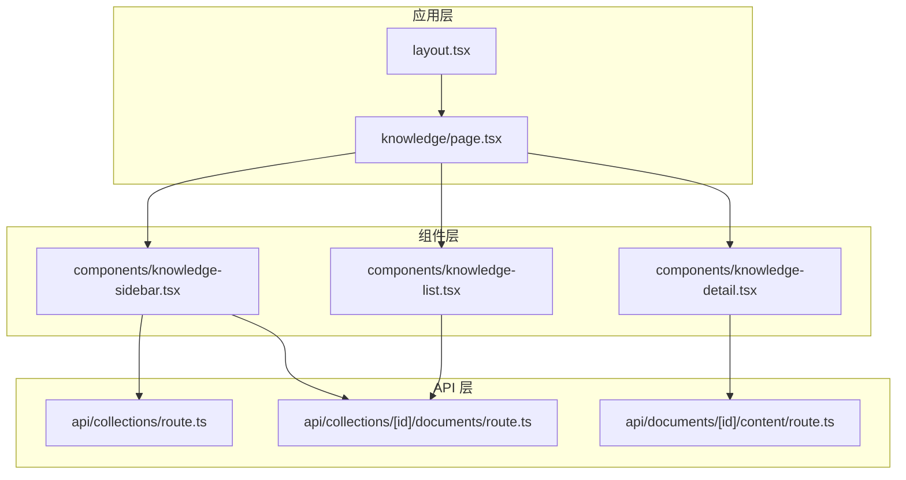
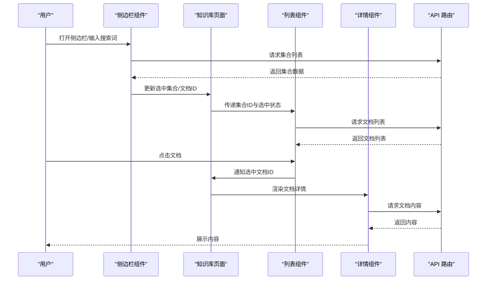
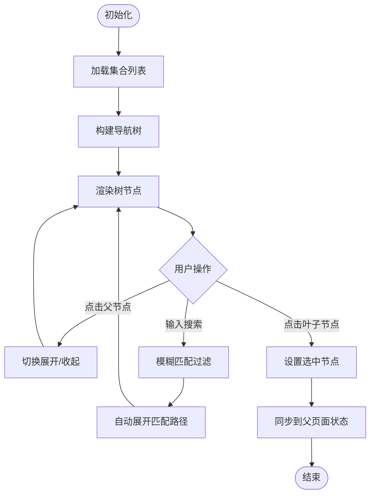
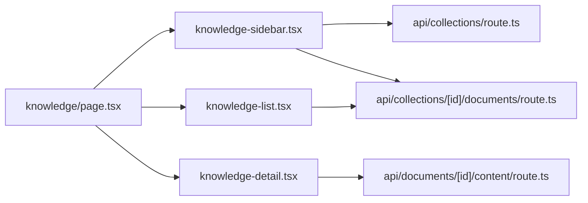

# 知识库侧边栏组件

<cite>
**本文档引用的文件**   
- [knowledge-sidebar.tsx](file://app/components/knowledge-sidebar.tsx)
- [knowledge-list.tsx](file://app/components/knowledge-list.tsx)
- [knowledge-detail.tsx](file://app/components/knowledge-detail.tsx)
- [page.tsx](file://app/knowledge/page.tsx)
- [layout.tsx](file://app/layout.tsx)
- [route.ts](file://app/api/collections/route.ts)
- [route.ts](file://app/api/collections/[id]/documents/route.ts)
- [route.ts](file://app/api/documents/[id]/content/route.ts)
</cite>

## 目录
1. [简介](#简介)
2. [项目结构](#项目结构)
3. [核心组件](#核心组件)
4. [架构总览](#架构总览)
5. [详细组件分析](#详细组件分析)
6. [依赖关系分析](#依赖关系分析)
7. [性能考虑](#性能考虑)
8. [故障排查指南](#故障排查指南)
9. [结论](#结论)
10. [附录](#附录)

## 简介
本文件为 RAG_Front 的知识库侧边栏组件提供全面文档，聚焦以下目标：
- 导航菜单的构建逻辑：树形结构渲染、动态展开收起与路径高亮。
- 与主页面状态同步机制：确保导航状态与当前视图一致。
- 搜索功能实现：快速定位文档与模糊匹配算法。
- 移动端适配策略：抽屉式布局与手势操作。
- 自定义导航项与权限控制配置方法。
- 键盘导航与可访问性支持细节。

## 项目结构
知识库侧边栏位于 app/components 下，并与知识库页面（app/knowledge）及 API 路由协同工作。整体采用 Next.js App Router 组织，组件按功能划分，API 路由按资源划分。

图表来源
- [layout.tsx](file://app/layout.tsx)
- [page.tsx](file://app/knowledge/page.tsx)
- [knowledge-sidebar.tsx](file://app/components/knowledge-sidebar.tsx)
- [knowledge-list.tsx](file://app/components/knowledge-list.tsx)
- [knowledge-detail.tsx](file://app/components/knowledge-detail.tsx)
- [route.ts](file://app/api/collections/route.ts)
- [route.ts](file://app/api/collections/[id]/documents/route.ts)
- [route.ts](file://app/api/documents/[id]/content/route.ts)

章节来源
- [layout.tsx](file://app/layout.tsx)
- [page.tsx](file://app/knowledge/page.tsx)
- [knowledge-sidebar.tsx](file://app/components/knowledge-sidebar.tsx)
- [knowledge-list.tsx](file://app/components/knowledge-list.tsx)
- [knowledge-detail.tsx](file://app/components/knowledge-detail.tsx)
- [route.ts](file://app/api/collections/route.ts)
- [route.ts](file://app/api/collections/[id]/documents/route.ts)
- [route.ts](file://app/api/documents/[id]/content/route.ts)

## 核心组件
- 知识库侧边栏（knowledge-sidebar.tsx）
  - 负责导航树渲染、搜索过滤、选中态与高亮、移动端抽屉开关、键盘导航与无障碍属性。
- 知识库列表（knowledge-list.tsx）
  - 负责集合/文档列表展示、分页与加载状态、点击跳转与选中同步。
- 知识库详情（knowledge-detail.tsx）
  - 负责文档内容渲染、加载错误处理、返回导航联动。
- 知识库页面（knowledge/page.tsx）
  - 作为容器协调侧边栏、列表与详情，维护全局导航状态与路由同步。

章节来源
- [knowledge-sidebar.tsx](file://app/components/knowledge-sidebar.tsx)
- [knowledge-list.tsx](file://app/components/knowledge-list.tsx)
- [knowledge-detail.tsx](file://app/components/knowledge-detail.tsx)
- [page.tsx](file://app/knowledge/page.tsx)

## 架构总览
侧边栏通过 API 获取集合与文档数据，结合本地状态管理完成树形渲染与交互；与主页面通过 props/state 或上下文进行状态同步；在移动端以抽屉形式呈现并支持手势滑动关闭。

图表来源
- [knowledge-sidebar.tsx](file://app/components/knowledge-sidebar.tsx)
- [page.tsx](file://app/knowledge/page.tsx)
- [knowledge-list.tsx](file://app/components/knowledge-list.tsx)
- [knowledge-detail.tsx](file://app/components/knowledge-detail.tsx)
- [route.ts](file://app/api/collections/route.ts)
- [route.ts](file://app/api/collections/[id]/documents/route.ts)
- [route.ts](file://app/api/documents/[id]/content/route.ts)

## 详细组件分析

### 侧边栏组件（knowledge-sidebar.tsx）
- 导航树构建
  - 将集合与文档组织为树形结构，支持多级节点渲染。
  - 使用递归组件或迭代方式渲染子节点，保证层级清晰。
- 动态展开收起
  - 维护展开状态集合，点击父节点切换展开/收起。
  - 对搜索结果自动展开包含匹配结果的父节点。
- 路径高亮
  - 根据当前选中的集合/文档ID，计算路径上的节点并添加高亮样式。
  - 高亮与选中态分离，避免误触。
- 搜索功能
  - 支持关键词模糊匹配，优先匹配标题与摘要字段。
  - 防抖处理减少频繁查询，提升性能。
  - 结果集合并去重，保持树结构完整性。
- 移动端适配
  - 小屏幕下以抽屉形式出现，支持遮罩点击关闭与滑动手势。
  - 尺寸自适应，内容区域滚动隔离。
- 键盘导航与可访问性
  - Tab 顺序合理，Enter/Space 触发选择，Esc 关闭抽屉。
  - aria-* 属性完善，包括 role、aria-expanded、aria-selected、aria-label 等。
  - 焦点管理：打开时聚焦首项，关闭时恢复焦点。

图表来源
- [knowledge-sidebar.tsx](file://app/components/knowledge-sidebar.tsx)

章节来源
- [knowledge-sidebar.tsx](file://app/components/knowledge-sidebar.tsx)

### 知识库列表（knowledge-list.tsx）
- 列表渲染
  - 基于集合ID拉取文档列表，支持分页与加载骨架屏。
- 选中同步
  - 点击文档后向父页面回调选中ID，侧边栏高亮对应节点。
- 错误处理
  - 网络异常与空数据友好提示，重试按钮。

章节来源
- [knowledge-list.tsx](file://app/components/knowledge-list.tsx)

### 知识库详情（knowledge-detail.tsx）
- 内容渲染
  - 根据文档ID拉取内容，支持富文本或Markdown渲染。
- 加载与错误
  - 显示加载中状态与错误信息，提供重试入口。
- 返回联动
  - 返回后保持侧边栏选中态与展开态。

章节来源
- [knowledge-detail.tsx](file://app/components/knowledge-detail.tsx)

### 知识库页面（knowledge/page.tsx）
- 状态协调
  - 维护当前集合ID与文档ID，驱动侧边栏高亮与列表/详情渲染。
- 路由同步
  - URL 参数变化时更新本地状态，刷新页面保持导航一致性。
- 权限控制
  - 根据角色或权限标志控制可见性与操作能力。

章节来源
- [page.tsx](file://app/knowledge/page.tsx)

## 依赖关系分析
侧边栏依赖 API 路由获取数据，与列表和详情组件通过父页面进行状态共享。

图表来源
- [knowledge-sidebar.tsx](file://app/components/knowledge-sidebar.tsx)
- [knowledge-list.tsx](file://app/components/knowledge-list.tsx)
- [knowledge-detail.tsx](file://app/components/knowledge-detail.tsx)
- [page.tsx](file://app/knowledge/page.tsx)
- [route.ts](file://app/api/collections/route.ts)
- [route.ts](file://app/api/collections/[id]/documents/route.ts)
- [route.ts](file://app/api/documents/[id]/content/route.ts)

章节来源
- [knowledge-sidebar.tsx](file://app/components/knowledge-sidebar.tsx)
- [knowledge-list.tsx](file://app/components/knowledge-list.tsx)
- [knowledge-detail.tsx](file://app/components/knowledge-detail.tsx)
- [page.tsx](file://app/knowledge/page.tsx)
- [route.ts](file://app/api/collections/route.ts)
- [route.ts](file://app/api/collections/[id]/documents/route.ts)
- [route.ts](file://app/api/documents/[id]/content/route.ts)

## 性能考虑
- 搜索防抖：降低高频输入导致的重复计算与渲染。
- 懒加载：按需加载文档列表与详情内容，减少初始负载。
- 虚拟滚动：长列表场景下使用虚拟滚动优化渲染性能。
- 缓存策略：对集合与文档列表做短期缓存，避免重复请求。
- 事件节流：拖拽、滚动与窗口尺寸变化事件进行节流处理。

## 故障排查指南
- 侧边栏无法展开
  - 检查集合数据是否为空，确认 API 响应结构与字段名一致。
  - 验证展开状态存储是否正确，避免被意外重置。
- 搜索无结果
  - 确认搜索字段映射正确，大小写与空格处理符合预期。
  - 检查防抖时间是否过长导致延迟明显。
- 高亮不正确
  - 核对当前选中ID与树节点ID是否一致，避免类型不一致。
  - 检查路径计算逻辑是否包含所有祖先节点。
- 移动端抽屉不显示
  - 检查媒体查询断点与抽屉开关状态。
  - 确认手势事件绑定未被其他元素拦截。
- 键盘导航失效
  - 检查 tabIndex 与 focus 管理逻辑，确保焦点可移动。
  - 验证 aria-* 属性是否完整且语义正确。

章节来源
- [knowledge-sidebar.tsx](file://app/components/knowledge-sidebar.tsx)
- [knowledge-list.tsx](file://app/components/knowledge-list.tsx)
- [knowledge-detail.tsx](file://app/components/knowledge-detail.tsx)
- [page.tsx](file://app/knowledge/page.tsx)

## 结论
知识库侧边栏组件通过清晰的树形结构、完善的搜索与高亮机制、良好的移动端适配以及健壮的键盘与可访问性支持，提供了稳定高效的导航体验。与主页面状态同步确保了视图一致性，API 分层设计便于扩展与维护。建议在生产环境中加入缓存与虚拟滚动以提升性能，并结合权限系统实现更细粒度的控制。

## 附录
- 自定义导航项
  - 在树构建阶段注入自定义节点，定义图标、权限标志与点击行为。
  - 通过配置对象统一维护导航项元数据，便于集中管理。
- 权限控制
  - 基于角色或权限标志过滤不可见节点，隐藏或禁用操作。
  - 在 API 层校验访问权限，确保数据安全。
- 键盘导航最佳实践
  - 明确 Tab 顺序，提供 Esc 关闭与 Enter 选择的快捷键。
  - 使用 aria-* 属性增强屏幕阅读器支持。
- 移动端手势
  - 支持左右滑动打开/关闭抽屉，点击遮罩关闭。
  - 防止与页面滚动冲突，确保交互流畅。