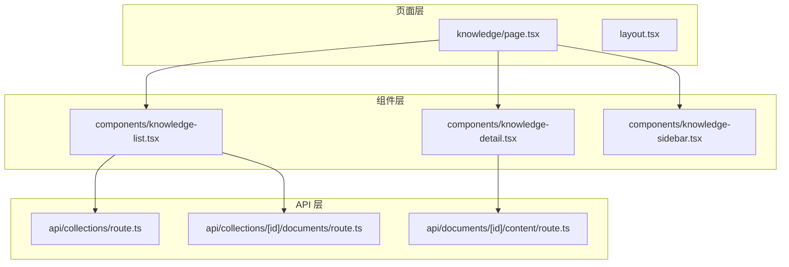
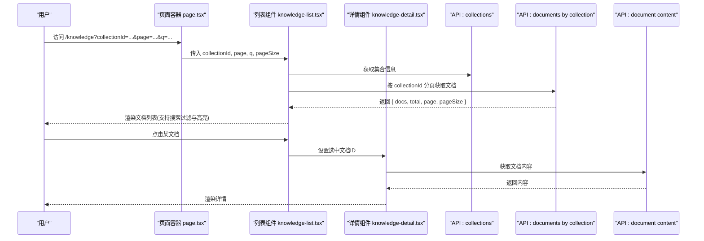
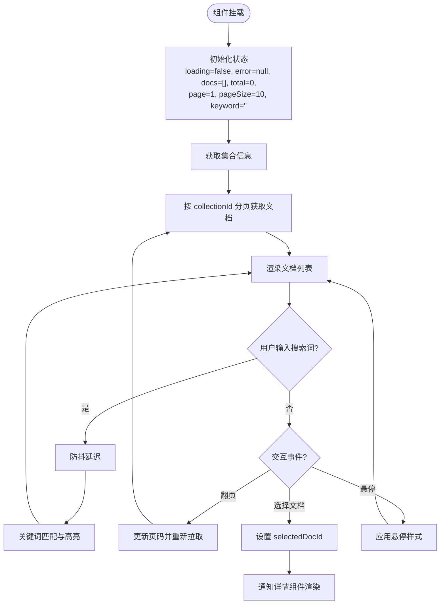
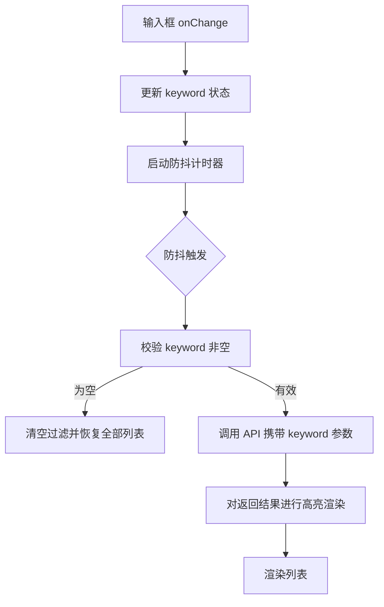
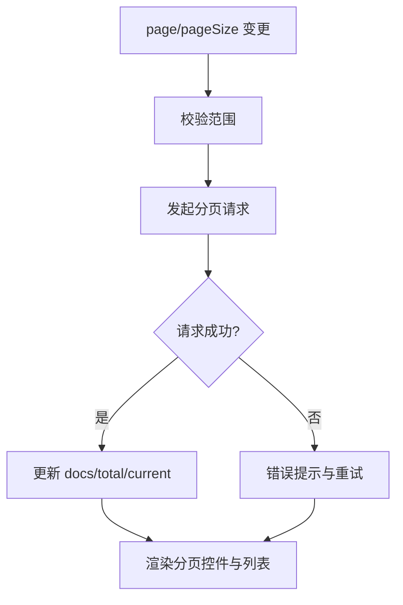
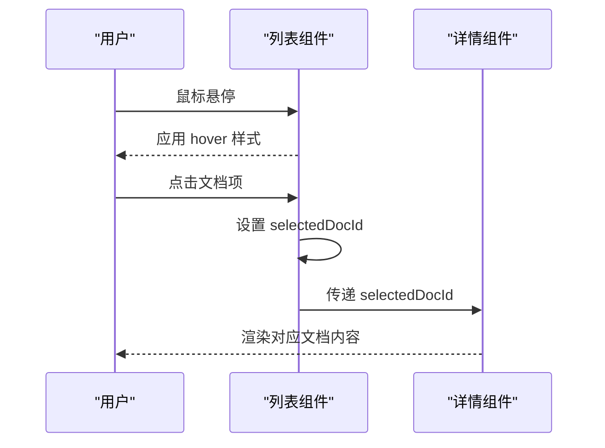
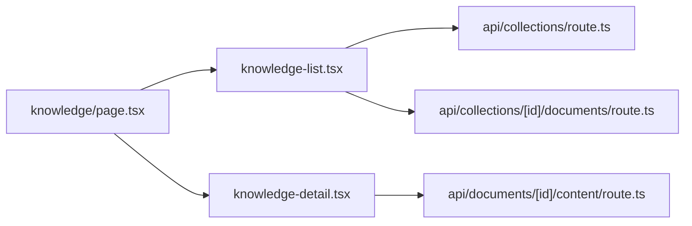

# 知识库列表组件

<cite>
**本文档引用的文件**
- [knowledge-list.tsx](file://app/components/knowledge-list.tsx)
- [knowledge-detail.tsx](file://app/components/knowledge-detail.tsx)
- [knowledge-sidebar.tsx](file://app/components/knowledge-sidebar.tsx)
- [page.tsx](file://app/knowledge/page.tsx)
- [page.module.css](file://app/knowledge/page.module.css)
- [route.ts](file://app/api/collections/route.ts)
- [route.ts](file://app/api/collections/[id]/documents/route.ts)
- [route.ts](file://app/api/documents/[id]/content/route.ts)
</cite>

## 目录
1. [简介](#简介)
2. [项目结构](#项目结构)
3. [核心组件](#核心组件)
4. [架构总览](#架构总览)
5. [详细组件分析](#详细组件分析)
6. [依赖关系分析](#依赖关系分析)
7. [性能考虑](#性能考虑)
8. [故障排查指南](#故障排查指南)
9. [结论](#结论)
10. [附录](#附录)

## 简介
本文件面向 RAG_Front 的知识库列表组件，系统性说明文档列表的渲染逻辑、数据绑定与状态管理；阐述搜索过滤的实现原理（关键词匹配、实时搜索、结果高亮）；详述分页配置与使用（页码计算、数据加载、性能优化）；解释列表项交互行为（点击跳转、悬停效果、选中状态）；并提供自定义样式与布局指南以及数据验证与错误处理方案。目标是帮助开发者快速理解并扩展该组件的功能。

## 项目结构
RAG_Front 采用 Next.js App Router 组织前端代码，知识库相关的前端组件位于 app/components 与 app/knowledge 目录，API 路由位于 app/api。知识库列表组件由页面容器与 UI 组件共同组成：
- 页面容器：负责路由、参数解析、初始数据获取与整体布局
- 列表组件：负责文档列表渲染、搜索过滤、分页控制与交互
- 详情侧边栏/详情页：用于展示选中文档的详细内容
- API 路由：提供集合与文档内容的服务端接口

图表来源
- [page.tsx](file://app/knowledge/page.tsx)
- [knowledge-list.tsx](file://app/components/knowledge-list.tsx)
- [knowledge-detail.tsx](file://app/components/knowledge-detail.tsx)
- [knowledge-sidebar.tsx](file://app/components/knowledge-sidebar.tsx)
- [route.ts](file://app/api/collections/route.ts)
- [route.ts](file://app/api/collections/[id]/documents/route.ts)
- [route.ts](file://app/api/documents/[id]/content/route.ts)

章节来源
- [page.tsx](file://app/knowledge/page.tsx)
- [knowledge-list.tsx](file://app/components/knowledge-list.tsx)
- [knowledge-detail.tsx](file://app/components/knowledge-detail.tsx)
- [knowledge-sidebar.tsx](file://app/components/knowledge-sidebar.tsx)
- [route.ts](file://app/api/collections/route.ts)
- [route.ts](file://app/api/collections/[id]/documents/route.ts)
- [route.ts](file://app/api/documents/[id]/content/route.ts)

## 核心组件
- 知识库列表组件：承载文档列表渲染、搜索过滤、分页控制与交互事件
- 知识库详情组件：承载选中文档的内容展示与操作
- 知识库侧边栏组件：承载导航与上下文切换
- 页面容器：负责路由参数、查询条件、分页与搜索状态的初始化与传递

章节来源
- [knowledge-list.tsx](file://app/components/knowledge-list.tsx)
- [knowledge-detail.tsx](file://app/components/knowledge-detail.tsx)
- [knowledge-sidebar.tsx](file://app/components/knowledge-sidebar.tsx)
- [page.tsx](file://app/knowledge/page.tsx)

## 架构总览
知识库列表组件采用“页面容器 + 可复用组件”的分层架构：
- 页面容器负责 URL 查询参数与本地状态同步，驱动列表与详情组件
- 列表组件通过 API 路由拉取集合与文档数据，维护本地搜索与分页状态
- 详情组件根据选中的文档 ID 请求内容并渲染
- API 路由提供集合列表、按集合分页获取文档、按文档 ID 获取内容等能力

图表来源
- [page.tsx](file://app/knowledge/page.tsx)
- [knowledge-list.tsx](file://app/components/knowledge-list.tsx)
- [knowledge-detail.tsx](file://app/components/knowledge-detail.tsx)
- [route.ts](file://app/api/collections/route.ts)
- [route.ts](file://app/api/collections/[id]/documents/route.ts)
- [route.ts](file://app/api/documents/[id]/content/route.ts)

## 详细组件分析

### 列表组件：渲染逻辑、数据绑定与状态管理
- 渲染逻辑
  - 接收集合 ID、当前页码、每页大小、搜索关键词等 props
  - 根据分页参数调用 API 获取文档列表，将返回的数据映射为列表项
  - 对搜索结果进行关键词匹配与高亮显示
- 数据绑定
  - 使用受控输入绑定搜索关键词，触发防抖后发起搜索请求
  - 使用受控状态管理当前页码、每页大小、排序字段等
  - 将选中文档 ID 提升到父级或共享状态，供详情组件使用
- 状态管理
  - 本地状态：loading、error、docs、total、page、pageSize、keyword、selectedDocId
  - 副作用：当 page、pageSize、keyword、collectionId 变化时重新拉取数据
  - 错误处理：网络异常、空结果、权限不足等统一提示

章节来源
- [knowledge-list.tsx](file://app/components/knowledge-list.tsx)

### 搜索过滤：关键词匹配、实时搜索与结果高亮
- 关键词匹配
  - 基于后端分页接口支持关键词过滤时，优先在后端执行匹配，减少前端计算量
  - 若仅在前端过滤，则对标题、摘要、标签等字段进行大小写不敏感匹配
- 实时搜索
  - 使用防抖策略避免频繁请求，典型延迟 300ms
  - 在防抖回调中重置页码为第一页并触发数据刷新
- 结果高亮
  - 对匹配的关键词片段进行包裹标记，配合 CSS 实现背景色或加粗高亮
  - 注意 XSS 防护，避免直接插入未转义的 HTML

章节来源
- [knowledge-list.tsx](file://app/components/knowledge-list.tsx)

### 分页功能：配置与使用、页码计算、数据加载与性能优化
- 配置项
  - pageSize：每页条数，默认 10，支持动态调整
  - total：总记录数，用于计算总页数
  - current：当前页码，从 URL 查询参数或本地状态同步
- 页码计算
  - 总页数 = Math.ceil(total / pageSize)
  - 边界保护：current 限制在 [1, totalPages]
- 数据加载
  - 当 page、pageSize、keyword、collectionId 任一变化时触发数据拉取
  - 首次加载与翻页均显示 loading 骨架屏
- 性能优化
  - 后端分页优先，避免全量拉取
  - 前端缓存最近一次请求结果，减少重复请求
  - 虚拟滚动（可选）：当单页条目较多时启用

章节来源
- [knowledge-list.tsx](file://app/components/knowledge-list.tsx)

### 列表项交互：点击跳转、悬停效果与选中状态
- 点击跳转
  - 点击列表项设置 selectedDocId，并触发详情面板或路由跳转
  - 支持在新窗口打开或嵌入侧边栏展示
- 悬停效果
  - 使用 CSS :hover 或类名切换实现阴影、背景色变化
  - 动画过渡时长建议 150-250ms，保持流畅
- 选中状态
  - 通过 selectedDocId 与当前项 id 对比，添加选中样式
  - 选中态需与键盘导航（上下键）联动，提升无障碍体验

章节来源
- [knowledge-list.tsx](file://app/components/knowledge-list.tsx)
- [knowledge-detail.tsx](file://app/components/knowledge-detail.tsx)

### 自定义样式与布局指南
- 主题与变量
  - 使用 CSS Modules 或 Tailwind 类名统一管理颜色、字号、间距
  - 定义列表项高度、行高、圆角、阴影等基础样式变量
- 布局模式
  - 卡片式：适合强调封面图与摘要
  - 表格式：适合批量管理与排序筛选
  - 瀑布流：适合图片为主的文档集合
- 响应式适配
  - 移动端隐藏次要列，保留标题与摘要
  - 分页控件在小屏下简化为上一页/下一页

章节来源
- [page.module.css](file://app/knowledge/page.module.css)

### 数据验证与错误处理
- 输入验证
  - 对 collectionId、page、pageSize、keyword 进行类型与范围校验
  - 非法值回退到默认值并提示
- 错误处理
  - 网络错误：显示重试按钮与错误消息
  - 空结果：展示空状态引导（如创建文档或调整搜索词）
  - 权限错误：提示登录或申请权限
- 容错机制
  - 请求超时与重试策略
  - 降级渲染：失败时显示占位符

章节来源
- [knowledge-list.tsx](file://app/components/knowledge-list.tsx)

## 依赖关系分析
- 组件依赖
  - 列表组件依赖 API 路由获取集合与文档数据
  - 详情组件依赖文档内容 API
  - 页面容器协调列表与详情组件的状态同步
- API 依赖
  - collections：获取集合元信息
  - collections/[id]/documents：按集合分页获取文档
  - documents/[id]/content：获取文档正文

图表来源
- [knowledge-list.tsx](file://app/components/knowledge-list.tsx)
- [knowledge-detail.tsx](file://app/components/knowledge-detail.tsx)
- [page.tsx](file://app/knowledge/page.tsx)
- [route.ts](file://app/api/collections/route.ts)
- [route.ts](file://app/api/collections/[id]/documents/route.ts)
- [route.ts](file://app/api/documents/[id]/content/route.ts)

章节来源
- [knowledge-list.tsx](file://app/components/knowledge-list.tsx)
- [knowledge-detail.tsx](file://app/components/knowledge-detail.tsx)
- [page.tsx](file://app/knowledge/page.tsx)
- [route.ts](file://app/api/collections/route.ts)
- [route.ts](file://app/api/collections/[id]/documents/route.ts)
- [route.ts](file://app/api/documents/[id]/content/route.ts)

## 性能考虑
- 请求优化
  - 使用后端分页与关键词过滤，减少数据传输
  - 合理设置 pageSize，避免单次过大负载
  - 对相同参数的请求进行去重与缓存
- 渲染优化
  - 列表项虚拟化（长列表场景）
  - 懒加载详情内容，按需请求
  - 使用 React.memo 或 useMemo/useCallback 减少重渲染
- 用户体验
  - 骨架屏与占位图提升感知速度
  - 防抖与节流降低频繁操作带来的抖动

[本节为通用指导，无需特定文件引用]

## 故障排查指南
- 常见问题
  - 列表不更新：检查 page/pageSize/keyword 状态是否变化且正确传递
  - 搜索无结果：确认后端是否支持关键词过滤，或前端过滤逻辑是否正确
  - 分页异常：校验 total 与 pageSize 计算，确保 current 边界保护
  - 详情空白：检查文档 ID 是否正确，API 是否返回内容
- 调试建议
  - 打印关键状态与请求参数
  - 使用浏览器网络面板查看 API 响应
  - 逐步注释定位问题模块

章节来源
- [knowledge-list.tsx](file://app/components/knowledge-list.tsx)
- [knowledge-detail.tsx](file://app/components/knowledge-detail.tsx)

## 结论
知识库列表组件通过清晰的页面容器与组件分层，实现了文档列表的渲染、搜索过滤、分页与交互。结合后端 API 的分页与过滤能力，保证了良好的性能与可扩展性。开发者可根据业务需求灵活定制样式与布局，并通过完善的数据验证与错误处理提升用户体验。

[本节为总结，无需特定文件引用]

## 附录
- 术语表
  - 集合：一组文档的逻辑分组
  - 分页：按页拉取数据以减轻负载
  - 防抖：延迟执行函数以减少频繁触发
- 最佳实践
  - 始终在后端执行分页与过滤
  - 对用户输入进行严格校验与转义
  - 提供友好的空状态与错误提示

[本节为补充信息，无需特定文件引用]