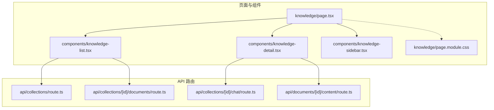
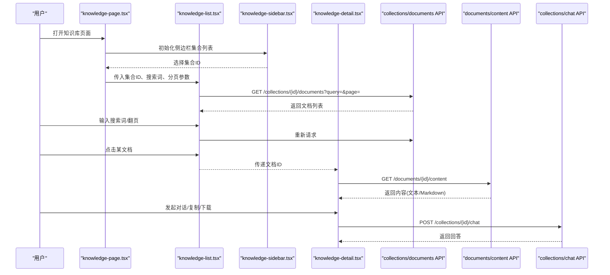
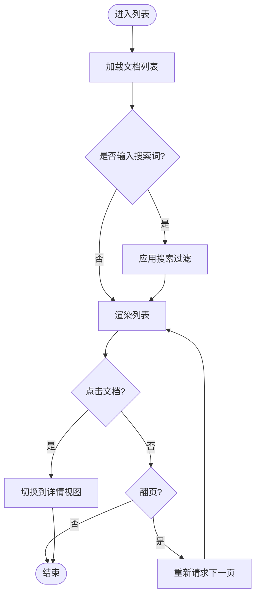
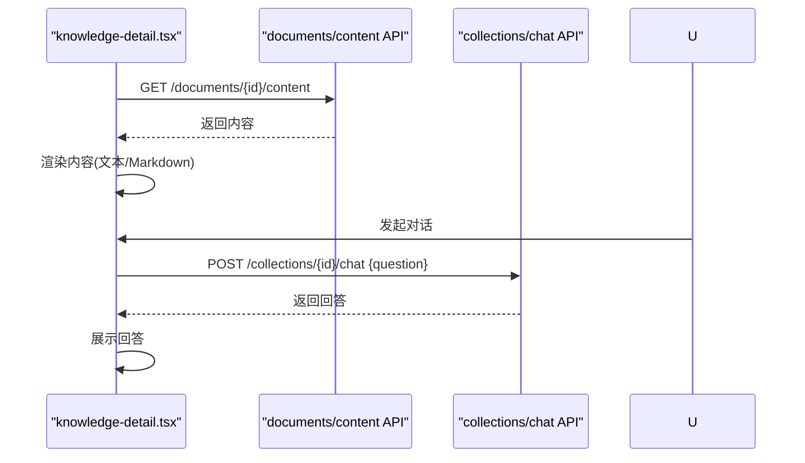
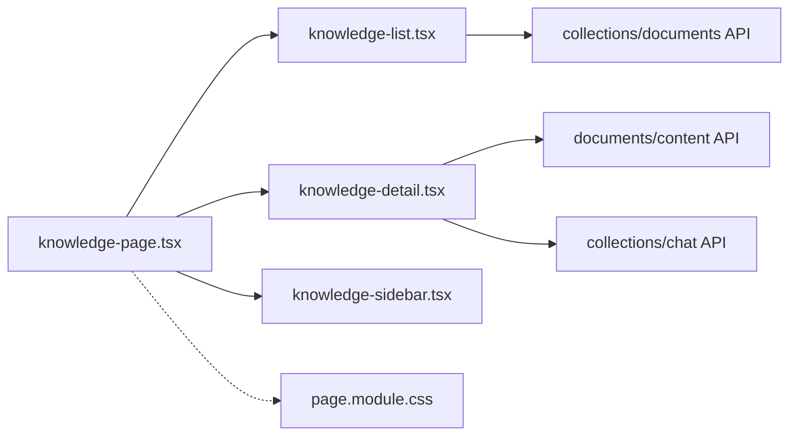

# 知识库管理

<cite>
**本文引用的文件**   
- [page.tsx](file://app/knowledge/page.tsx)
- [knowledge-list.tsx](file://app/components/knowledge-list.tsx)
- [knowledge-detail.tsx](file://app/components/knowledge-detail.tsx)
- [knowledge-sidebar.tsx](file://app/components/knowledge-sidebar.tsx)
- [page.module.css](file://app/knowledge/page.module.css)
- [route.ts](file://app/api/collections/route.ts)
- [route.ts](file://app/api/collections/[id]/documents/route.ts)
- [route.ts](file://app/api/collections/[id]/chat/route.ts)
- [route.ts](file://app/api/documents/[id]/content/route.ts)
</cite>

## 目录
1. [简介](#简介)
2. [项目结构](#项目结构)
3. [核心组件](#核心组件)
4. [架构总览](#架构总览)
5. [详细组件分析](#详细组件分析)
6. [依赖关系分析](#依赖关系分析)
7. [性能考虑](#性能考虑)
8. [故障排查指南](#故障排查指南)
9. [结论](#结论)
10. [附录：接口与使用示例](#附录接口与使用示例)

## 简介
本文件为 RAG_Front 的知识库管理系统提供全面文档，覆盖以下目标：
- 知识库的核心功能：文档列表展示、详情查看、侧边栏导航等。
- 深入分析 knowledge-page.tsx 的主页面逻辑：数据获取、状态管理与用户交互。
- 说明 knowledge-list 组件的文档列表渲染、搜索过滤与分页功能。
- 描述 knowledge-detail 组件的内容展示、格式支持与交互操作。
- 解释 knowledge-sidebar 组件的导航逻辑与状态同步。
- 包含 CSS 样式定制选项与响应式设计实现。
- 提供知识库数据的 CRUD 操作接口说明与使用示例。

## 项目结构
知识库模块采用 Next.js App Router 组织，前端页面与组件位于 app 目录下，API 路由位于 app/api 下。核心文件如下：
- 页面入口：app/knowledge/page.tsx
- 组件：app/components/knowledge-list.tsx、knowledge-detail.tsx、knowledge-sidebar.tsx
- 样式：app/knowledge/page.module.css
- API 路由：collections、documents 相关 route.ts

图表来源
- [page.tsx](file://app/knowledge/page.tsx)
- [knowledge-list.tsx](file://app/components/knowledge-list.tsx)
- [knowledge-detail.tsx](file://app/components/knowledge-detail.tsx)
- [knowledge-sidebar.tsx](file://app/components/knowledge-sidebar.tsx)
- [page.module.css](file://app/knowledge/page.module.css)
- [route.ts](file://app/api/collections/route.ts)
- [route.ts](file://app/api/collections/[id]/documents/route.ts)
- [route.ts](file://app/api/collections/[id]/chat/route.ts)
- [route.ts](file://app/api/documents/[id]/content/route.ts)

章节来源
- [page.tsx](file://app/knowledge/page.tsx)
- [knowledge-list.tsx](file://app/components/knowledge-list.tsx)
- [knowledge-detail.tsx](file://app/components/knowledge-detail.tsx)
- [knowledge-sidebar.tsx](file://app/components/knowledge-sidebar.tsx)
- [page.module.css](file://app/knowledge/page.module.css)
- [route.ts](file://app/api/collections/route.ts)
- [route.ts](file://app/api/collections/[id]/documents/route.ts)
- [route.ts](file://app/api/collections/[id]/chat/route.ts)
- [route.ts](file://app/api/documents/[id]/content/route.ts)

## 核心组件
- knowledge-page.tsx：主页面容器，负责聚合子组件、维护全局状态（如当前集合、搜索词、分页参数）、处理用户交互并协调数据获取。
- knowledge-list.tsx：文档列表渲染，支持关键词搜索、筛选、分页；与 collections/documents API 交互。
- knowledge-detail.tsx：文档详情展示，支持富文本/Markdown 渲染、复制、下载、对话问答等交互；通过 documents/[id]/content 获取内容。
- knowledge-sidebar.tsx：侧边栏导航，展示集合列表或分类，点击切换当前集合，保持与主页面状态同步。

章节来源
- [page.tsx](file://app/knowledge/page.tsx)
- [knowledge-list.tsx](file://app/components/knowledge-list.tsx)
- [knowledge-detail.tsx](file://app/components/knowledge-detail.tsx)
- [knowledge-sidebar.tsx](file://app/components/knowledge-sidebar.tsx)

## 架构总览
知识库系统采用“页面容器 + 功能组件 + API 路由”的分层架构。页面容器负责状态与流程编排，功能组件专注 UI 与交互，API 路由封装后端能力。

图表来源
- [page.tsx](file://app/knowledge/page.tsx)
- [knowledge-list.tsx](file://app/components/knowledge-list.tsx)
- [knowledge-detail.tsx](file://app/components/knowledge-detail.tsx)
- [knowledge-sidebar.tsx](file://app/components/knowledge-sidebar.tsx)
- [route.ts](file://app/api/collections/[id]/documents/route.ts)
- [route.ts](file://app/api/documents/[id]/content/route.ts)
- [route.ts](file://app/api/collections/[id]/chat/route.ts)

## 详细组件分析

### knowledge-page.tsx（主页面）
- 职责
  - 聚合 knowledge-list、knowledge-detail、knowledge-sidebar。
  - 维护全局状态：当前集合 ID、搜索关键词、分页参数、选中文档 ID、加载状态、错误信息。
  - 处理用户交互：切换集合、更新搜索词、翻页、选择文档、触发对话。
  - 协调数据流：根据状态变化调用相应 API 获取数据。
- 数据获取
  - 当集合或搜索条件变化时，调用 collections/documents API 拉取文档列表。
  - 当选中文档变化时，调用 documents/[id]/content 获取详细内容。
- 状态管理
  - 使用 React 状态管理集合、搜索、分页、选中文档、加载与错误。
  - 副作用处理：在依赖项变化时触发数据获取，避免重复请求。
- 用户交互
  - 侧边栏切换集合，更新主页面状态并刷新列表。
  - 列表页搜索与分页，实时或延迟触发查询。
  - 详情页交互：复制内容、下载文件、发起对话。

章节来源
- [page.tsx](file://app/knowledge/page.tsx)

### knowledge-list.tsx（文档列表）
- 渲染
  - 接收集合 ID、搜索词、分页参数作为 props。
  - 渲染文档卡片，显示标题、摘要、更新时间等关键信息。
- 搜索与过滤
  - 支持关键词搜索，可结合集合维度进行过滤。
  - 可选按时间、类型等维度筛选（由 API 支持）。
- 分页
  - 支持页码切换与每页条数设置。
  - 与 API 约定 page、pageSize 等参数。
- 交互
  - 点击文档跳转到详情或内联展开详情。
  - 支持批量操作（如删除、导出），视 API 能力而定。

图表来源
- [knowledge-list.tsx](file://app/components/knowledge-list.tsx)
- [route.ts](file://app/api/collections/[id]/documents/route.ts)

章节来源
- [knowledge-list.tsx](file://app/components/knowledge-list.tsx)
- [route.ts](file://app/api/collections/[id]/documents/route.ts)

### knowledge-detail.tsx（文档详情）
- 内容展示
  - 支持纯文本与 Markdown 渲染，自动适配代码高亮与链接跳转。
  - 提供元数据展示：创建时间、作者、标签等。
- 格式支持
  - 文本、Markdown、代码块、表格、图片等常见格式。
  - 对超长内容进行懒加载或分段渲染以提升性能。
- 交互操作
  - 复制全文、下载原文、打印预览。
  - 基于集合的对话问答，调用 collections/chat API 生成回答。
  - 收藏、分享、反馈等功能（视需求扩展）。

图表来源
- [knowledge-detail.tsx](file://app/components/knowledge-detail.tsx)
- [route.ts](file://app/api/documents/[id]/content/route.ts)
- [route.ts](file://app/api/collections/[id]/chat/route.ts)

章节来源
- [knowledge-detail.tsx](file://app/components/knowledge-detail.tsx)
- [route.ts](file://app/api/documents/[id]/content/route.ts)
- [route.ts](file://app/api/collections/[id]/chat/route.ts)

### knowledge-sidebar.tsx（侧边栏导航）
- 导航逻辑
  - 展示集合列表，支持新增、编辑、删除集合（若权限允许）。
  - 点击集合项切换当前集合，并向父组件发送事件以更新主页面状态。
- 状态同步
  - 与 knowledge-page.tsx 的状态双向同步：选中集合、搜索词、分页参数。
  - 支持快捷键或键盘导航提升可用性。
- 响应式
  - 移动端折叠为抽屉式菜单，桌面端固定侧栏。

章节来源
- [knowledge-sidebar.tsx](file://app/components/knowledge-sidebar.tsx)
- [page.tsx](file://app/knowledge/page.tsx)

## 依赖关系分析
- 组件耦合
  - knowledge-page.tsx 作为容器，低耦合地组合三个功能组件。
  - knowledge-list.tsx 与 knowledge-detail.tsx 通过 props 和事件通信，避免直接依赖。
- API 依赖
  - 列表与详情分别依赖不同的 API 路由，便于独立扩展与维护。
  - 对话功能通过集合维度的 chat API 提供上下文。
- 样式依赖
  - 使用模块化 CSS（page.module.css）隔离样式，避免全局污染。

图表来源
- [page.tsx](file://app/knowledge/page.tsx)
- [knowledge-list.tsx](file://app/components/knowledge-list.tsx)
- [knowledge-detail.tsx](file://app/components/knowledge-detail.tsx)
- [knowledge-sidebar.tsx](file://app/components/knowledge-sidebar.tsx)
- [page.module.css](file://app/knowledge/page.module.css)
- [route.ts](file://app/api/collections/[id]/documents/route.ts)
- [route.ts](file://app/api/documents/[id]/content/route.ts)
- [route.ts](file://app/api/collections/[id]/chat/route.ts)

章节来源
- [page.tsx](file://app/knowledge/page.tsx)
- [knowledge-list.tsx](file://app/components/knowledge-list.tsx)
- [knowledge-detail.tsx](file://app/components/knowledge-detail.tsx)
- [knowledge-sidebar.tsx](file://app/components/knowledge-sidebar.tsx)
- [page.module.css](file://app/knowledge/page.module.css)
- [route.ts](file://app/api/collections/[id]/documents/route.ts)
- [route.ts](file://app/api/documents/[id]/content/route.ts)
- [route.ts](file://app/api/collections/[id]/chat/route.ts)

## 性能考虑
- 列表分页与懒加载：减少首屏数据量，按需加载后续内容。
- 搜索防抖：避免频繁请求，提升用户体验。
- 详情内容分段渲染：对大文档进行分片渲染，降低内存占用。
- 缓存策略：对静态资源与常用集合列表做客户端缓存。
- 骨架屏与占位符：提升感知性能。

[本节为通用指导，不直接分析具体文件]

## 故障排查指南
- 常见问题
  - 列表为空：检查集合 ID 是否正确、API 返回状态码、网络连通性。
  - 详情无法加载：确认文档 ID 存在、content API 权限、内容格式支持。
  - 搜索无结果：核对搜索词与后端字段映射、大小写敏感性与停用词。
  - 对话失败：检查集合上下文、消息体格式、后端模型配置。
- 调试建议
  - 打开浏览器开发者工具，查看 Network 面板的请求与响应。
  - 在控制台输出关键状态变量，定位状态同步问题。
  - 逐步注释组件逻辑，缩小问题范围。

章节来源
- [knowledge-list.tsx](file://app/components/knowledge-list.tsx)
- [knowledge-detail.tsx](file://app/components/knowledge-detail.tsx)
- [knowledge-sidebar.tsx](file://app/components/knowledge-sidebar.tsx)
- [page.tsx](file://app/knowledge/page.tsx)

## 结论
知识库管理系统通过清晰的组件分层与 API 解耦，实现了文档列表、详情展示与侧边导航的完整闭环。配合模块化样式与响应式布局，具备良好的可扩展性与用户体验。建议在后续迭代中加强缓存、错误边界与无障碍支持。

[本节为总结性内容，不直接分析具体文件]

## 附录：接口与使用示例
以下为知识库相关 API 的概要与使用示例（方法、路径、主要参数与返回说明）：

- 获取集合下的文档列表
  - 方法：GET
  - 路径：/api/collections/{id}/documents
  - 查询参数：query（搜索关键词）、page（页码）、pageSize（每页数量）
  - 返回：文档列表（含 id、title、summary、updatedAt 等）
  - 使用示例：fetch("/api/collections/123/documents?query=RAG&page=1&pageSize=20")

- 获取文档内容
  - 方法：GET
  - 路径：/api/documents/{id}/content
  - 返回：内容字符串（文本或 Markdown）
  - 使用示例：fetch("/api/documents/456/content")

- 集合对话问答
  - 方法：POST
  - 路径：/api/collections/{id}/chat
  - 请求体：{ question: string }
  - 返回：{ answer: string }
  - 使用示例：fetch("/api/collections/123/chat", { method: "POST", body: JSON.stringify({ question: "什么是RAG？" }) })

- 集合基础操作（CRUD）
  - 方法：GET/POST/PUT/DELETE
  - 路径：/api/collections
  - 用途：列出集合、新增集合、更新集合、删除集合
  - 使用示例：
    - 获取集合列表：fetch("/api/collections")
    - 新增集合：fetch("/api/collections", { method: "POST", body: JSON.stringify({ name: "技术文档" }) })

注意：
- 所有接口需遵循统一的鉴权与错误码规范（由后端定义）。
- 前端应处理加载态、错误态与空数据态，保证用户体验。
- 对于大文档内容，建议分页或流式传输以减少首屏压力。

章节来源
- [route.ts](file://app/api/collections/route.ts)
- [route.ts](file://app/api/collections/[id]/documents/route.ts)
- [route.ts](file://app/api/collections/[id]/chat/route.ts)
- [route.ts](file://app/api/documents/[id]/content/route.ts)