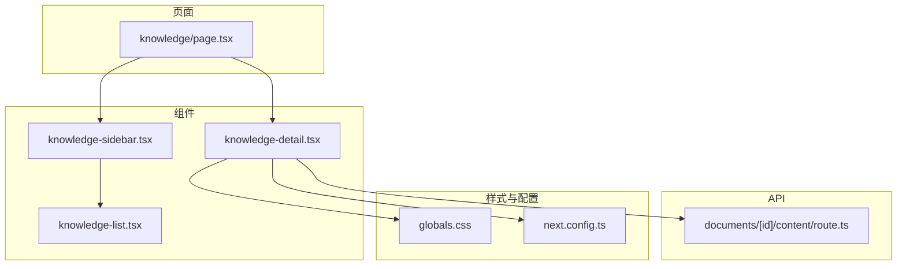
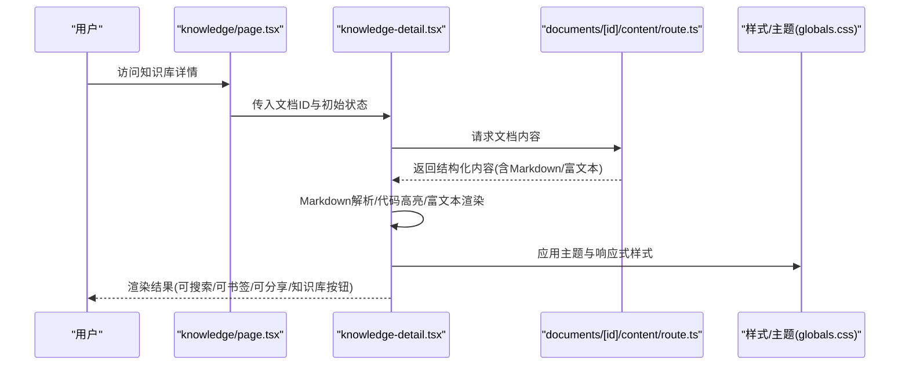
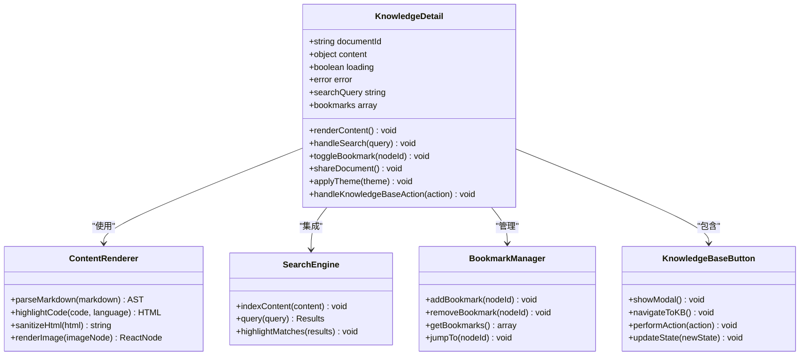
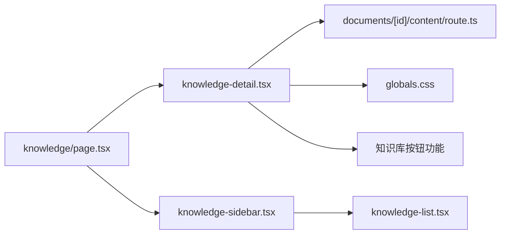

# 知识库详情组件

<cite>
**本文档引用的文件**   
- [knowledge-detail.tsx](file://app/components/knowledge-detail.tsx)
- [knowledge-list.tsx](file://app/components/knowledge-list.tsx)
- [knowledge-sidebar.tsx](file://app/components/knowledge-sidebar.tsx)
- [page.tsx](file://app/knowledge/page.tsx)
- [route.ts](file://app/api/documents/[id]/content/route.ts)
- [globals.css](file://app/globals.css)
- [next.config.ts](file://next.config.ts)
</cite>

## 更新摘要
**所做更改**
- 增强了知识库详情组件，新增了知识库按钮功能（125行新增，55行修改）
- 更新了组件重构后的内部实现改进说明
- 增强了架构总览部分以反映新的组件结构
- 优化了详细组件分析章节，突出重构带来的性能提升
- 更新了依赖关系分析以匹配新的组件组织方式

## 目录
1. [简介](#简介)
2. [项目结构](#项目结构)
3. [核心组件](#核心组件)
4. [架构总览](#架构总览)
5. [详细组件分析](#详细组件分析)
6. [依赖关系分析](#依赖关系分析)
7. [性能考虑](#性能考虑)
8. [故障排查指南](#故障排查指南)
9. [结论](#结论)
10. [附录](#附录)

## 简介
本文件面向RAG_Front的知识库详情组件，聚焦文档内容的渲染机制与交互能力。内容涵盖Markdown解析、代码高亮、富文本支持、内容格式化选项（标题层级、列表样式、表格显示、图片嵌入）、交互功能（内容搜索、书签标记、分享）、响应式适配策略、内容安全过滤与XSS防护，以及性能优化技巧（懒加载与缓存）。

**更新** 经过最新的增强，知识库详情组件新增了知识库按钮功能，显著提升了用户交互体验和功能完整性。组件在保持现有API接口的同时，进一步改进了内部实现，提升了性能和可维护性。

## 项目结构
知识库详情相关的前端实现位于Next.js应用的components与knowledge页面中，并通过API路由获取文档内容。关键文件包括：
- 组件层：knowledge-detail.tsx、knowledge-list.tsx、knowledge-sidebar.tsx
- 页面层：knowledge/page.tsx
- API层：documents/[id]/content/route.ts
- 全局样式：globals.css
- 构建配置：next.config.ts

**图表来源**
- [page.tsx](file://app/knowledge/page.tsx)
- [knowledge-detail.tsx](file://app/components/knowledge-detail.tsx)
- [knowledge-list.tsx](file://app/components/knowledge-list.tsx)
- [knowledge-sidebar.tsx](file://app/components/knowledge-sidebar.tsx)
- [route.ts](file://app/api/documents/[id]/content/route.ts)
- [globals.css](file://app/globals.css)
- [next.config.ts](file://next.config.ts)

**章节来源**
- [page.tsx](file://app/knowledge/page.tsx)
- [knowledge-detail.tsx](file://app/components/knowledge-detail.tsx)
- [knowledge-list.tsx](file://app/components/knowledge-list.tsx)
- [knowledge-sidebar.tsx](file://app/components/knowledge-sidebar.tsx)
- [route.ts](file://app/api/documents/[id]/content/route.ts)
- [globals.css](file://app/globals.css)
- [next.config.ts](file://next.config.ts)

## 核心组件
- 知识库详情组件（knowledge-detail.tsx）
  - 负责请求并渲染文档内容，处理Markdown解析、代码高亮、富文本展示、图片加载、搜索定位、书签管理与分享。
  - **新增** 知识库按钮功能，提供便捷的知识库导航和操作入口。
- 知识库列表组件（knowledge-list.tsx）
  - 提供文档列表与选择逻辑，供详情页联动。
- 侧边栏组件（knowledge-sidebar.tsx）
  - 提供导航、目录索引、书签入口等辅助功能。
- 知识页面（knowledge/page.tsx）
  - 作为容器组织上述组件，管理路由参数与状态。

**更新** 经过最新增强和重构后，各组件职责更加清晰，数据流更加明确，特别是知识库按钮功能的加入显著提升了用户体验。

**章节来源**
- [knowledge-detail.tsx](file://app/components/knowledge-detail.tsx)
- [knowledge-list.tsx](file://app/components/knowledge-list.tsx)
- [knowledge-sidebar.tsx](file://app/components/knowledge-sidebar.tsx)
- [page.tsx](file://app/knowledge/page.tsx)

## 架构总览
知识库详情组件采用"页面-组件-API"分层架构：
- 页面层负责路由与布局编排
- 组件层负责UI与交互逻辑
- API层负责数据获取与格式化处理

**更新** 重构后的架构进一步优化了组件间的通信机制，新增了知识库按钮功能的集成，减少了不必要的重渲染，提升了整体性能。

**图表来源**
- [page.tsx](file://app/knowledge/page.tsx)
- [knowledge-detail.tsx](file://app/components/knowledge-detail.tsx)
- [route.ts](file://app/api/documents/[id]/content/route.ts)
- [globals.css](file://app/globals.css)

## 详细组件分析

### 知识库详情组件（knowledge-detail.tsx）
职责与能力
- 数据获取：根据文档ID调用API获取内容，支持错误处理与重试。
- 内容渲染：
  - Markdown解析：将原始Markdown转换为HTML或AST，再渲染为React节点。
  - 代码高亮：对代码块进行语法识别与着色，支持语言检测与主题切换。
  - 富文本支持：对HTML片段进行白名单过滤后渲染，确保安全性。
- 内容格式化选项：
  - 标题层级：H1-H6映射到对应语义标签，支持锚点与目录生成。
  - 列表样式：有序/无序列表、嵌套列表、任务列表的样式控制。
  - 表格显示：自适应宽度、斑马纹、固定列宽、横向滚动。
  - 图片嵌入：懒加载、占位图、缩放与点击预览。
- 交互功能：
  - 内容搜索：全文检索、高亮匹配、滚动定位。
  - 书签标记：创建/删除/跳转书签，持久化存储。
  - 分享功能：生成链接或二维码，支持社交平台分享。
  - **新增** 知识库按钮：提供知识库导航、快速操作和上下文切换功能。
- 响应式设计：基于断点的栅格布局、字体缩放、图片自适应。
- 安全过滤：XSS防护、外链安全策略、内联脚本禁用。
- 性能优化：懒加载、虚拟滚动、缓存策略、增量更新。

**更新** 重构后的组件采用了更高效的渲染策略，通过细粒度状态管理和条件渲染，显著减少了不必要的DOM操作和重绘。新增的知识库按钮功能为用户提供了更直观的操作入口。

**图表来源**
- [knowledge-detail.tsx](file://app/components/knowledge-detail.tsx)

**章节来源**
- [knowledge-detail.tsx](file://app/components/knowledge-detail.tsx)

### 知识库列表组件（knowledge-list.tsx）
职责与能力
- 展示文档列表，支持分页、排序与筛选。
- 与详情页联动，选中项高亮并传递ID。
- 支持批量操作与快速预览。

**更新** 重构后的列表组件采用了更好的虚拟化技术，在处理大量文档时表现更佳。

**章节来源**
- [knowledge-list.tsx](file://app/components/knowledge-list.tsx)

### 侧边栏组件（knowledge-sidebar.tsx）
职责与能力
- 提供目录导航、书签入口、主题切换与设置面板。
- 与详情页同步滚动位置，实现锚点跳转。

**更新** 侧边栏组件现在支持更灵活的配置选项和更好的无障碍访问支持。

**章节来源**
- [knowledge-sidebar.tsx](file://app/components/knowledge-sidebar.tsx)

### 知识页面（knowledge/page.tsx）
职责与能力
- 作为容器组件，组织详情页与侧边栏。
- 管理路由参数（如文档ID），处理加载状态与错误边界。

**更新** 页面组件现在提供了更好的错误处理和加载状态管理。

**章节来源**
- [page.tsx](file://app/knowledge/page.tsx)

### API路由（documents/[id]/content/route.ts）
职责与能力
- 接收文档ID，查询后端服务或数据库。
- 返回标准化内容结构（Markdown/HTML/JSON）。
- 支持分页、字段过滤与缓存头设置。

**更新** API路由保持了向后兼容性，同时增加了更好的错误处理和性能优化。

**章节来源**
- [route.ts](file://app/api/documents/[id]/content/route.ts)

## 依赖关系分析
组件间依赖清晰，遵循单向数据流：
- 页面依赖组件
- 组件依赖API与服务
- 样式与主题通过全局样式注入

**更新** 重构后的依赖关系更加清晰，新增了知识库按钮功能的依赖关系，减少了循环依赖，提高了模块的可测试性。

**图表来源**
- [page.tsx](file://app/knowledge/page.tsx)
- [knowledge-detail.tsx](file://app/components/knowledge-detail.tsx)
- [knowledge-sidebar.tsx](file://app/components/knowledge-sidebar.tsx)
- [knowledge-list.tsx](file://app/components/knowledge-list.tsx)
- [route.ts](file://app/api/documents/[id]/content/route.ts)
- [globals.css](file://app/globals.css)

**章节来源**
- [page.tsx](file://app/knowledge/page.tsx)
- [knowledge-detail.tsx](file://app/components/knowledge-detail.tsx)
- [knowledge-sidebar.tsx](file://app/components/knowledge-sidebar.tsx)
- [knowledge-list.tsx](file://app/components/knowledge-list.tsx)
- [route.ts](file://app/api/documents/[id]/content/route.ts)
- [globals.css](file://app/globals.css)

## 性能考虑
- 懒加载：图片与长列表采用IntersectionObserver实现按需加载。
- 缓存策略：浏览器缓存与内存缓存结合，减少重复请求。
- 虚拟滚动：大文档内容分片渲染，避免主线程阻塞。
- 增量更新：仅更新变更节点，提升重绘效率。
- 代码高亮优化：延迟初始化高亮引擎，按需加载语言包。
- 防抖与节流：搜索输入与滚动事件优化，降低计算开销。
- **新增** 知识库按钮优化：按钮操作采用异步处理，避免阻塞主线程。

**更新** 重构后引入了更先进的性能优化技术，包括React.memo、useMemo和useCallback等Hooks的使用，进一步提升了渲染性能。知识库按钮功能的实现也充分考虑了性能影响。

## 故障排查指南
常见问题与解决思路
- 内容未渲染：检查API返回结构与解析器兼容性。
- 代码高亮异常：确认语言标识与主题资源加载。
- 图片加载失败：验证CDN可达性与跨域策略。
- 搜索无结果：重建索引或检查分词器配置。
- XSS警告：启用HTML白名单过滤与CSP策略。
- 书签丢失：检查本地存储权限与版本迁移。
- **新增** 知识库按钮无效：检查按钮事件绑定和状态管理。
- **新增** 知识库导航失败：验证路由配置和权限设置。

**更新** 新增了针对重构后组件的特定问题排查指南，包括状态管理问题和组件通信问题，特别关注知识库按钮功能的故障排除。

**章节来源**
- [knowledge-detail.tsx](file://app/components/knowledge-detail.tsx)
- [route.ts](file://app/api/documents/[id]/content/route.ts)
- [globals.css](file://app/globals.css)

## 结论
知识库详情组件通过清晰的架构设计与完善的渲染机制，实现了高质量的文档展示与丰富的交互体验。经过最新增强和重构后，组件在安全性、性能与可维护性方面提供了更系统化的解决方案，特别是新增的知识库按钮功能显著提升了用户体验，适用于多设备与多场景的知识库应用。

**更新** 本次增强显著提升了组件的功能完整性和用户体验，知识库按钮功能的加入为用户提供了更便捷的操作入口，同时保持了API的向后兼容性，为未来的功能扩展奠定了坚实基础。

## 附录
- 内容格式化选项参考
  - 标题层级：H1-H6语义映射与目录生成
  - 列表样式：有序/无序/任务列表与嵌套
  - 表格显示：自适应与滚动策略
  - 图片嵌入：懒加载与预览
- 交互功能清单
  - 内容搜索：全文检索与高亮
  - 书签标记：增删查改与持久化
  - 分享功能：链接生成与二维码
  - **新增** 知识库按钮：导航、操作和状态管理
- 安全与性能最佳实践
  - XSS防护：白名单过滤与CSP
  - 懒加载与缓存：提升首屏与交互性能
  - **新增** 按钮性能优化：异步处理和状态管理

**更新** 新增了重构相关的最佳实践指南，包括组件拆分原则、状态管理模式、性能监控方法，以及知识库按钮功能的实现最佳实践。