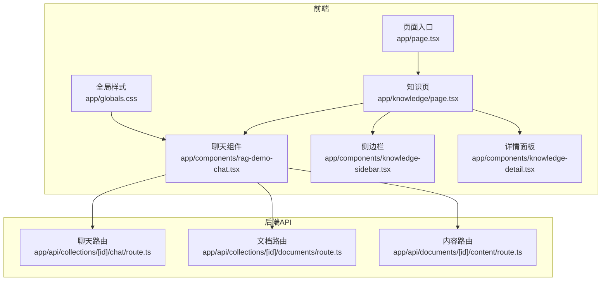
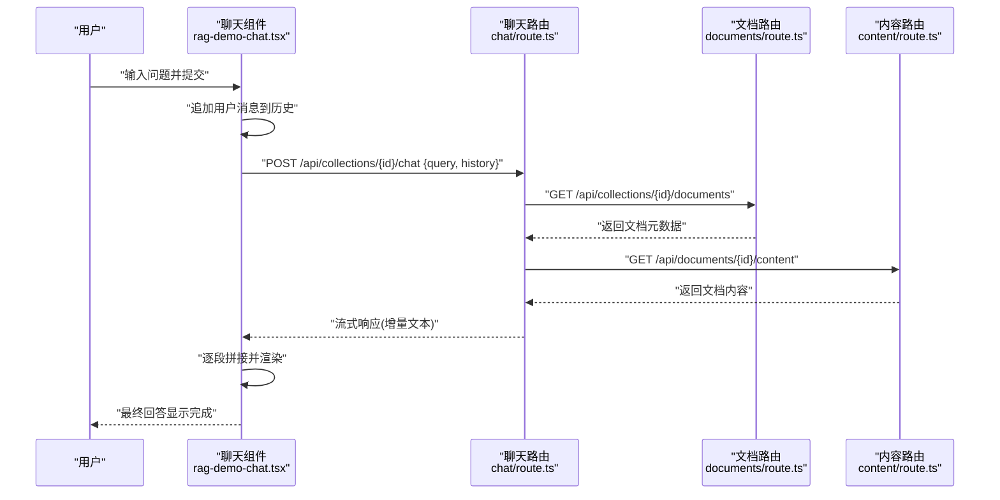
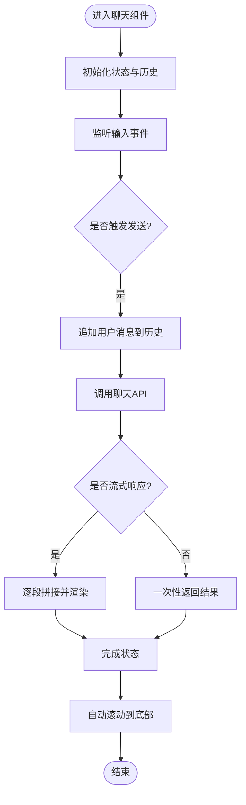
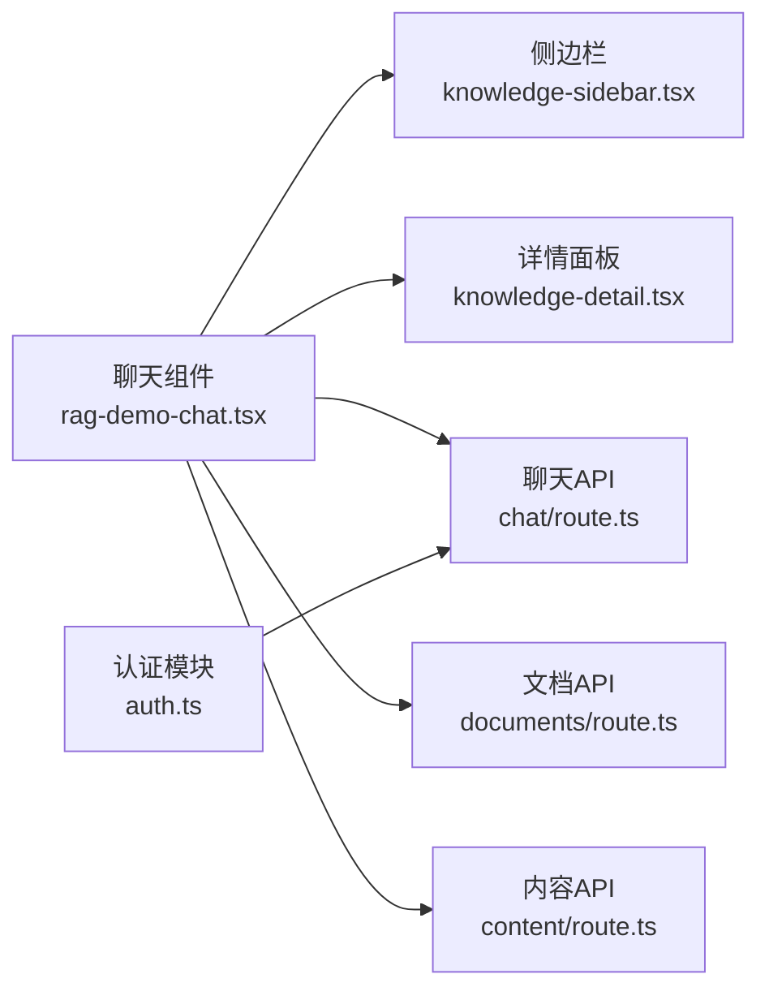

# RAG演示聊天组件

<cite>
**本文档引用的文件**
- [rag-demo-chat.tsx](file://app/components/rag-demo-chat.tsx)
- [route.ts](file://app/api/collections/[id]/chat/route.ts)
- [route.ts](file://app/api/collections/[id]/documents/route.ts)
- [route.ts](file://app/api/documents/[id]/content/route.ts)
- [page.tsx](file://app/knowledge/page.tsx)
- [knowledge-sidebar.tsx](file://app/components/knowledge-sidebar.tsx)
- [knowledge-detail.tsx](file://app/components/knowledge-detail.tsx)
- [auth.ts](file://app/lib/auth.ts)
- [layout.tsx](file://app/layout.tsx)
- [page.tsx](file://app/page.tsx)
- [globals.css](file://app/globals.css)
- [package.json](file://package.json)
</cite>

## 目录
1. [简介](#简介)
2. [项目结构](#项目结构)
3. [核心组件](#核心组件)
4. [架构总览](#架构总览)
5. [详细组件分析](#详细组件分析)
6. [依赖关系分析](#依赖关系分析)
7. [性能考虑](#性能考虑)
8. [故障排查指南](#故障排查指南)
9. [结论](#结论)
10. [附录](#附录)

## 简介
本文件为“RAG演示聊天组件”（RAG Demo Chat）的完整技术文档。该组件提供基于检索增强生成（RAG）的对话界面，支持消息输入、历史展示、流式响应与错误处理，并与后端API进行交互，实现知识库检索与AI回答的闭环。文档覆盖功能特性、消息处理流程、WebSocket连接管理、消息格式规范、配置选项、样式定制、扩展点、用户体验优化、键盘快捷键、移动端适配、消息持久化、会话管理、性能优化策略以及测试与调试方法。

## 项目结构
本项目采用Next.js应用结构，聊天组件位于前端组件目录中，相关API路由位于API目录中，页面入口与布局文件负责组合与渲染。

图表来源
- [page.tsx](file://app/page.tsx)
- [page.tsx](file://app/knowledge/page.tsx)
- [rag-demo-chat.tsx](file://app/components/rag-demo-chat.tsx)
- [knowledge-sidebar.tsx](file://app/components/knowledge-sidebar.tsx)
- [knowledge-detail.tsx](file://app/components/knowledge-detail.tsx)
- [route.ts](file://app/api/collections/[id]/chat/route.ts)
- [route.ts](file://app/api/collections/[id]/documents/route.ts)
- [route.ts](file://app/api/documents/[id]/content/route.ts)
- [globals.css](file://app/globals.css)

章节来源
- [page.tsx](file://app/page.tsx)
- [page.tsx](file://app/knowledge/page.tsx)
- [rag-demo-chat.tsx](file://app/components/rag-demo-chat.tsx)
- [knowledge-sidebar.tsx](file://app/components/knowledge-sidebar.tsx)
- [knowledge-detail.tsx](file://app/components/knowledge-detail.tsx)
- [route.ts](file://app/api/collections/[id]/chat/route.ts)
- [route.ts](file://app/api/collections/[id]/documents/route.ts)
- [route.ts](file://app/api/documents/[id]/content/route.ts)
- [globals.css](file://app/globals.css)

## 核心组件
- 聊天组件：负责用户输入、消息列表渲染、流式响应拼接、错误提示、发送状态控制、滚动定位与自动聚焦等。
- 侧边栏：用于选择或切换知识库集合，传递集合ID给聊天组件。
- 详情面板：展示当前选中集合的文档信息，辅助用户理解上下文。
- API路由：提供聊天请求、文档列表与内容获取能力，供聊天组件调用。

章节来源
- [rag-demo-chat.tsx](file://app/components/rag-demo-chat.tsx)
- [knowledge-sidebar.tsx](file://app/components/knowledge-sidebar.tsx)
- [knowledge-detail.tsx](file://app/components/knowledge-detail.tsx)
- [route.ts](file://app/api/collections/[id]/chat/route.ts)
- [route.ts](file://app/api/collections/[id]/documents/route.ts)
- [route.ts](file://app/api/documents/[id]/content/route.ts)

## 架构总览
聊天组件通过REST API与后端交互，支持流式响应（如Server-Sent Events或ReadableStream）。当用户提交问题时，组件将消息追加到本地历史，并发起请求；后端根据集合ID检索相关知识片段，结合大模型生成回答，并以流式方式逐步返回。前端实时拼接增量文本，更新UI，并在完成时标记状态。

图表来源
- [rag-demo-chat.tsx](file://app/components/rag-demo-chat.tsx)
- [route.ts](file://app/api/collections/[id]/chat/route.ts)
- [route.ts](file://app/api/collections/[id]/documents/route.ts)
- [route.ts](file://app/api/documents/[id]/content/route.ts)

## 详细组件分析

### 聊天组件（rag-demo-chat.tsx）
- 功能要点
  - 消息输入框：支持多行输入、回车发送、禁用状态下防重复提交。
  - 历史记录展示：按时间顺序渲染用户与AI消息，支持自动滚动到底部。
  - 流式响应：接收增量文本并即时更新，避免长等待。
  - 错误处理：网络异常、服务端错误、超时等场景的友好提示。
  - 状态管理：发送中、完成、失败等状态控制。
  - 键盘快捷键：Enter发送、Shift+Enter换行、Esc清空输入。
  - 移动端适配：自适应宽度、触摸友好的输入区域、软键盘遮挡处理。
  - 自定义样式：通过CSS变量或类名覆盖默认样式。
  - 扩展点：可插拔的消息处理器、渲染器、错误回调。

- 数据流
  - 用户输入 -> 本地历史追加 -> 发起API请求 -> 流式增量更新 -> 完成状态标记。

- 关键交互
  - 与侧边栏联动：选择集合后，聊天组件携带集合ID进行检索。
  - 与详情面板联动：点击某条回答可查看引用来源（若后端返回）。

图表来源
- [rag-demo-chat.tsx](file://app/components/rag-demo-chat.tsx)

章节来源
- [rag-demo-chat.tsx](file://app/components/rag-demo-chat.tsx)

### 侧边栏（knowledge-sidebar.tsx）
- 功能要点
  - 展示可用知识库集合列表。
  - 支持搜索与筛选。
  - 选中集合后将ID传递给聊天组件。

- 交互流程
  - 用户选择集合 -> 更新选中状态 -> 通知父组件 -> 聊天组件使用新集合ID。

章节来源
- [knowledge-sidebar.tsx](file://app/components/knowledge-sidebar.tsx)

### 详情面板（knowledge-detail.tsx）
- 功能要点
  - 展示选中集合的文档摘要与元数据。
  - 支持打开文档详情（可选）。

章节来源
- [knowledge-detail.tsx](file://app/components/knowledge-detail.tsx)

### 聊天API路由（chat/route.ts）
- 职责
  - 接收聊天请求（包含查询与历史）。
  - 调用文档路由获取相关文档。
  - 调用内容路由获取具体文档内容。
  - 组装检索结果与大模型提示词。
  - 以流式方式返回生成的回答。

- 错误处理
  - 参数校验失败返回400。
  - 检索失败或无结果返回404或空结果。
  - 大模型调用异常返回500。

章节来源
- [route.ts](file://app/api/collections/[id]/chat/route.ts)

### 文档路由（documents/route.ts）
- 职责
  - 列出指定集合下的文档元数据（标题、摘要、更新时间等）。

章节来源
- [route.ts](file://app/api/collections/[id]/documents/route.ts)

### 内容路由（content/route.ts）
- 职责
  - 根据文档ID返回具体内容（可能分块或全文）。

章节来源
- [route.ts](file://app/api/documents/[id]/content/route.ts)

### 认证与权限（auth.ts）
- 职责
  - 提供鉴权逻辑（如JWT解析、角色校验）。
  - 在API层保护敏感操作。

章节来源
- [auth.ts](file://app/lib/auth.ts)

### 页面与布局（page.tsx, layout.tsx）
- 职责
  - 页面入口与路由组织。
  - 全局布局与样式注入。

章节来源
- [page.tsx](file://app/page.tsx)
- [layout.tsx](file://app/layout.tsx)

## 依赖关系分析
- 组件依赖
  - 聊天组件依赖侧边栏与详情面板的数据。
  - 聊天组件依赖API路由提供的聊天、文档与内容接口。
- 外部依赖
  - Next.js框架、React组件库、HTTP客户端（fetch或axios）、可能的流式处理库。

图表来源
- [rag-demo-chat.tsx](file://app/components/rag-demo-chat.tsx)
- [knowledge-sidebar.tsx](file://app/components/knowledge-sidebar.tsx)
- [knowledge-detail.tsx](file://app/components/knowledge-detail.tsx)
- [route.ts](file://app/api/collections/[id]/chat/route.ts)
- [route.ts](file://app/api/collections/[id]/documents/route.ts)
- [route.ts](file://app/api/documents/[id]/content/route.ts)
- [auth.ts](file://app/lib/auth.ts)

章节来源
- [rag-demo-chat.tsx](file://app/components/rag-demo-chat.tsx)
- [knowledge-sidebar.tsx](file://app/components/knowledge-sidebar.tsx)
- [knowledge-detail.tsx](file://app/components/knowledge-detail.tsx)
- [route.ts](file://app/api/collections/[id]/chat/route.ts)
- [route.ts](file://app/api/collections/[id]/documents/route.ts)
- [route.ts](file://app/api/documents/[id]/content/route.ts)
- [auth.ts](file://app/lib/auth.ts)

## 性能考虑
- 流式响应
  - 减少首屏延迟，提升用户体验。
  - 前端增量渲染，避免整段重绘。
- 缓存策略
  - 对文档列表与内容做短期缓存（内存或浏览器缓存）。
  - 对常见查询结果进行去重与缓存。
- 请求优化
  - 合并小请求，避免频繁往返。
  - 合理设置超时与重试机制。
- 渲染优化
  - 虚拟列表或分页加载长历史。
  - 使用不可变数据结构减少重渲染。
- 资源管理
  - 及时释放流式读取器与定时器。
  - 避免内存泄漏（取消未完成的请求）。

[本节为通用指导，不直接分析具体文件]

## 故障排查指南
- 常见问题
  - 网络连接失败：检查网络状态与代理设置。
  - 流式响应中断：确认服务端推送完整性与前端读取器关闭。
  - 权限错误：检查认证令牌与角色权限。
  - 数据为空：确认集合ID与文档存在性。
- 调试技巧
  - 启用控制台日志与网络面板监控。
  - 模拟错误场景（超时、404、500）验证错误处理。
  - 使用断点调试流式数据拼接过程。
- 恢复策略
  - 自动重试与降级方案（如回退到非流式请求）。
  - 用户提示与反馈，引导重试或更换集合。

章节来源
- [route.ts](file://app/api/collections/[id]/chat/route.ts)
- [route.ts](file://app/api/collections/[id]/documents/route.ts)
- [route.ts](file://app/api/documents/[id]/content/route.ts)
- [auth.ts](file://app/lib/auth.ts)

## 结论
RAG演示聊天组件通过清晰的组件分层与API解耦，实现了高效的检索增强对话体验。流式响应与完善的错误处理提升了可用性，配合侧边栏与详情面板增强了知识探索能力。建议在后续迭代中加强缓存与性能优化，完善测试覆盖与可观测性。

[本节为总结，不直接分析具体文件]

## 附录

### 配置选项
- 基础配置
  - 集合ID：用于限定检索范围。
  - 流式开关：启用或禁用流式响应。
  - 最大历史长度：限制本地存储的历史消息数量。
- 样式配置
  - CSS变量：主题色、字体、间距等。
  - 类名覆盖：自定义消息气泡、输入框样式。
- 行为配置
  - 自动滚动：是否自动滚动到底部。
  - 键盘快捷键：自定义发送与换行键位。
  - 错误回调：自定义错误提示与重试策略。

[本节为概念性说明，不直接分析具体文件]

### 消息格式规范
- 请求体
  - query：用户问题字符串。
  - history：历史消息数组（含角色与内容）。
  - collectionId：集合标识。
- 响应体（流式）
  - delta：增量文本片段。
  - done：是否结束标志。
  - error：错误信息（如有）。
- 文档元数据
  - id：文档唯一标识。
  - title：标题。
  - summary：摘要。
  - updatedAt：更新时间。

[本节为概念性说明，不直接分析具体文件]

### WebSocket连接管理
- 连接建立
  - 在组件挂载时尝试建立连接。
  - 失败时进行指数退避重试。
- 心跳保活
  - 定期发送ping消息维持连接。
- 断开处理
  - 捕获异常并清理资源。
  - 重新连接前重置状态。

[本节为概念性说明，不直接分析具体文件]

### 用户体验优化
- 输入体验
  - 自动聚焦输入框。
  - 占位符提示与示例问题。
- 反馈机制
  - 发送中动画与进度指示。
  - 成功与失败的明确提示。
- 无障碍支持
  - 语义化标签与ARIA属性。
  - 键盘导航与屏幕阅读器兼容。

[本节为概念性说明，不直接分析具体文件]

### 移动端适配方案
- 布局适配
  - 弹性布局与媒体查询。
  - 输入区域高度自适应。
- 交互优化
  - 触摸手势支持（滑动删除历史）。
  - 软键盘遮挡处理与焦点管理。
- 性能优化
  - 减少重排与重绘。
  - 图片与资源懒加载。

[本节为概念性说明，不直接分析具体文件]

### 消息持久化与会话管理
- 本地存储
  - 使用localStorage或IndexedDB保存历史。
  - 支持导入导出会话。
- 会话同步
  - 跨设备同步（需后端支持）。
  - 冲突解决策略（最后写入优先）。

[本节为概念性说明，不直接分析具体文件]

### 测试方法与调试技巧
- 单元测试
  - 测试消息处理逻辑与状态转换。
  - 模拟API响应与错误场景。
- 集成测试
  - 端到端流程验证（输入到输出）。
  - 流式响应拼接正确性。
- 调试技巧
  - 使用浏览器开发者工具监控网络与DOM。
  - 打印关键状态与中间结果。

[本节为概念性说明，不直接分析具体文件]