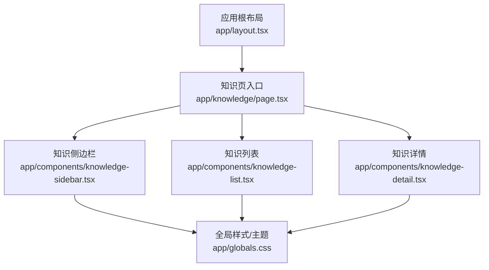
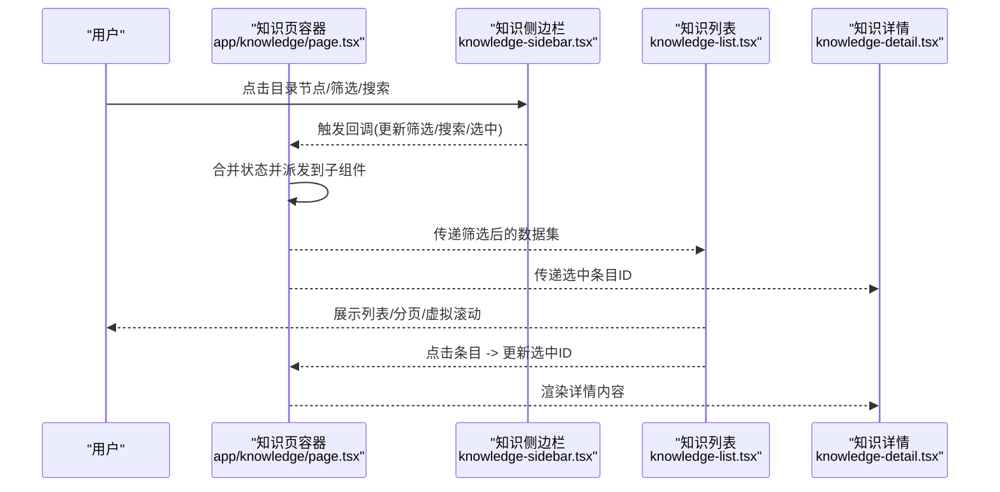
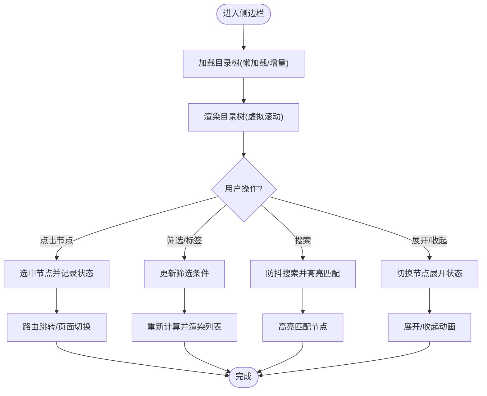
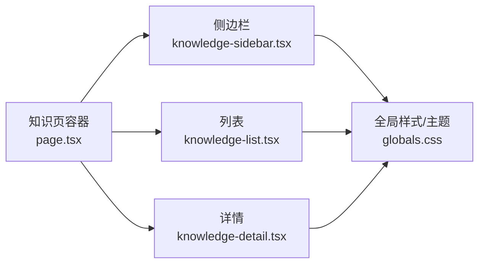

# 知识侧边栏组件

<cite>
**本文引用的文件**   
- [knowledge-sidebar.tsx](file://app/components/knowledge-sidebar.tsx)
- [knowledge-list.tsx](file://app/components/knowledge-list.tsx)
- [knowledge-detail.tsx](file://app/components/knowledge-detail.tsx)
- [page.tsx](file://app/knowledge/page.tsx)
- [layout.tsx](file://app/layout.tsx)
- [globals.css](file://app/globals.css)
- [package.json](file://package.json)
</cite>

## 目录
1. [简介](#简介)
2. [项目结构](#项目结构)
3. [核心组件](#核心组件)
4. [架构总览](#架构总览)
5. [详细组件分析](#详细组件分析)
6. [依赖关系分析](#依赖关系分析)
7. [性能考量](#性能考量)
8. [故障排查指南](#故障排查指南)
9. [结论](#结论)
10. [附录](#附录)

## 简介
本文件为 knowledge-sidebar 组件的权威技术文档，面向开发者与产品使用者。内容覆盖侧边栏导航功能、目录树结构与层级折叠展开、快速跳转、分类筛选、标签管理、搜索集成、路由导航与页面切换、状态保持机制、响应式设计与移动端适配、手势支持、配置项与主题定制、图标设置、目录结构生成、动态加载与异步更新、以及性能优化（虚拟滚动与大容量数据处理）等关键主题。

## 项目结构
本项目采用 Next.js App Router 组织代码，知识相关页面与组件位于 app 目录下：
- 页面层：app/knowledge/page.tsx 作为知识页入口，负责布局与数据装配
- 组件层：app/components 下包含 knowledge-sidebar.tsx、knowledge-list.tsx、knowledge-detail.tsx 等
- 样式与全局：app/globals.css 提供全局样式与主题变量
- 运行时与依赖：package.json 定义依赖与脚本

图表来源
- [layout.tsx](file://app/layout.tsx)
- [page.tsx](file://app/knowledge/page.tsx)
- [knowledge-sidebar.tsx](file://app/components/knowledge-sidebar.tsx)
- [knowledge-list.tsx](file://app/components/knowledge-list.tsx)
- [knowledge-detail.tsx](file://app/components/knowledge-detail.tsx)
- [globals.css](file://app/globals.css)

章节来源
- [page.tsx](file://app/knowledge/page.tsx)
- [layout.tsx](file://app/layout.tsx)
- [globals.css](file://app/globals.css)

## 核心组件
- 知识侧边栏（knowledge-sidebar.tsx）
  - 职责：展示知识目录树、处理层级折叠/展开、提供快速跳转、分类筛选、标签管理与搜索集成、响应式交互与手势支持
  - 关键能力：目录树渲染、节点选择与路由跳转、筛选与搜索过滤、移动端抽屉模式、主题与图标配置
- 知识列表（knowledge-list.tsx）
  - 职责：以列表形式展示当前筛选结果，支持分页或虚拟滚动、点击跳转详情
- 知识详情（knowledge-detail.tsx）
  - 职责：渲染选中条目的详细内容，支持返回与分享等操作

章节来源
- [knowledge-sidebar.tsx](file://app/components/knowledge-sidebar.tsx)
- [knowledge-list.tsx](file://app/components/knowledge-list.tsx)
- [knowledge-detail.tsx](file://app/components/knowledge-detail.tsx)

## 架构总览
知识侧边栏与列表、详情通过“状态提升”的方式在知识页中协同工作。知识页作为容器，维护统一的筛选、搜索与选中状态，并向下分发 props；侧边栏负责树形导航与筛选条件变更，列表负责数据呈现与交互，详情负责内容渲染。

图表来源
- [page.tsx](file://app/knowledge/page.tsx)
- [knowledge-sidebar.tsx](file://app/components/knowledge-sidebar.tsx)
- [knowledge-list.tsx](file://app/components/knowledge-list.tsx)
- [knowledge-detail.tsx](file://app/components/knowledge-detail.tsx)

## 详细组件分析

### 知识侧边栏（knowledge-sidebar.tsx）
- 目录树结构与层级折叠
  - 使用递归渲染实现多级目录，支持展开/收起动画与状态持久化
  - 节点类型区分（文件夹/文档），不同图标与交互行为
- 快速跳转与路由导航
  - 点击节点后通过 Next.js 路由进行页面切换，保留查询参数用于筛选与搜索
  - 支持键盘快捷键（如 Enter/Space）与无障碍属性
- 分类筛选与标签管理
  - 顶部筛选区支持按分类、标签组合过滤，实时联动目录树高亮
  - 标签可新增/删除，支持去重与本地缓存
- 搜索集成
  - 输入框支持防抖搜索，匹配标题与摘要，命中项高亮显示
  - 搜索结果可一键跳转到对应目录节点
- 响应式与移动端适配
  - 桌面端常驻侧边栏，移动端以抽屉形式滑出，支持遮罩关闭与手势滑动关闭
  - 断点切换时自动调整宽度与布局
- 配置项与主题定制
  - 支持主题色、字体、间距、图标库等配置，通过 CSS 变量与 props 注入
  - 图标可通过自定义映射表替换默认图标
- 目录结构生成与动态加载
  - 支持从后端 API 拉取目录树，增量加载子节点，避免一次性加载大体积数据
  - 提供骨架屏与错误重试机制
- 性能优化
  - 对大数据量目录树启用虚拟滚动，仅渲染可视区域节点
  - 使用 memo/useMemo/useCallback 减少不必要的重渲染
  - 搜索与筛选采用防抖与节流策略

图表来源
- [knowledge-sidebar.tsx](file://app/components/knowledge-sidebar.tsx)

章节来源
- [knowledge-sidebar.tsx](file://app/components/knowledge-sidebar.tsx)

### 知识列表（knowledge-list.tsx）
- 数据展示与交互
  - 根据侧边栏筛选条件渲染列表，支持分页、排序与批量操作
  - 点击行跳转详情，支持多选与批量删除
- 虚拟滚动与大数据处理
  - 对长列表启用虚拟滚动，按需渲染可见项，降低内存占用与重排开销
- 状态同步
  - 与侧边栏共享筛选与搜索状态，确保视图一致性

章节来源
- [knowledge-list.tsx](file://app/components/knowledge-list.tsx)

### 知识详情（knowledge-detail.tsx）
- 内容渲染
  - 渲染富文本、附件与元数据，支持预览与下载
- 导航与状态保持
  - 返回上一页并保持筛选与搜索上下文
  - 支持分享链接携带筛选参数

章节来源
- [knowledge-detail.tsx](file://app/components/knowledge-detail.tsx)

### 知识页容器（app/knowledge/page.tsx）
- 状态管理
  - 集中管理筛选、搜索、选中节点、分页等状态
  - 将状态与回调函数传递给侧边栏、列表与详情
- 路由与参数
  - 解析 URL 查询参数，初始化筛选与搜索条件
  - 路由变化时同步更新视图状态

章节来源
- [page.tsx](file://app/knowledge/page.tsx)

## 依赖关系分析
- 组件内聚与耦合
  - 侧边栏与列表、详情通过 props 解耦，状态集中在知识页容器，降低组件间直接依赖
- 外部依赖
  - 依赖 Next.js 路由与 React Hooks 进行状态与导航管理
  - 样式基于全局 CSS 变量，便于主题切换
- 潜在循环依赖
  - 组件间无直接相互导入，通过容器协调，避免循环依赖

图表来源
- [page.tsx](file://app/knowledge/page.tsx)
- [knowledge-sidebar.tsx](file://app/components/knowledge-sidebar.tsx)
- [knowledge-list.tsx](file://app/components/knowledge-list.tsx)
- [knowledge-detail.tsx](file://app/components/knowledge-detail.tsx)
- [globals.css](file://app/globals.css)

章节来源
- [page.tsx](file://app/knowledge/page.tsx)
- [globals.css](file://app/globals.css)

## 性能考量
- 目录树与列表的虚拟滚动
  - 仅渲染可视区域节点，显著降低首屏渲染时间与内存占用
- 防抖与节流
  - 搜索输入与窗口 resize 事件使用防抖/节流，减少频繁计算与重绘
- 懒加载与增量更新
  - 目录树按需加载子节点，避免一次性加载大量数据
- 状态与渲染优化
  - 使用 React.memo、useMemo、useCallback 避免不必要重渲染
- 网络请求优化
  - 请求去重、缓存与错误重试，保障用户体验

[本节为通用性能建议，不直接分析具体文件]

## 故障排查指南
- 目录树无法展开
  - 检查节点数据结构是否完整，确认展开状态是否正确持久化
- 筛选与搜索无效
  - 验证筛选条件与搜索关键词的匹配逻辑，检查防抖延迟是否过长
- 路由跳转异常
  - 确认路由参数格式与解析逻辑，检查浏览器历史记录与刷新后状态恢复
- 移动端手势失效
  - 检查触摸事件监听与遮罩层遮挡问题，确认断点切换逻辑
- 性能卡顿
  - 评估虚拟滚动配置、列表长度与节点复杂度，必要时增加分页或简化渲染

[本节为通用排查建议，不直接分析具体文件]

## 结论
knowledge-sidebar 组件通过清晰的职责划分与状态提升架构，实现了强大的目录导航、筛选与搜索能力，并在响应式与性能方面提供了完善的解决方案。结合虚拟滚动、懒加载与防抖策略，能够高效处理大容量数据与复杂交互场景。

[本节为总结性内容，不直接分析具体文件]

## 附录
- 配置项清单（示例）
  - 主题：主色、背景色、字体族、字号、间距
  - 图标：默认图标映射、自定义图标库
  - 行为：展开动画时长、搜索防抖延迟、虚拟滚动阈值
- 主题定制步骤
  - 在 globals.css 中定义 CSS 变量，组件通过 var() 引用
  - 通过 props 覆盖默认主题值，实现运行时切换
- 目录结构生成方案
  - 后端提供树形接口，前端按需加载子节点
  - 首次加载根节点，点击展开时再拉取子节点数据

[本节为补充信息，不直接分析具体文件]