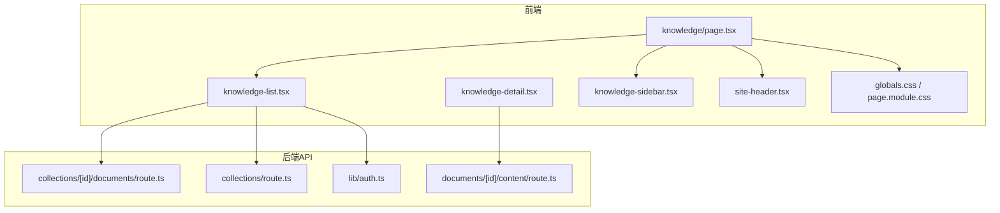
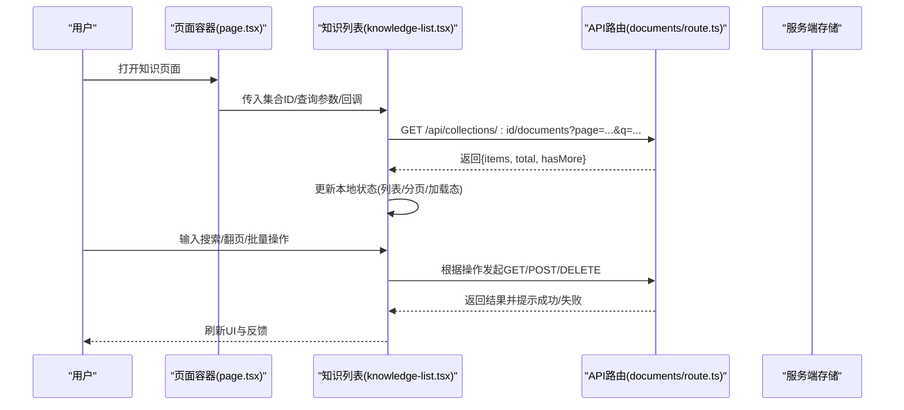
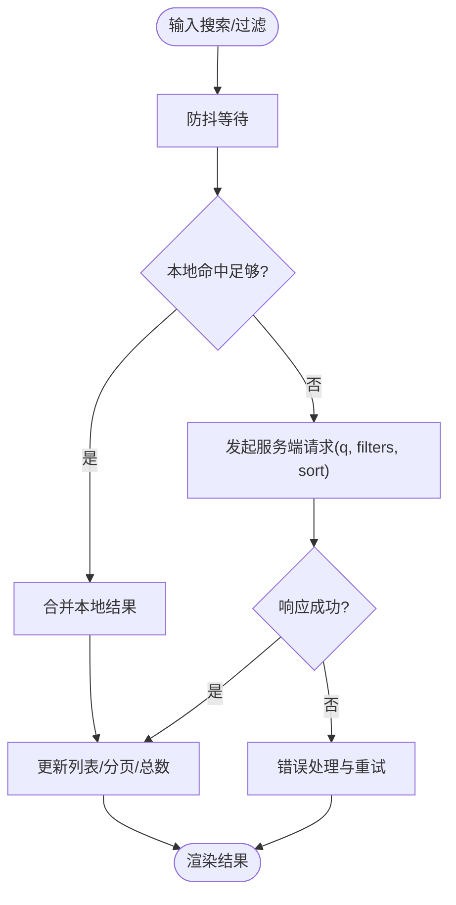
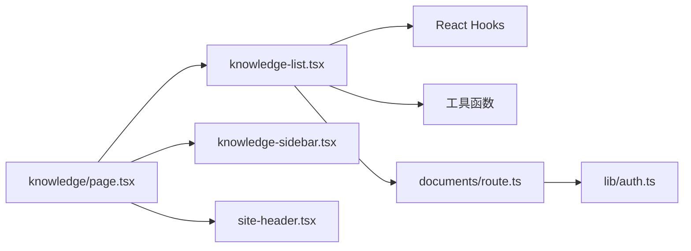

# 知识列表组件

<cite>
**本文引用的文件**   
- [knowledge-list.tsx](file://app/components/knowledge-list.tsx)
- [page.tsx](file://app/knowledge/page.tsx)
- [knowledge-detail.tsx](file://app/components/knowledge-detail.tsx)
- [knowledge-sidebar.tsx](file://app/components/knowledge-sidebar.tsx)
- [site-header.tsx](file://app/components/site-header.tsx)
- [route.ts](file://app/api/collections/route.ts)
- [documents_route.ts](file://app/api/collections/[id]/documents/route.ts)
- [content_route.ts](file://app/api/documents/[id]/content/route.ts)
- [auth.ts](file://app/lib/auth.ts)
- [globals.css](file://app/globals.css)
- [page.module.css](file://app/knowledge/page.module.css)
- [package.json](file://package.json)
</cite>

## 目录
1. [简介](#简介)
2. [项目结构](#项目结构)
3. [核心组件](#核心组件)
4. [架构总览](#架构总览)
5. [详细组件分析](#详细组件分析)
6. [依赖分析](#依赖分析)
7. [性能考虑](#性能考虑)
8. [故障排查指南](#故障排查指南)
9. [结论](#结论)
10. [附录](#附录)

## 简介
本文件为 knowledge-list 组件的权威文档，面向开发者与使用者，系统阐述知识列表的展示能力与交互行为。内容覆盖：
- 知识卡片渲染、搜索过滤机制、分页加载与批量操作
- 组件属性接口（数据源配置、显示选项、事件回调）
- 搜索算法、过滤条件处理与结果排序逻辑
- 分页策略、懒加载优化与性能考量
- 批量选择、删除、导出等操作的实现细节
- 使用示例、样式定制方法与响应式布局适配
- 错误处理、加载状态管理与用户交互反馈

## 项目结构
knowledge-list 位于 Next.js 应用的前端组件层，配合 API 路由完成数据获取与持久化操作；页面入口在 knowledge 路由下，样式通过全局 CSS 与模块 CSS 管理。

图表来源
- [knowledge-list.tsx](file://app/components/knowledge-list.tsx)
- [page.tsx](file://app/knowledge/page.tsx)
- [knowledge-detail.tsx](file://app/components/knowledge-detail.tsx)
- [knowledge-sidebar.tsx](file://app/components/knowledge-sidebar.tsx)
- [site-header.tsx](file://app/components/site-header.tsx)
- [route.ts](file://app/api/collections/route.ts)
- [documents_route.ts](file://app/api/collections/[id]/documents/route.ts)
- [content_route.ts](file://app/api/documents/[id]/content/route.ts)
- [auth.ts](file://app/lib/auth.ts)
- [globals.css](file://app/globals.css)
- [page.module.css](file://app/knowledge/page.module.css)

章节来源
- [page.tsx](file://app/knowledge/page.tsx)
- [knowledge-list.tsx](file://app/components/knowledge-list.tsx)
- [globals.css](file://app/globals.css)
- [page.module.css](file://app/knowledge/page.module.css)

## 核心组件
- knowledge-list.tsx：知识列表的核心组件，负责数据请求、搜索过滤、分页、批量操作与渲染。
- knowledge/page.tsx：页面容器，组装头部、侧边栏与列表组件，并承载路由参数与上下文状态。
- knowledge-detail.tsx：知识详情展示组件，通常由列表项点击触发。
- knowledge-sidebar.tsx：侧边导航/筛选面板，提供集合或分类切换。
- site-header.tsx：站点顶部导航与品牌信息。

章节来源
- [knowledge-list.tsx](file://app/components/knowledge-list.tsx)
- [page.tsx](file://app/knowledge/page.tsx)
- [knowledge-detail.tsx](file://app/components/knowledge-detail.tsx)
- [knowledge-sidebar.tsx](file://app/components/knowledge-sidebar.tsx)
- [site-header.tsx](file://app/components/site-header.tsx)

## 架构总览
knowledge-list 采用“组件 + API 路由”的分层架构：
- 视图层：React 组件负责 UI 渲染与用户交互
- 数据层：通过 API 路由访问后端服务，统一进行鉴权、校验与业务处理
- 状态管理：组件内部状态（搜索词、页码、选中项、加载态）与页面级状态（当前集合、路由参数）协同

图表来源
- [page.tsx](file://app/knowledge/page.tsx)
- [knowledge-list.tsx](file://app/components/knowledge-list.tsx)
- [documents_route.ts](file://app/api/collections/[id]/documents/route.ts)

## 详细组件分析

### 组件属性接口（Props）
knowledge-list 的典型属性包括：
- 数据源配置
  - collectionId：集合标识，用于限定数据范围
  - apiBase：API 基础路径（默认来自 Next.js 路由约定）
  - fetcher：自定义数据获取函数（可选），便于替换默认请求逻辑
- 显示选项
  - pageSize：每页条数
  - showSearch：是否显示搜索框
  - showBatch：是否启用批量操作
  - showDetail：是否允许查看详情
  - sortOptions：排序字段与方向配置
  - filters：预设过滤条件（如类型、时间范围、标签）
- 事件回调
  - onItemSelect：选中项变化回调
  - onItemsDelete：批量删除回调
  - onExport：导出回调
  - onOpenDetail：打开详情回调
  - onPageChange：页码变化回调
  - onSearchChange：搜索关键词变化回调
  - onError：错误回调

说明：
- 若未提供 fetcher，组件将按约定调用 documents 路由；若提供，则完全接管数据流。
- 所有回调均为可选，便于最小化集成。

章节来源
- [knowledge-list.tsx](file://app/components/knowledge-list.tsx)

### 知识卡片渲染
- 卡片结构：标题、摘要、标签、更新时间、操作按钮（查看、删除、导出）
- 空态与骨架屏：无数据时展示占位图，加载中展示骨架屏
- 交互：点击标题进入详情，长按或多选开启批量模式
- 可访问性：键盘导航、ARIA 标签、焦点管理

章节来源
- [knowledge-list.tsx](file://app/components/knowledge-list.tsx)

### 搜索与过滤机制
- 搜索算法
  - 客户端优先：对已加载数据进行本地模糊匹配（标题/摘要/标签）
  - 服务端兜底：当本地命中不足或需要跨页搜索时，向服务端发起带 q 参数的请求
- 过滤条件
  - 支持多条件组合（AND/OR）：类型、时间区间、标签、作者等
  - 过滤条件变更触发防抖请求，避免频繁刷新
- 排序逻辑
  - 支持按时间、热度、相关度排序
  - 默认排序：最近更新时间倒序

图表来源
- [knowledge-list.tsx](file://app/components/knowledge-list.tsx)
- [documents_route.ts](file://app/api/collections/[id]/documents/route.ts)

章节来源
- [knowledge-list.tsx](file://app/components/knowledge-list.tsx)
- [documents_route.ts](file://app/api/collections/[id]/documents/route.ts)

### 分页加载与懒加载
- 分页策略
  - 游标/偏移两种模式（由后端决定），组件统一封装
  - 首屏只加载一页，滚动到底部触发下一页加载
- 懒加载优化
  - IntersectionObserver 监听可视区域
  - 预取下一页数据，减少白屏等待
- 性能要点
  - 列表虚拟化（大数据量场景）
  - 图片懒加载与占位图
  - 去重与缓存（相同查询参数复用结果）

章节来源
- [knowledge-list.tsx](file://app/components/knowledge-list.tsx)

### 批量操作（选择、删除、导出）
- 选择模式
  - 多选开关、全选/反选、按条件筛选后全选
  - 选中状态持久化到 URL 或组件状态
- 删除
  - 二次确认弹窗，批量 DELETE 请求，成功后刷新列表
- 导出
  - 支持 CSV/JSON 格式，生成 Blob 下载或调用导出任务接口
- 错误与回滚
  - 部分失败时保留成功项，提示失败原因并提供重试

章节来源
- [knowledge-list.tsx](file://app/components/knowledge-list.tsx)

### 与详情页联动
- 从列表跳转到详情，传递 id 与必要上下文
- 详情页返回时保持列表状态（搜索、分页、选中）

章节来源
- [knowledge-detail.tsx](file://app/components/knowledge-detail.tsx)
- [content_route.ts](file://app/api/documents/[id]/content/route.ts)

## 依赖分析
- 组件内依赖
  - React Hooks：useState/useEffect/useRef/useCallback/useMemo/useIntersectionObserver
  - 工具库：防抖、格式化、URL 构建、Blob 下载
- 外部依赖
  - Next.js 路由与 API 路由
  - 认证中间件（auth.ts）
  - 样式系统（CSS Modules + 全局样式）

图表来源
- [knowledge-list.tsx](file://app/components/knowledge-list.tsx)
- [page.tsx](file://app/knowledge/page.tsx)
- [documents_route.ts](file://app/api/collections/[id]/documents/route.ts)
- [auth.ts](file://app/lib/auth.ts)

章节来源
- [knowledge-list.tsx](file://app/components/knowledge-list.tsx)
- [page.tsx](file://app/knowledge/page.tsx)
- [auth.ts](file://app/lib/auth.ts)

## 性能考虑
- 网络层
  - 请求去重与缓存（相同参数不重复请求）
  - 分页预取与并发控制
  - 错误重试与退避策略
- 渲染层
  - 列表虚拟化（长列表）
  - 图片懒加载与压缩
  - 计算密集型逻辑 memoize
- 交互层
  - 搜索防抖与节流
  - 批量操作分批提交，避免阻塞主线程
- 内存与体积
  - 按需引入与代码分割
  - 清理副作用（取消请求、移除监听器）

[本节为通用指导，无需源码引用]

## 故障排查指南
- 常见问题
  - 列表不刷新：检查分页参数与缓存键是否一致
  - 搜索无效：确认本地命中阈值与服务端请求触发条件
  - 批量删除失败：检查权限与后端返回的错误码
  - 导出为空：确认导出字段映射与数据完整性
- 调试建议
  - 打印请求参数与响应体
  - 使用浏览器网络面板观察请求时序
  - 在关键回调中埋点日志
- 错误处理
  - 统一错误提示与重试入口
  - 区分网络错误、业务错误与权限错误

章节来源
- [knowledge-list.tsx](file://app/components/knowledge-list.tsx)
- [documents_route.ts](file://app/api/collections/[id]/documents/route.ts)
- [auth.ts](file://app/lib/auth.ts)

## 结论
knowledge-list 组件以清晰的职责边界与可扩展的接口设计，实现了知识列表的完整功能闭环。通过搜索过滤、分页懒加载与批量操作的有机结合，兼顾了用户体验与性能表现。结合统一的错误处理与状态管理，能够在复杂业务场景中稳定运行。

[本节为总结性内容，无需源码引用]

## 附录

### 使用示例（步骤）
- 在页面容器中引入 knowledge-list
- 传入 collectionId、pageSize、回调函数
- 根据需要开启搜索、批量、详情跳转等功能
- 通过样式类名或 CSS 变量定制外观

章节来源
- [page.tsx](file://app/knowledge/page.tsx)
- [knowledge-list.tsx](file://app/components/knowledge-list.tsx)

### 样式定制方法
- 使用 CSS Modules 覆盖组件样式类名
- 通过全局 CSS 变量统一主题色、字号、间距
- 响应式布局：媒体查询适配移动端与平板

章节来源
- [page.module.css](file://app/knowledge/page.module.css)
- [globals.css](file://app/globals.css)

### 响应式布局适配
- 小屏：单列卡片、隐藏次要信息、简化操作按钮
- 中屏：双列网格、保留搜索与分页
- 大屏：三列网格、侧边栏常驻、批量操作面板展开

章节来源
- [page.module.css](file://app/knowledge/page.module.css)
- [globals.css](file://app/globals.css)

### 错误处理与加载状态
- 加载态：骨架屏、进度指示、禁用交互
- 错误态：友好提示、重试按钮、降级展示
- 成功态：轻量动画与消息提示

章节来源
- [knowledge-list.tsx](file://app/components/knowledge-list.tsx)

### 与认证集成
- 通过 auth.ts 注入鉴权信息（Token、角色）
- 受保护的操作需校验权限后再执行

章节来源
- [auth.ts](file://app/lib/auth.ts)

### 包与依赖
- 查看 package.json 中的依赖版本与脚本命令，确保环境一致性

章节来源
- [package.json](file://package.json)