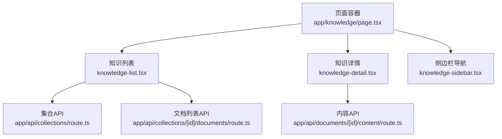
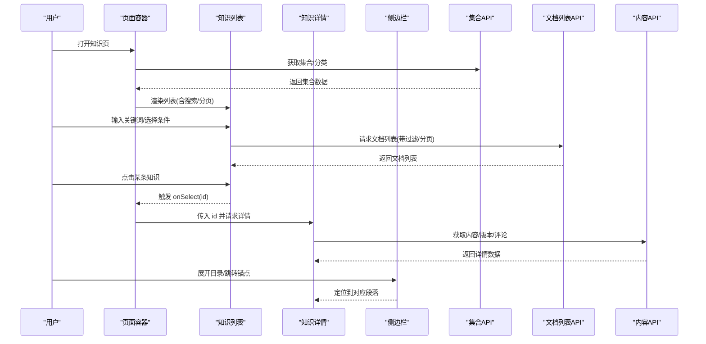
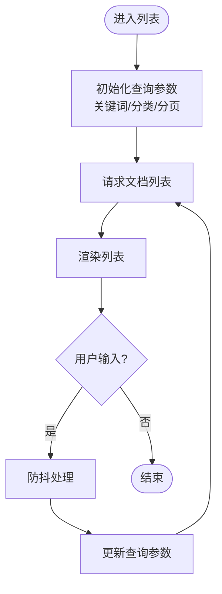
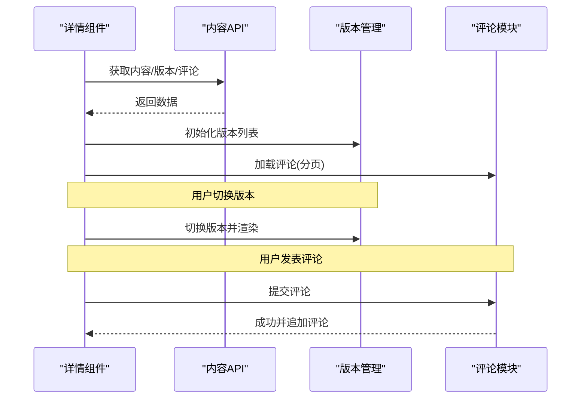
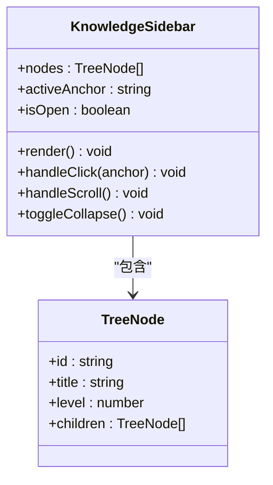
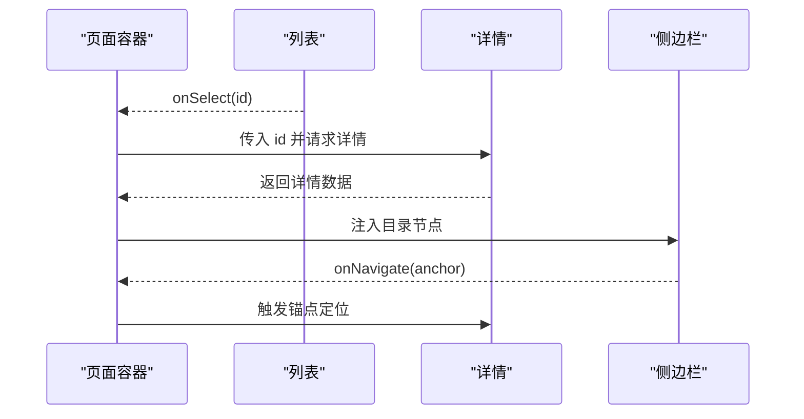
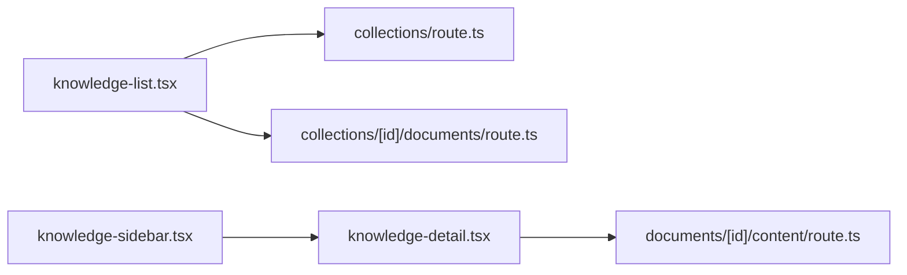

# 知识管理组件

<cite>
**本文引用的文件**   
- [knowledge-list.tsx](file://app/components/knowledge-list.tsx)
- [knowledge-detail.tsx](file://app/components/knowledge-detail.tsx)
- [knowledge-sidebar.tsx](file://app/components/knowledge-sidebar.tsx)
- [page.tsx](file://app/knowledge/page.tsx)
- [route.ts](file://app/api/collections/route.ts)
- [route.ts](file://app/api/collections/[id]/documents/route.ts)
- [route.ts](file://app/api/documents/[id]/content/route.ts)
</cite>

## 目录
1. [简介](#简介)
2. [项目结构](#项目结构)
3. [核心组件](#核心组件)
4. [架构总览](#架构总览)
5. [详细组件分析](#详细组件分析)
6. [依赖关系分析](#依赖关系分析)
7. [性能考虑](#性能考虑)
8. [故障排查指南](#故障排查指南)
9. [结论](#结论)
10. [附录：接口与样式定制](#附录接口与样式定制)

## 简介
本文件面向“知识管理”相关的前端组件，系统性说明 knowledge-list、knowledge-detail、knowledge-sidebar 三大组件的功能边界、数据流、事件通信、属性接口与样式定制方式，并给出组合使用模式与布局最佳实践。同时覆盖搜索过滤、分页、批量操作、内容编辑、版本管理与评论等关键能力的设计要点，以及数据加载优化、缓存策略和错误处理机制。

## 项目结构
- 组件位于 app/components 下，页面入口在 app/knowledge/page.tsx，API 路由位于 app/api 下。
- 典型交互流程：页面容器编排三个子组件；列表组件负责检索、筛选、分页与批量操作；详情组件负责内容展示、编辑、版本切换与评论；侧边栏提供目录导航与快速跳转。

**图示来源** 
- [page.tsx](file://app/knowledge/page.tsx)
- [knowledge-list.tsx](file://app/components/knowledge-list.tsx)
- [knowledge-detail.tsx](file://app/components/knowledge-detail.tsx)
- [knowledge-sidebar.tsx](file://app/components/knowledge-sidebar.tsx)
- [route.ts](file://app/api/collections/route.ts)
- [route.ts](file://app/api/collections/[id]/documents/route.ts)
- [route.ts](file://app/api/documents/[id]/content/route.ts)

**章节来源**
- [page.tsx](file://app/knowledge/page.tsx)
- [knowledge-list.tsx](file://app/components/knowledge-list.tsx)
- [knowledge-detail.tsx](file://app/components/knowledge-detail.tsx)
- [knowledge-sidebar.tsx](file://app/components/knowledge-sidebar.tsx)
- [route.ts](file://app/api/collections/route.ts)
- [route.ts](file://app/api/collections/[id]/documents/route.ts)
- [route.ts](file://app/api/documents/[id]/content/route.ts)

## 核心组件
- knowledge-list：知识列表展示、搜索过滤、分页、批量选择与批量操作（如删除、导出）。
- knowledge-detail：知识详情展示、内容编辑、版本管理与评论。
- knowledge-sidebar：侧边栏导航、目录结构与快速跳转。

职责划分清晰，通过页面容器进行状态编排与事件转发，避免组件间直接耦合。

**章节来源**
- [knowledge-list.tsx](file://app/components/knowledge-list.tsx)
- [knowledge-detail.tsx](file://app/components/knowledge-detail.tsx)
- [knowledge-sidebar.tsx](file://app/components/knowledge-sidebar.tsx)

## 架构总览
整体采用“页面容器 + 功能组件 + API 路由”的分层架构：
- 页面容器负责聚合状态、路由参数与跨组件通信。
- 功能组件专注 UI 与局部交互逻辑。
- API 路由统一对外暴露集合、文档与内容的增删改查能力。

**图示来源** 
- [page.tsx](file://app/knowledge/page.tsx)
- [knowledge-list.tsx](file://app/components/knowledge-list.tsx)
- [knowledge-detail.tsx](file://app/components/knowledge-detail.tsx)
- [knowledge-sidebar.tsx](file://app/components/knowledge-sidebar.tsx)
- [route.ts](file://app/api/collections/route.ts)
- [route.ts](file://app/api/collections/[id]/documents/route.ts)
- [route.ts](file://app/api/documents/[id]/content/route.ts)

## 详细组件分析

### knowledge-list 组件
- 功能要点
  - 列表展示：支持卡片或表格视图，显示标题、摘要、更新时间、标签等。
  - 搜索过滤：按关键词、分类、时间范围、标签等多维度过滤。
  - 分页：支持页码、每页条数、总条数与后端分页参数映射。
  - 批量操作：多选后执行删除、导出、移动等操作。
- 数据流
  - 从 API 拉取集合与文档列表，本地维护查询参数与选中项。
  - 搜索与分页变化时重新发起请求，必要时做防抖。
- 事件回调
  - onSelect(id)、onBatchAction(actions, ids)、onSearchChange(query)、onPageChange(page, pageSize)。
- 性能与体验
  - 列表滚动虚拟化（可选）、请求去重与取消、空态与骨架屏。

**图示来源** 
- [knowledge-list.tsx](file://app/components/knowledge-list.tsx)
- [route.ts](file://app/api/collections/[id]/documents/route.ts)

**章节来源**
- [knowledge-list.tsx](file://app/components/knowledge-list.tsx)
- [route.ts](file://app/api/collections/[id]/documents/route.ts)

### knowledge-detail 组件
- 功能要点
  - 详情展示：富文本/Markdown 渲染、目录生成、图片与附件预览。
  - 内容编辑：在线编辑器、自动保存、撤销重做、权限控制。
  - 版本管理：历史版本列表、对比差异、回滚与合并。
  - 评论功能：评论列表、回复、点赞、@提及、审核状态。
- 数据流
  - 根据 id 拉取内容、版本与评论，本地维护编辑草稿与当前版本。
  - 提交变更时调用内容 API，成功后刷新版本与评论。
- 事件回调
  - onVersionSwitch(versionId)、onCommentSubmit(comment)、onSaveDraft(draft)、onPublish(publishPayload)。
- 性能与体验
  - 懒加载大文档片段、评论分页、增量更新、并发请求合并。

**图示来源** 
- [knowledge-detail.tsx](file://app/components/knowledge-detail.tsx)
- [route.ts](file://app/api/documents/[id]/content/route.ts)

**章节来源**
- [knowledge-detail.tsx](file://app/components/knowledge-detail.tsx)
- [route.ts](file://app/api/documents/[id]/content/route.ts)

### knowledge-sidebar 组件
- 功能要点
  - 目录结构：基于文档标题自动生成目录树。
  - 快速跳转：点击目录项滚动至对应锚点。
  - 导航高亮：滚动监听当前可见段落并高亮。
- 数据流
  - 接收详情组件的目录节点与锚点信息，内部维护滚动位置与高亮状态。
- 事件回调
  - onNavigate(anchor)、onToggleCollapse(isOpen)。
- 性能与体验
  - IntersectionObserver 实现高效滚动监听、虚拟目录渲染（长文档）。

**图示来源** 
- [knowledge-sidebar.tsx](file://app/components/knowledge-sidebar.tsx)

**章节来源**
- [knowledge-sidebar.tsx](file://app/components/knowledge-sidebar.tsx)

### 组件间数据传递与状态同步
- 页面容器作为单一事实源，持有：
  - 当前选中的知识 id、查询参数、分页状态、批量选中项。
- 事件总线式通信：
  - 列表向容器上报 onSelect、onBatchAction、onSearchChange、onPageChange。
  - 容器将 id 与查询参数下发给详情与侧边栏。
- 副作用管理：
  - 使用统一的请求封装，处理 loading、error、重试与取消。

**图示来源** 
- [page.tsx](file://app/knowledge/page.tsx)
- [knowledge-list.tsx](file://app/components/knowledge-list.tsx)
- [knowledge-detail.tsx](file://app/components/knowledge-detail.tsx)
- [knowledge-sidebar.tsx](file://app/components/knowledge-sidebar.tsx)

**章节来源**
- [page.tsx](file://app/knowledge/page.tsx)
- [knowledge-list.tsx](file://app/components/knowledge-list.tsx)
- [knowledge-detail.tsx](file://app/components/knowledge-detail.tsx)
- [knowledge-sidebar.tsx](file://app/components/knowledge-sidebar.tsx)

## 依赖关系分析
- 组件依赖
  - 列表依赖集合与文档列表 API。
  - 详情依赖内容 API（含版本与评论）。
  - 侧边栏依赖详情提供的目录节点。
- 外部依赖
  - 网络请求库、富文本编辑器、Markdown 渲染器、UI 组件库。
- 潜在循环依赖
  - 通过页面容器解耦，避免组件间直接互相引用。

**图示来源** 
- [knowledge-list.tsx](file://app/components/knowledge-list.tsx)
- [knowledge-detail.tsx](file://app/components/knowledge-detail.tsx)
- [knowledge-sidebar.tsx](file://app/components/knowledge-sidebar.tsx)
- [route.ts](file://app/api/collections/route.ts)
- [route.ts](file://app/api/collections/[id]/documents/route.ts)
- [route.ts](file://app/api/documents/[id]/content/route.ts)

**章节来源**
- [knowledge-list.tsx](file://app/components/knowledge-list.tsx)
- [knowledge-detail.tsx](file://app/components/knowledge-detail.tsx)
- [knowledge-sidebar.tsx](file://app/components/knowledge-sidebar.tsx)
- [route.ts](file://app/api/collections/route.ts)
- [route.ts](file://app/api/collections/[id]/documents/route.ts)
- [route.ts](file://app/api/documents/[id]/content/route.ts)

## 性能考虑
- 列表
  - 防抖搜索、分页与后端排序结合、虚拟滚动、请求去重与取消。
- 详情
  - 分段懒加载、评论分页、版本切换不重复拉取已缓存数据。
- 侧边栏
  - 目录节点按需渲染、IntersectionObserver 节流滚动事件。
- 缓存策略
  - 浏览器内存缓存（Map/Set）+ 轻量持久化（localStorage/sessionStorage），设置过期时间与失效键名。
- 错误处理
  - 统一错误码映射、重试机制、降级展示与用户提示。

[本节为通用指导，无需具体文件来源]

## 故障排查指南
- 常见问题
  - 列表无数据：检查查询参数、分页大小、API 返回结构。
  - 详情加载失败：校验 id 合法性、权限、网络超时与重试次数。
  - 评论无法提交：检查表单校验、鉴权令牌与后端接口状态。
  - 目录跳转无效：确认锚点 id 唯一性与 DOM 挂载时机。
- 调试建议
  - 开启请求日志、网络面板抓包、组件 props/state 快照对比。
  - 对复杂异步流程增加埋点与错误上报。

[本节为通用指导，无需具体文件来源]

## 结论
通过页面容器协调三大组件，配合清晰的 API 分层与事件通信，实现了知识管理的完整闭环。建议在后续迭代中完善权限模型、国际化与可访问性，并引入更完善的监控与性能指标采集。

[本节为总结性内容，无需具体文件来源]

## 附录：接口与样式定制

### 属性接口定义（示例）
- knowledge-list
  - query: { keyword?: string; category?: string; tags?: string[]; dateRange?: { start?: string; end?: string } }
  - pagination: { page: number; pageSize: number; total: number }
  - selectedIds: string[]
  - viewMode: "list" | "grid"
- knowledge-detail
  - id: string
  - versionId?: string
  - readOnly?: boolean
  - showComments?: boolean
- knowledge-sidebar
  - nodes: Array<TreeNode>
  - activeAnchor?: string
  - collapsible?: boolean

[本节为概念性接口描述，无需具体文件来源]

### 事件回调处理（示例）
- knowledge-list
  - onSelect(id): void
  - onBatchAction(actions, ids): Promise<void>
  - onSearchChange(query): void
  - onPageChange(page, pageSize): void
- knowledge-detail
  - onVersionSwitch(versionId): void
  - onCommentSubmit(comment): Promise<void>
  - onSaveDraft(draft): Promise<void>
  - onPublish(payload): Promise<void>
- knowledge-sidebar
  - onNavigate(anchor): void
  - onToggleCollapse(isOpen): void

[本节为概念性事件描述，无需具体文件来源]

### 样式定制选项（示例）
- 主题变量
  - --knowledge-bg、--knowledge-text、--knowledge-border、--knowledge-accent
- 布局尺寸
  - --sidebar-width、--list-gap、--detail-padding
- 组件类名
  - .kl-list、.kl-card、.kl-detail、.kl-sidebar、.kl-comment-item

[本节为概念性样式约定，无需具体文件来源]