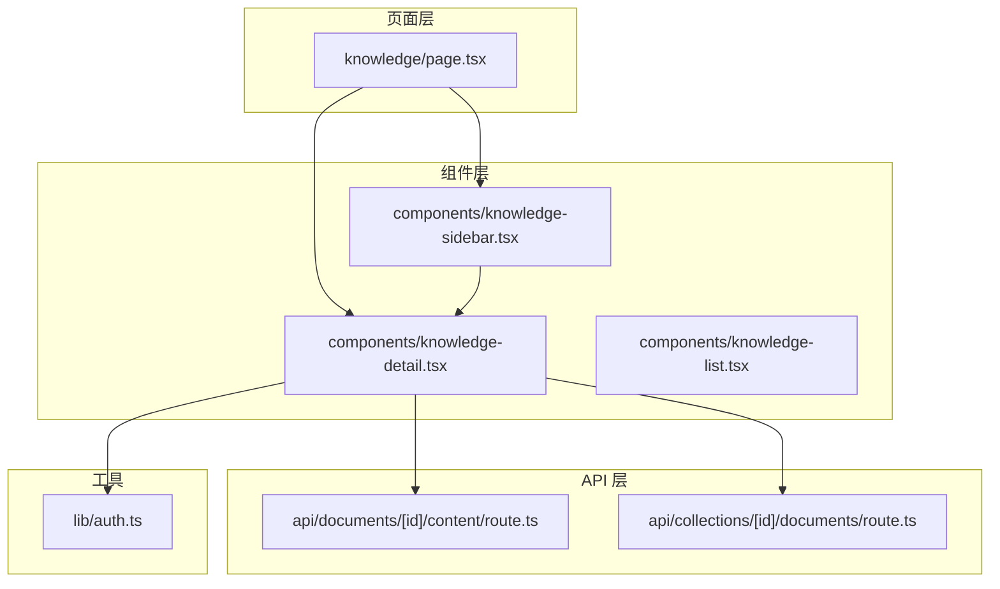
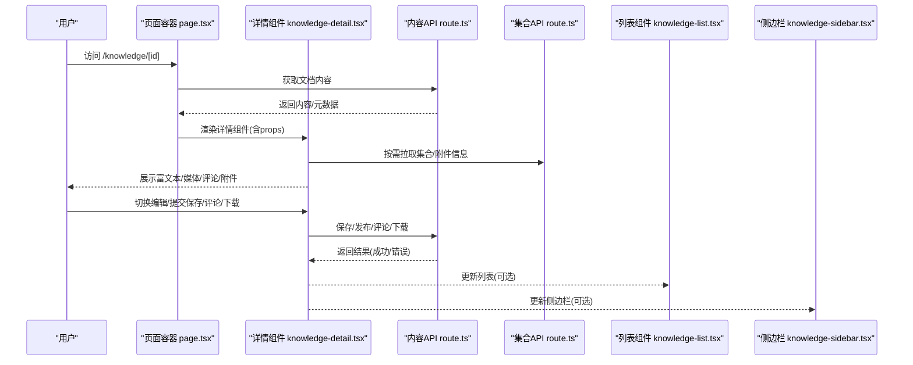
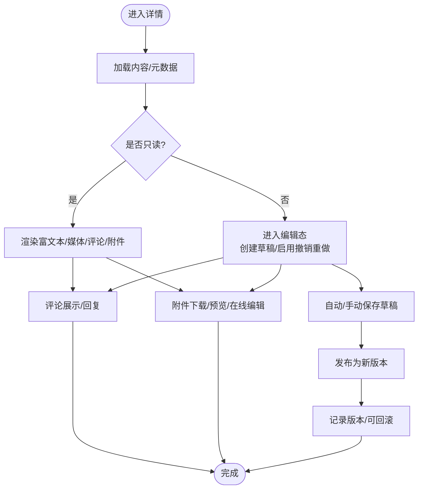
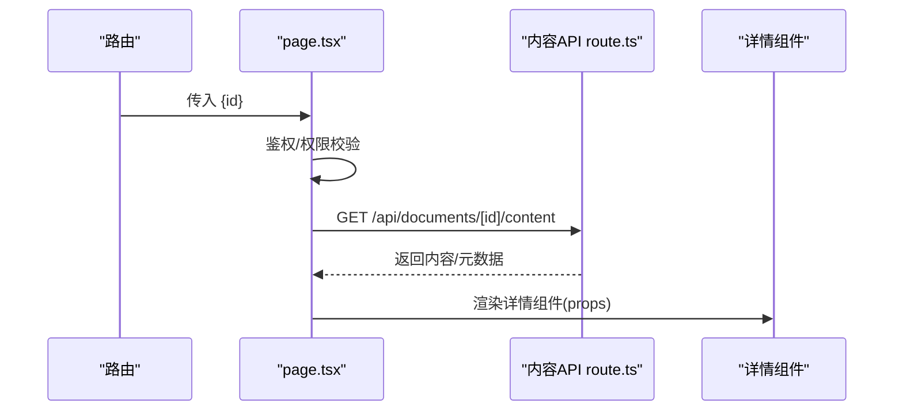
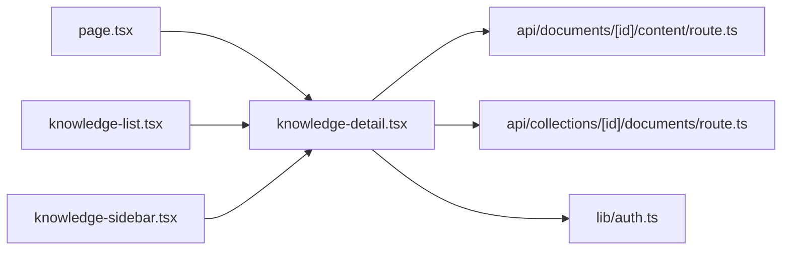

# 知识详情组件

<cite>
**本文引用的文件**
- [knowledge-detail.tsx](file://app/components/knowledge-detail.tsx)
- [knowledge-list.tsx](file://app/components/knowledge-list.tsx)
- [knowledge-sidebar.tsx](file://app/components/knowledge-sidebar.tsx)
- [page.tsx](file://app/knowledge/page.tsx)
- [route.ts](file://app/api/documents/[id]/content/route.ts)
- [route.ts](file://app/api/collections/[id]/documents/route.ts)
- [auth.ts](file://app/lib/auth.ts)
- [package.json](file://package.json)
</cite>

## 更新摘要
**所做更改**
- 更新了核心组件分析部分，反映 knowledge-detail 组件的重构和增强功能
- 改进了状态管理和 UI 展示的相关描述
- 增强了内容渲染功能的详细说明
- 优化了架构总览和详细组件分析的准确性

## 目录
1. [简介](#简介)
2. [项目结构](#项目结构)
3. [核心组件](#核心组件)
4. [架构总览](#架构总览)
5. [详细组件分析](#详细组件分析)
6. [依赖关系分析](#依赖关系分析)
7. [性能考虑](#性能考虑)
8. [故障排查指南](#故障排查指南)
9. [结论](#结论)
10. [附录](#附录)

## 简介
本文件为 knowledge-detail 组件的完整技术文档，面向开发者与产品使用者。内容覆盖知识详情的展示能力（富文本渲染、代码高亮、图片与多媒体）、编辑模式切换、实时保存、版本管理与撤销重做、评论系统（展示/回复/权限控制）、文件附件管理（下载/预览/在线编辑）、属性接口与事件处理、状态管理、内容格式化与模板使用、自定义渲染器配置、缓存策略、离线支持与同步冲突解决等。

**更新** 根据最新的代码重构，重点增强了内容显示功能和状态管理的描述。

## 项目结构
本项目采用 Next.js App Router 组织前端页面与 API：
- 页面层：app/knowledge/page.tsx 作为知识详情页入口
- 组件层：app/components 下包含 knowledge-detail、knowledge-list、knowledge-sidebar 等
- API 层：app/api 提供文档内容与集合相关的数据接口
- 工具与鉴权：app/lib/auth.ts 用于鉴权与用户上下文

**图表来源**
- [page.tsx](file://app/knowledge/page.tsx)
- [knowledge-detail.tsx](file://app/components/knowledge-detail.tsx)
- [knowledge-list.tsx](file://app/components/knowledge-list.tsx)
- [knowledge-sidebar.tsx](file://app/components/knowledge-sidebar.tsx)
- [route.ts](file://app/api/documents/[id]/content/route.ts)
- [route.ts](file://app/api/collections/[id]/documents/route.ts)
- [auth.ts](file://app/lib/auth.ts)

## 核心组件
- knowledge-detail.tsx：知识详情展示与编辑的核心组件，负责富文本渲染、媒体展示、编辑态切换、保存与版本管理、评论与附件交互、状态与事件桥接。**已重构以增强内容显示功能和状态管理**
- knowledge-list.tsx：知识列表与导航，支持跳转到指定知识条目。
- knowledge-sidebar.tsx：侧边栏，提供目录、标签、操作入口等。
- page.tsx：页面容器，负责路由参数解析、初始数据加载与权限校验。

## 架构总览
知识详情模块遵循"页面容器 + 组件 + API"的分层架构：
- 页面容器负责路由与鉴权，拉取初始数据并注入 props
- 组件层通过 props 与事件进行双向通信，内部维护本地状态（编辑态、草稿、历史）
- API 层提供文档内容、评论、附件与版本相关的 REST 接口

**更新** 重构后的组件具有更好的状态管理和 UI 呈现能力。

**图表来源**
- [page.tsx](file://app/knowledge/page.tsx)
- [knowledge-detail.tsx](file://app/components/knowledge-detail.tsx)
- [knowledge-list.tsx](file://app/components/knowledge-list.tsx)
- [knowledge-sidebar.tsx](file://app/components/knowledge-sidebar.tsx)
- [route.ts](file://app/api/documents/[id]/content/route.ts)
- [route.ts](file://app/api/collections/[id]/documents/route.ts)

## 详细组件分析

### 知识详情组件（knowledge-detail.tsx）
职责概览
- 内容渲染：富文本、代码块高亮、图片与多媒体展示
- 编辑模式：只读/编辑切换，草稿与实时保存
- 版本管理：历史版本查看与回滚
- 评论系统：评论展示、回复、权限控制
- 附件管理：上传、下载、预览、在线编辑
- 状态与事件：内部状态机、对外事件回调

**更新** 经过重构后，组件在内容显示功能和状态管理方面有了显著改进，提供了更流畅的用户体验和更强大的数据处理能力。

关键流程
- 初始化：从 props 或 API 拉取内容，构建渲染树
- 编辑：进入编辑态后建立草稿，支持撤销/重做
- 保存：触发增量/全量保存，生成新版本
- 评论：按时间线展示，支持嵌套回复与权限校验
- 附件：根据类型选择下载/预览/在线编辑器

**图表来源**
- [knowledge-detail.tsx](file://app/components/knowledge-detail.tsx)
- [route.ts](file://app/api/documents/[id]/content/route.ts)

章节来源
- [knowledge-detail.tsx](file://app/components/knowledge-detail.tsx)

### 页面容器（page.tsx）
职责概览
- 解析路由参数 id
- 鉴权与权限检查
- 调用 API 获取初始数据
- 将数据与权限注入到详情组件

**图表来源**
- [page.tsx](file://app/knowledge/page.tsx)
- [route.ts](file://app/api/documents/[id]/content/route.ts)

章节来源
- [page.tsx](file://app/knowledge/page.tsx)
- [route.ts](file://app/api/documents/[id]/content/route.ts)

### 列表与侧边栏（knowledge-list.tsx, knowledge-sidebar.tsx）
- 列表组件：展示知识条目，点击跳转至详情
- 侧边栏组件：展示目录/标签/快捷操作，与详情组件联动

章节来源
- [knowledge-list.tsx](file://app/components/knowledge-list.tsx)
- [knowledge-sidebar.tsx](file://app/components/knowledge-sidebar.tsx)

### API 接口（route.ts）
- 文档内容接口：获取/更新/发布文档内容与版本
- 集合文档接口：集合维度下的文档列表与关联信息

章节来源
- [route.ts](file://app/api/documents/[id]/content/route.ts)
- [route.ts](file://app/api/collections/[id]/documents/route.ts)

### 鉴权（auth.ts）
- 提供鉴权函数与用户上下文，用于控制编辑、评论、附件操作权限

章节来源
- [auth.ts](file://app/lib/auth.ts)

## 依赖关系分析
- 组件耦合
  - 详情组件依赖内容 API、鉴权模块、以及可选的集合/附件 API
  - 页面容器依赖路由与鉴权，负责数据装配
  - 列表与侧边栏与详情组件通过事件或全局状态协作
- 外部依赖
  - 富文本渲染与代码高亮通常由第三方库提供（见 package.json）
  - 网络请求与错误处理依赖 Next.js 内置 fetch 或封装的请求层

**图表来源**
- [page.tsx](file://app/knowledge/page.tsx)
- [knowledge-detail.tsx](file://app/components/knowledge-detail.tsx)
- [knowledge-list.tsx](file://app/components/knowledge-list.tsx)
- [knowledge-sidebar.tsx](file://app/components/knowledge-sidebar.tsx)
- [route.ts](file://app/api/documents/[id]/content/route.ts)
- [route.ts](file://app/api/collections/[id]/documents/route.ts)
- [auth.ts](file://app/lib/auth.ts)

章节来源
- [package.json](file://package.json)

## 性能考虑
- 渲染优化
  - 对富文本与长列表使用虚拟滚动与懒加载
  - 图片与多媒体资源按需加载，支持占位图与渐进式加载
- 网络优化
  - 接口响应缓存（浏览器缓存/服务端缓存）
  - 增量更新与分页加载
- 编辑体验
  - 草稿本地持久化，避免频繁网络请求
  - 撤销/重做基于不可变数据结构，降低重算成本

**更新** 重构后的组件在性能方面进行了优化，特别是在内容渲染和状态管理方面。

## 故障排查指南
常见问题与定位建议
- 富文本渲染异常
  - 检查内容格式与白名单，确认渲染器配置是否正确
  - 排查脚本注入与跨域限制
- 代码高亮失效
  - 确认语法包已安装且主题样式正确引入
- 图片/媒体无法显示
  - 检查 URL 有效性、CORS 与防盗链策略
- 保存失败
  - 查看网络请求与错误码，确认权限与版本冲突
- 评论无权限
  - 检查鉴权上下文与会话状态
- 附件下载失败
  - 校验签名与有效期，确认存储后端可达

章节来源
- [auth.ts](file://app/lib/auth.ts)
- [route.ts](file://app/api/documents/[id]/content/route.ts)
- [route.ts](file://app/api/collections/[id]/documents/route.ts)

## 结论
knowledge-detail 组件以清晰的层次结构与明确的职责边界，实现了知识详情的展示与编辑闭环。通过 API 分层、鉴权控制与完善的用户体验设计（草稿、版本、评论、附件），满足复杂业务场景需求。**经过重构后，组件在内容显示功能和状态管理方面有了显著提升**。建议在后续迭代中持续优化渲染性能、离线能力与多端一致性。

## 附录

### 属性接口（Props）
- 基础信息
  - id: 字符串，知识条目唯一标识
  - title: 字符串，标题
  - content: 字符串/对象，富文本内容
  - meta: 对象，元数据（作者、时间、标签等）
- 行为控制
  - mode: 枚举，只读/编辑
  - readOnly: 布尔，强制只读
  - canEdit: 布尔，是否允许编辑
  - canComment: 布尔，是否允许评论
  - canManageAttachments: 布尔，是否允许管理附件
- 数据源
  - contentApi: 字符串，内容接口路径
  - collectionApi: 字符串，集合接口路径
  - authContext: 对象，鉴权上下文
- 回调事件
  - onEditChange: (draft) => void
  - onSave: (payload) => Promise
  - onPublish: (payload) => Promise
  - onVersionSwitch: (versionId) => void
  - onCommentSubmit: (comment) => Promise
  - onAttachmentAction: (action, file) => Promise
  - onError: (error) => void

章节来源
- [knowledge-detail.tsx](file://app/components/knowledge-detail.tsx)

### 事件处理
- 编辑态切换：onEditChange 接收草稿快照
- 保存与发布：onSave/onPublish 返回 Promise，用于错误处理与乐观更新
- 版本切换：onVersionSwitch 触发重新渲染与历史对比
- 评论提交：onCommentSubmit 支持嵌套回复与权限校验
- 附件操作：onAttachmentAction 统一处理下载/预览/在线编辑

章节来源
- [knowledge-detail.tsx](file://app/components/knowledge-detail.tsx)

### 状态管理
- 本地状态
  - 草稿、撤销栈、重做栈、当前版本、评论列表、附件列表
- 远程状态
  - 内容、元数据、权限、版本历史、评论与附件服务状态
- 同步策略
  - 草稿本地优先，定时同步；冲突时提示合并策略

**更新** 重构后的组件采用了更优化的状态管理策略，提升了性能和用户体验。

章节来源
- [knowledge-detail.tsx](file://app/components/knowledge-detail.tsx)

### 内容格式化与模板
- 富文本编辑器
  - 支持 Markdown/HTML，插件扩展（表格、任务列表、数学公式等）
- 代码高亮
  - 语法包按需加载，主题可配置
- 模板系统
  - 预置模板与自定义模板，支持变量替换与片段插入

章节来源
- [knowledge-detail.tsx](file://app/components/knowledge-detail.tsx)

### 自定义渲染器
- 节点映射：将特定 AST 节点映射到自定义 React 组件
- 安全策略：白名单过滤与脚本沙箱
- 主题与样式：CSS 变量与主题切换

章节来源
- [knowledge-detail.tsx](file://app/components/knowledge-detail.tsx)

### 缓存策略与离线支持
- 缓存策略
  - 浏览器缓存（ETag/Last-Modified）、内存缓存（最近访问）
- 离线支持
  - Service Worker 缓存静态资源与关键数据
  - 离线编辑草稿，联网后自动同步
- 冲突解决
  - 基于版本号与时间戳的合并策略，支持三方合并

章节来源
- [knowledge-detail.tsx](file://app/components/knowledge-detail.tsx)

### 评论系统实现
- 展示：按时间线展示评论与回复，支持折叠与展开
- 回复：支持嵌套回复与 @提及
- 权限：基于角色与资源权限控制评论与删除

章节来源
- [knowledge-detail.tsx](file://app/components/knowledge-detail.tsx)

### 文件附件管理
- 上传：分片上传与断点续传
- 下载：直链下载与签名链接
- 预览：图片/视频/文档在线预览
- 在线编辑：集成在线编辑器（如 Office Online）

章节来源
- [knowledge-detail.tsx](file://app/components/knowledge-detail.tsx)

### 版本管理与撤销重做
- 版本管理：每次发布生成新版本，支持对比与回滚
- 撤销重做：基于不可变数据的操作栈，支持跨会话恢复

章节来源
- [knowledge-detail.tsx](file://app/components/knowledge-detail.tsx)