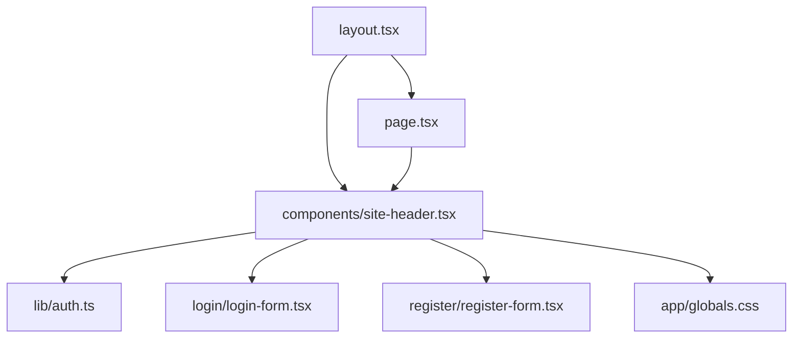
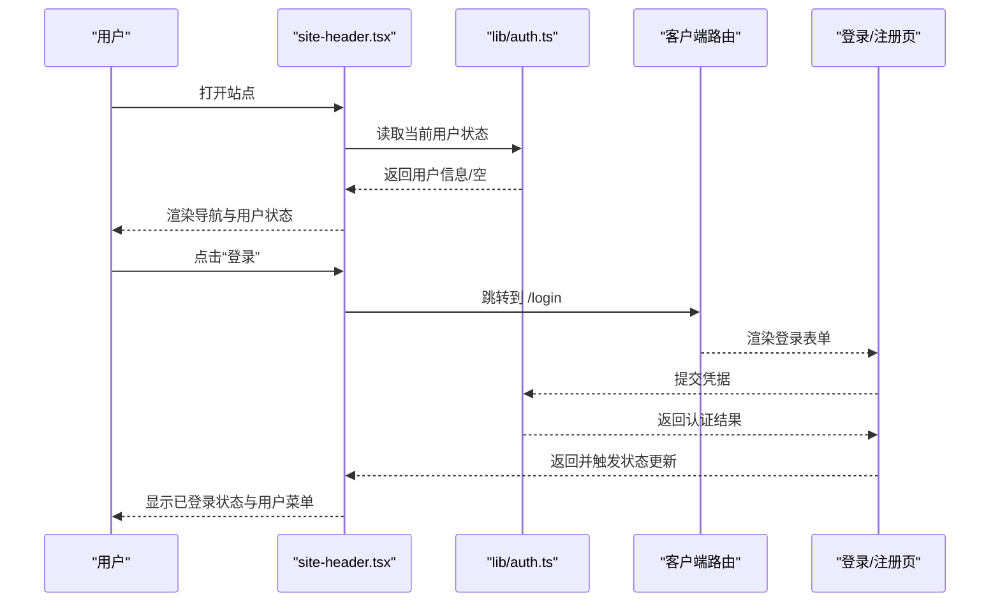
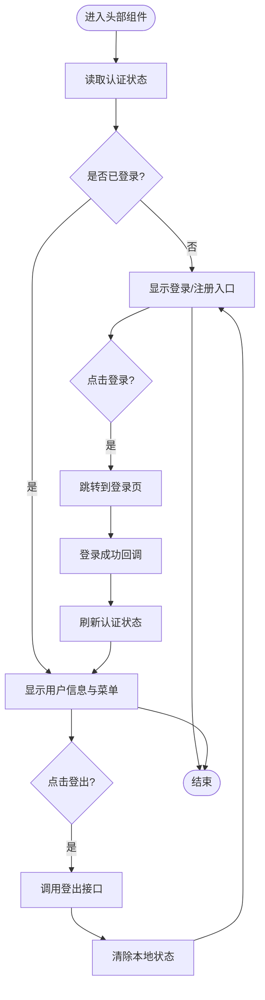
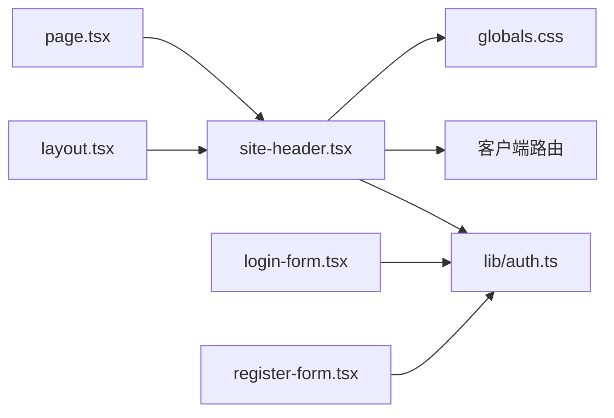

# 站点头部组件

<cite>
**本文档引用的文件**   
- [site-header.tsx](file://app/components/site-header.tsx)
- [auth.ts](file://app/lib/auth.ts)
- [layout.tsx](file://app/layout.tsx)
- [page.tsx](file://app/page.tsx)
- [login-form.tsx](file://app/login/login-form.tsx)
- [register-form.tsx](file://app/register/register-form.tsx)
- [globals.css](file://app/globals.css)
</cite>

## 目录
1. [简介](#简介)
2. [项目结构](#项目结构)
3. [核心组件](#核心组件)
4. [架构总览](#架构总览)
5. [详细组件分析](#详细组件分析)
6. [依赖关系分析](#依赖关系分析)
7. [性能考量](#性能考量)
8. [故障排查指南](#故障排查指南)
9. [结论](#结论)
10. [附录](#附录)

## 简介
本文件为“站点头部组件”（Site Header）的完整技术文档，面向开发者与产品/设计人员。内容涵盖：
- 功能概览：用户状态显示、菜单项配置、导航链接、登录/注册入口
- 属性与配置：Props 定义、默认值、类型约束
- 样式定制：主题适配、响应式策略、CSS 变量与类名约定
- 使用示例：在页面布局中的集成方式、事件处理与回调
- 认证与权限：用户状态的获取与更新机制、受保护路由的访问控制
- 可访问性与 SEO：无障碍标签、语义化结构与搜索引擎优化建议

## 项目结构
站点头部组件位于 app/components 下，作为全局导航被 layout.tsx 引入并在所有页面渲染。认证逻辑集中在 app/lib/auth.ts，登录/注册表单分别在 login 与 register 目录下。全局样式通过 globals.css 管理。

图表来源
- [layout.tsx](file://app/layout.tsx)
- [site-header.tsx](file://app/components/site-header.tsx)
- [auth.ts](file://app/lib/auth.ts)
- [page.tsx](file://app/page.tsx)
- [login-form.tsx](file://app/login/login-form.tsx)
- [register-form.tsx](file://app/register/register-form.tsx)
- [globals.css](file://app/globals.css)

章节来源
- [layout.tsx](file://app/layout.tsx)
- [site-header.tsx](file://app/components/site-header.tsx)
- [auth.ts](file://app/lib/auth.ts)
- [page.tsx](file://app/page.tsx)
- [login-form.tsx](file://app/login/login-form.tsx)
- [register-form.tsx](file://app/register/register-form.tsx)
- [globals.css](file://app/globals.css)

## 核心组件
- 组件职责
  - 展示顶部导航栏，包含品牌标识、主导航菜单、用户状态区、登录/注册入口
  - 根据认证状态切换显示“已登录/未登录”视图
  - 提供移动端折叠菜单与键盘可达性支持
  - 与认证模块联动，触发登录/登出流程并刷新状态
- 关键能力
  - 用户状态读取与订阅更新
  - 菜单项配置（静态或动态）
  - 导航跳转（客户端路由）
  - 主题与样式扩展点（CSS 变量、类名覆盖）
  - 可访问性（ARIA、焦点管理）

章节来源
- [site-header.tsx](file://app/components/site-header.tsx)
- [auth.ts](file://app/lib/auth.ts)

## 架构总览
头部组件与认证模块、布局层及页面层的关系如下：
- 布局层负责注入头部组件到页面骨架
- 头部组件从认证模块读取当前用户状态，并在状态变化时重新渲染
- 登录/注册入口跳转到对应页面，完成认证后返回并刷新头部状态
- 导航链接通过客户端路由进行无刷新跳转

图表来源
- [site-header.tsx](file://app/components/site-header.tsx)
- [auth.ts](file://app/lib/auth.ts)
- [login-form.tsx](file://app/login/login-form.tsx)
- [register-form.tsx](file://app/register/register-form.tsx)
- [page.tsx](file://app/page.tsx)

## 详细组件分析

### 组件接口与属性（Props）
- 推荐属性清单
  - menuItems: 菜单项数组，每项包含标题、路径、是否受保护等字段
  - brandLabel: 品牌名称或 Logo 文本
  - onLoginClick/onLogoutClick: 登录/登出回调钩子
  - userState: 外部传入的用户状态（可选，若由内部认证模块管理则可不传）
  - theme: 主题键或主题对象（用于样式定制）
  - mobileMenuOpen: 移动端菜单展开状态（受控）
  - onMobileMenuToggle: 移动端菜单开关回调
- 默认行为
  - 未登录时显示“登录/注册”入口；已登录时显示用户名与下拉菜单
  - 移动端默认收起菜单，点击汉堡按钮展开
  - 导航点击走客户端路由，避免整页刷新

章节来源
- [site-header.tsx](file://app/components/site-header.tsx)

### 用户状态与认证集成
- 状态来源
  - 优先使用内部认证模块提供的状态与订阅
  - 若外部传入 userState，则以外部为准
- 状态更新
  - 登录成功后刷新状态并关闭登录弹窗/跳转回原页面
  - 登出后清空状态并重置导航视图
- 权限控制
  - 对受保护的菜单项，未登录或未授权时隐藏或禁用
  - 受保护路由在进入前检查认证状态，必要时重定向至登录页

图表来源
- [site-header.tsx](file://app/components/site-header.tsx)
- [auth.ts](file://app/lib/auth.ts)

章节来源
- [site-header.tsx](file://app/components/site-header.tsx)
- [auth.ts](file://app/lib/auth.ts)

### 菜单项配置与导航
- 菜单项结构
  - 标题：用于显示
  - 路径：导航目标
  - 受保护：布尔值，决定是否需认证
  - 图标/描述：可选，增强可读性
- 导航实现
  - 客户端路由跳转，支持历史回退
  - 受保护项在未登录时拦截并重定向
- 动态菜单
  - 可根据用户角色或后端配置动态生成菜单

章节来源
- [site-header.tsx](file://app/components/site-header.tsx)

### 样式定制与主题适配
- CSS 变量
  - 建议暴露颜色、字号、间距等变量，便于主题切换
- 类名约定
  - 提供稳定的类名前缀，方便覆盖样式
- 响应式
  - 小屏设备自动切换为折叠菜单
  - 触摸友好的交互区域尺寸
- 主题模式
  - 支持明/暗主题切换，保持对比度与可读性

章节来源
- [site-header.tsx](file://app/components/site-header.tsx)
- [globals.css](file://app/globals.css)

### 可访问性与 SEO
- 可访问性
  - 使用语义化标签（nav、ul/li、button/a）
  - 为交互元素提供 aria-label、aria-expanded、role 等属性
  - 确保键盘可达与焦点顺序合理
- SEO
  - 导航链接使用正确的 href 与 title
  - 避免用图片替代文字导致不可读
  - 保持页面标题与描述清晰

章节来源
- [site-header.tsx](file://app/components/site-header.tsx)

### 与其他组件的集成
- 与布局层集成
  - 在 layout.tsx 中引入并包裹页面内容，保证全局可见
- 与登录/注册表单集成
  - 通过路由跳转与回调函数协同工作
- 与页面级状态管理集成
  - 如需跨组件共享用户状态，可在上层容器注入 userState

章节来源
- [layout.tsx](file://app/layout.tsx)
- [site-header.tsx](file://app/components/site-header.tsx)
- [login-form.tsx](file://app/login/login-form.tsx)
- [register-form.tsx](file://app/register/register-form.tsx)

## 依赖关系分析
- 直接依赖
  - 认证模块：读取/更新用户状态
  - 路由系统：导航跳转
  - 样式文件：全局样式与主题变量
- 间接依赖
  - 布局层：决定组件挂载位置
  - 登录/注册页：完成认证流程

图表来源
- [site-header.tsx](file://app/components/site-header.tsx)
- [auth.ts](file://app/lib/auth.ts)
- [layout.tsx](file://app/layout.tsx)
- [page.tsx](file://app/page.tsx)
- [login-form.tsx](file://app/login/login-form.tsx)
- [register-form.tsx](file://app/register/register-form.tsx)
- [globals.css](file://app/globals.css)

章节来源
- [site-header.tsx](file://app/components/site-header.tsx)
- [auth.ts](file://app/lib/auth.ts)
- [layout.tsx](file://app/layout.tsx)
- [page.tsx](file://app/page.tsx)
- [login-form.tsx](file://app/login/login-form.tsx)
- [register-form.tsx](file://app/register/register-form.tsx)
- [globals.css](file://app/globals.css)

## 性能考量
- 状态订阅最小化：仅在认证状态变化时重新渲染头部
- 懒加载菜单数据：按需请求菜单配置，减少首屏负载
- 路由跳转优化：使用客户端路由避免整页刷新
- 样式与资源：合并样式、使用 CSS 变量减少重复计算

[本节为通用指导，不直接分析具体文件]

## 故障排查指南
- 常见问题
  - 登录后头部未刷新：检查认证状态订阅与回调是否正确触发
  - 受保护菜单仍可见：确认权限判断逻辑与菜单项标记
  - 移动端菜单无法展开：检查状态管理与事件绑定
  - 主题不生效：确认 CSS 变量与类名覆盖优先级
- 调试建议
  - 在认证回调处打印状态变化
  - 使用浏览器开发者工具检查网络请求与路由跳转
  - 验证 ARIA 属性与键盘可达性

章节来源
- [site-header.tsx](file://app/components/site-header.tsx)
- [auth.ts](file://app/lib/auth.ts)

## 结论
站点头部组件是应用的全局导航与认证入口，承担用户状态展示、菜单导航与主题适配等职责。通过与认证模块和路由系统的协作，实现了流畅的登录/注册体验与权限控制。遵循可访问性与 SEO 最佳实践，可提升用户体验与搜索引擎友好度。建议在项目中统一使用 CSS 变量与稳定类名，以便灵活定制主题与样式。

[本节为总结性内容，不直接分析具体文件]

## 附录
- 使用示例
  - 在布局层引入并渲染头部组件，确保所有页面共享
  - 配置菜单项数组，设置受保护项与导航路径
  - 监听登录/登出回调，执行必要的业务逻辑
- 最佳实践
  - 将用户状态提升到上层容器，避免重复订阅
  - 对敏感操作增加二次确认
  - 保持导航文案简洁明确，符合用户心智模型

[本节为补充说明，不直接分析具体文件]