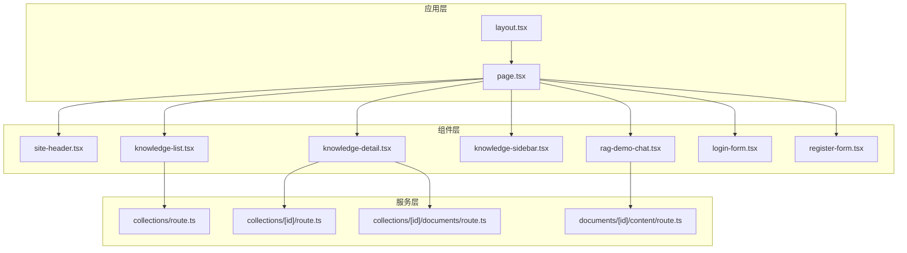
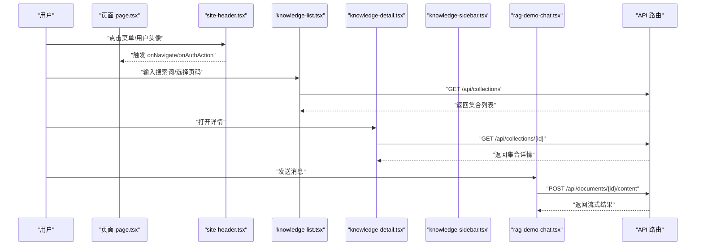
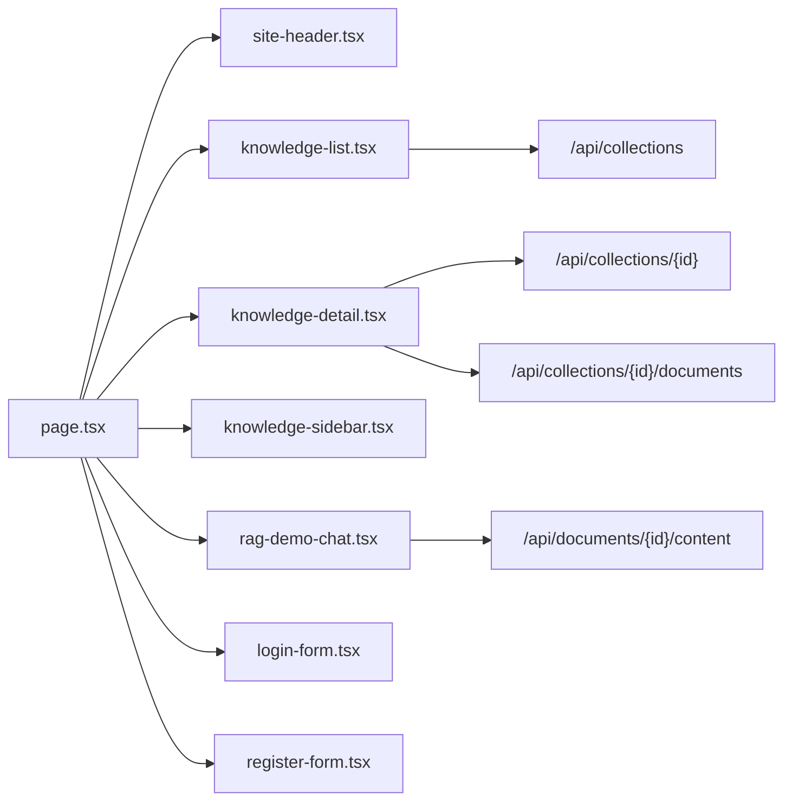

# 组件库

<cite>
**本文引用的文件**   
- [package.json](file://package.json)
- [next.config.ts](file://next.config.ts)
- [tsconfig.json](file://tsconfig.json)
- [layout.tsx](file://app/layout.tsx)
- [page.tsx](file://app/page.tsx)
- [site-header.tsx](file://app/components/site-header.tsx)
- [knowledge-list.tsx](file://app/components/knowledge-list.tsx)
- [knowledge-detail.tsx](file://app/components/knowledge-detail.tsx)
- [knowledge-sidebar.tsx](file://app/components/knowledge-sidebar.tsx)
- [rag-demo-chat.tsx](file://app/components/rag-demo-chat.tsx)
- [login-form.tsx](file://app/login/login-form.tsx)
- [register-form.tsx](file://app/register/register-form.tsx)
- [auth.ts](file://app/lib/auth.ts)
- [globals.css](file://app/globals.css)
- [page.module.css](file://app/knowledge/page.module.css)
- [route.ts](file://app/api/collections/route.ts)
- [route.ts](file://app/api/collections/[id]/route.ts)
- [route.ts](file://app/api/collections/[id]/documents/route.ts)
- [route.ts](file://app/api/documents/[id]/content/route.ts)
</cite>

## 目录
1. [简介](#简介)
2. [项目结构](#项目结构)
3. [核心组件](#核心组件)
4. [架构总览](#架构总览)
5. [详细组件分析](#详细组件分析)
6. [依赖关系分析](#依赖关系分析)
7. [性能考虑](#性能考虑)
8. [故障排查指南](#故障排查指南)
9. [结论](#结论)
10. [附录](#附录)

## 简介
本文件为 RAG_Front 的组件库文档，聚焦于可复用 UI 与业务组件，包括头部导航、知识管理（列表、详情、侧边栏）、演示聊天以及登录注册表单等。文档覆盖：
- 组件功能、属性接口、事件回调与样式定制
- site-header 的导航、菜单配置与用户状态展示
- 组件间通信机制与数据传递方式
- 使用示例、最佳实践与性能优化建议
- 主题定制、国际化支持与无障碍访问特性
- 组合模式与布局技巧
- 测试方法与调试技巧

## 项目结构
RAG_Front 基于 Next.js 应用，采用 App Router 组织页面与组件。组件集中在 app/components 下，API 路由在 app/api 下，全局样式与布局在 app 根目录。

图表来源
- [layout.tsx:1-200](file://app/layout.tsx#L1-L200)
- [page.tsx:1-200](file://app/page.tsx#L1-L200)
- [site-header.tsx:1-200](file://app/components/site-header.tsx#L1-L200)
- [knowledge-list.tsx:1-200](file://app/components/knowledge-list.tsx#L1-L200)
- [knowledge-detail.tsx:1-200](file://app/components/knowledge-detail.tsx#L1-L200)
- [knowledge-sidebar.tsx:1-200](file://app/components/knowledge-sidebar.tsx#L1-L200)
- [rag-demo-chat.tsx:1-200](file://app/components/rag-demo-chat.tsx#L1-L200)
- [login-form.tsx:1-200](file://app/login/login-form.tsx#L1-L200)
- [register-form.tsx:1-200](file://app/register/register-form.tsx#L1-L200)
- [route.ts:1-200](file://app/api/collections/route.ts#L1-L200)
- [route.ts:1-200](file://app/api/collections/[id]/route.ts#L1-L200)
- [route.ts:1-200](file://app/api/collections/[id]/documents/route.ts#L1-L200)
- [route.ts:1-200](file://app/api/documents/[id]/content/route.ts#L1-L200)

章节来源
- [layout.tsx:1-200](file://app/layout.tsx#L1-L200)
- [page.tsx:1-200](file://app/page.tsx#L1-L200)

## 核心组件
本节概述各组件的职责与交互边界，便于快速定位与理解整体能力。

- site-header：顶部导航与用户状态展示，支持菜单项配置、路由跳转与鉴权入口。
- knowledge-list：知识库列表，支持分页、搜索、筛选与批量操作。
- knowledge-detail：知识库详情，包含元信息、文档列表与内容预览。
- knowledge-sidebar：侧边导航与快捷操作，如切换视图、过滤条件。
- rag-demo-chat：演示聊天界面，发送消息、接收流式响应与错误提示。
- login-form / register-form：登录与注册表单，含校验、提交与错误处理。
- auth：认证工具函数，封装鉴权逻辑与令牌管理。

章节来源
- [site-header.tsx:1-200](file://app/components/site-header.tsx#L1-L200)
- [knowledge-list.tsx:1-200](file://app/components/knowledge-list.tsx#L1-L200)
- [knowledge-detail.tsx:1-200](file://app/components/knowledge-detail.tsx#L1-L200)
- [knowledge-sidebar.tsx:1-200](file://app/components/knowledge-sidebar.tsx#L1-L200)
- [rag-demo-chat.tsx:1-200](file://app/components/rag-demo-chat.tsx#L1-L200)
- [login-form.tsx:1-200](file://app/login/login-form.tsx#L1-L200)
- [register-form.tsx:1-200](file://app/register/register-form.tsx#L1-L200)
- [auth.ts:1-200](file://app/lib/auth.ts#L1-L200)

## 架构总览
组件通过 props 与事件向上/向下传递数据；页面作为容器编排组件；API 路由提供数据获取与写入；全局样式与主题变量集中管理。

图表来源
- [page.tsx:1-200](file://app/page.tsx#L1-L200)
- [site-header.tsx:1-200](file://app/components/site-header.tsx#L1-L200)
- [knowledge-list.tsx:1-200](file://app/components/knowledge-list.tsx#L1-L200)
- [knowledge-detail.tsx:1-200](file://app/components/knowledge-detail.tsx#L1-L200)
- [knowledge-sidebar.tsx:1-200](file://app/components/knowledge-sidebar.tsx#L1-L200)
- [rag-demo-chat.tsx:1-200](file://app/components/rag-demo-chat.tsx#L1-L200)
- [route.ts:1-200](file://app/api/collections/route.ts#L1-L200)
- [route.ts:1-200](file://app/api/collections/[id]/route.ts#L1-L200)
- [route.ts:1-200](file://app/api/documents/[id]/content/route.ts#L1-L200)

## 详细组件分析

### site-header 组件
职责：
- 顶部导航渲染与菜单项配置
- 用户状态显示（登录态、头像、下拉菜单）
- 鉴权入口与路由跳转

属性接口（建议）：
- menuItems：菜单项数组，每项包含 label、path、icon、children
- user：当前用户对象，包含 id、name、avatar、roles
- onNavigate：菜单点击回调，参数为选中项
- onAuthAction：鉴权动作回调，如登录/登出
- brand：品牌名或 Logo 配置
- theme：主题开关（light/dark）

事件回调：
- onMenuClick(item)
- onUserMenuAction(action, payload)
- onThemeToggle()

样式定制：
- 通过 CSS 变量或 className 覆盖主色、字号、间距
- 支持响应式折叠（移动端汉堡菜单）

使用示例（路径引用）：
- [site-header.tsx:1-200](file://app/components/site-header.tsx#L1-L200)

最佳实践：
- 将菜单项与权限结合，按角色动态渲染
- 用户状态变化时及时刷新 header
- 避免在 render 中创建新对象，使用 useMemo 缓存

无障碍访问：
- 为按钮与链接添加 aria-label
- 键盘导航支持 Tab/Enter/Escape
- 高对比度与焦点可见性

章节来源
- [site-header.tsx:1-200](file://app/components/site-header.tsx#L1-L200)

### knowledge-list 组件
职责：
- 展示知识库集合列表
- 支持搜索、筛选、分页与批量操作

属性接口（建议）：
- collections：集合数据数组
- loading：加载状态
- error：错误信息
- searchQuery：搜索关键词
- filters：筛选条件（分类、时间范围等）
- pageSize：每页条数
- onPageChange：页码变更回调
- onSelect：行选择回调
- onRefresh：刷新回调

事件回调：
- onSearch(query)
- onFilterChange(filters)
- onRowClick(collection)
- onBatchAction(actions, selectedIds)

样式定制：
- 表格列宽、排序图标、空状态占位图
- 响应式卡片布局（小屏）

使用示例（路径引用）：
- [knowledge-list.tsx:1-200](file://app/components/knowledge-list.tsx#L1-L200)

性能优化：
- 虚拟滚动（大数据量）
- 防抖搜索与分页请求合并
- 使用 React.memo 包裹行组件

章节来源
- [knowledge-list.tsx:1-200](file://app/components/knowledge-list.tsx#L1-L200)

### knowledge-detail 组件
职责：
- 展示集合元信息与文档列表
- 内容预览与下载

属性接口（建议）：
- collection：集合详情对象
- documents：文档列表
- loading：加载状态
- error：错误信息
- onBack：返回回调
- onOpenDoc：打开文档回调

事件回调：
- onDocumentClick(doc)
- onDownload(docId)
- onPreview(docId)

样式定制：
- 详情卡片布局、文档缩略图、标签样式

使用示例（路径引用）：
- [knowledge-detail.tsx:1-200](file://app/components/knowledge-detail.tsx#L1-L200)

章节来源
- [knowledge-detail.tsx:1-200](file://app/components/knowledge-detail.tsx#L1-L200)

### knowledge-sidebar 组件
职责：
- 侧边导航与快捷操作
- 视图切换（列表/网格/树形）
- 常用筛选条件面板

属性接口（建议）：
- viewMode：当前视图模式
- filters：筛选面板数据
- onSwitchView(mode)
- onApplyFilters(filters)

样式定制：
- 宽度、背景、分隔线、图标颜色

使用示例（路径引用）：
- [knowledge-sidebar.tsx:1-200](file://app/components/knowledge-sidebar.tsx#L1-L200)

章节来源
- [knowledge-sidebar.tsx:1-200](file://app/components/knowledge-sidebar.tsx#L1-L200)

### rag-demo-chat 组件
职责：
- 演示聊天界面
- 发送消息、接收流式响应、错误提示

属性接口（建议）：
- documentId：目标文档 ID
- messages：消息历史
- onSend(message)
- onError(error)

事件回调：
- onMessageReceived(msg)
- onStreamUpdate(chunk)
- onRetry()

样式定制：
- 气泡样式、滚动区域、加载动画

使用示例（路径引用）：
- [rag-demo-chat.tsx:1-200](file://app/components/rag-demo-chat.tsx#L1-L200)

章节来源
- [rag-demo-chat.tsx:1-200](file://app/components/rag-demo-chat.tsx#L1-L200)

### 登录与注册表单
职责：
- 登录/注册表单校验、提交与错误处理
- 与认证模块集成

属性接口（建议）：
- onSubmit(values)
- onSuccess()
- onError(error)
- mode：'login' | 'register'

使用示例（路径引用）：
- [login-form.tsx:1-200](file://app/login/login-form.tsx#L1-L200)
- [register-form.tsx:1-200](file://app/register/register-form.tsx#L1-L200)

章节来源
- [login-form.tsx:1-200](file://app/login/login-form.tsx#L1-L200)
- [register-form.tsx:1-200](file://app/register/register-form.tsx#L1-L200)

### 认证工具 auth
职责：
- 封装鉴权逻辑、令牌存取与状态判断

接口（建议）：
- getToken()
- setToken(token)
- removeToken()
- isAuthenticated()
- getUserInfo()

使用示例（路径引用）：
- [auth.ts:1-200](file://app/lib/auth.ts#L1-L200)

章节来源
- [auth.ts:1-200](file://app/lib/auth.ts#L1-L200)

## 依赖关系分析
组件依赖关系与调用链如下：

图表来源
- [page.tsx:1-200](file://app/page.tsx#L1-L200)
- [site-header.tsx:1-200](file://app/components/site-header.tsx#L1-L200)
- [knowledge-list.tsx:1-200](file://app/components/knowledge-list.tsx#L1-L200)
- [knowledge-detail.tsx:1-200](file://app/components/knowledge-detail.tsx#L1-L200)
- [knowledge-sidebar.tsx:1-200](file://app/components/knowledge-sidebar.tsx#L1-L200)
- [rag-demo-chat.tsx:1-200](file://app/components/rag-demo-chat.tsx#L1-L200)
- [route.ts:1-200](file://app/api/collections/route.ts#L1-L200)
- [route.ts:1-200](file://app/api/collections/[id]/route.ts#L1-L200)
- [route.ts:1-200](file://app/api/collections/[id]/documents/route.ts#L1-L200)
- [route.ts:1-200](file://app/api/documents/[id]/content/route.ts#L1-L200)

章节来源
- [page.tsx:1-200](file://app/page.tsx#L1-L200)
- [route.ts:1-200](file://app/api/collections/route.ts#L1-L200)
- [route.ts:1-200](file://app/api/collections/[id]/route.ts#L1-L200)
- [route.ts:1-200](file://app/api/collections/[id]/documents/route.ts#L1-L200)
- [route.ts:1-200](file://app/api/documents/[id]/content/route.ts#L1-L200)

## 性能考虑
- 列表与详情：
  - 使用分页与懒加载减少首屏压力
  - 对大列表启用虚拟滚动
  - 图片与媒体资源使用 CDN 与压缩
- 网络请求：
  - 合并重复请求与去重
  - 合理设置缓存策略（ETag/Cache-Control）
  - 失败重试与退避策略
- 渲染优化：
  - 使用 React.memo、useMemo、useCallback
  - 拆分重型组件为子组件
  - 避免在 render 中创建新对象
- 主题与样式：
  - 使用 CSS 变量与按需加载样式
  - 避免过度嵌套与复杂选择器

[本节为通用指导，不直接分析具体文件]

## 故障排查指南
常见问题与定位方法：
- 菜单不生效：检查 onNavigate 是否绑定、路由是否正确
- 列表无数据：确认 API 返回结构与字段映射
- 详情空白：验证集合 ID 与权限
- 聊天无响应：检查网络连接与后端流式接口
- 登录失败：查看 token 存储与过期处理

调试技巧：
- 使用浏览器开发者工具 Network 面板查看请求
- 在组件内打印关键 state 与 props
- 使用控制台断点与日志输出
- 针对异步流程增加超时与错误捕获

章节来源
- [site-header.tsx:1-200](file://app/components/site-header.tsx#L1-L200)
- [knowledge-list.tsx:1-200](file://app/components/knowledge-list.tsx#L1-L200)
- [knowledge-detail.tsx:1-200](file://app/components/knowledge-detail.tsx#L1-L200)
- [rag-demo-chat.tsx:1-200](file://app/components/rag-demo-chat.tsx#L1-L200)
- [auth.ts:1-200](file://app/lib/auth.ts#L1-L200)

## 结论
RAG_Front 组件库以清晰的职责划分与良好的组合模式为基础，提供了完整的头部导航、知识管理与演示聊天能力。通过统一的属性接口与事件回调，组件易于扩展与复用。遵循本文的最佳实践与性能建议，可在保证用户体验的同时提升开发效率。

[本节为总结性内容，不直接分析具体文件]

## 附录

### 主题定制
- 使用 CSS 变量定义主色、背景、文字与边框
- 在 layout 或根组件注入主题上下文
- 支持明暗主题切换与持久化

### 国际化支持
- 抽取文案到 i18n 文件
- 组件通过 key 获取文本
- 支持多语言切换与回退

### 无障碍访问
- 语义化 HTML 与正确 ARIA 属性
- 键盘导航与焦点管理
- 屏幕阅读器友好描述

### 组合模式与布局技巧
- 页面作为容器编排组件
- 使用插槽/children 进行内容注入
- 通过 props 控制行为与样式

### 测试方法与调试技巧
- 单元测试：Jest + React Testing Library
- 组件快照测试与交互测试
- 端到端测试：Playwright/Cypress
- 调试：React DevTools、网络抓包、日志追踪

章节来源
- [globals.css:1-200](file://app/globals.css#L1-L200)
- [page.module.css:1-200](file://app/knowledge/page.module.css#L1-L200)
- [package.json:1-200](file://package.json#L1-L200)
- [next.config.ts:1-200](file://next.config.ts#L1-L200)
- [tsconfig.json:1-200](file://tsconfig.json#L1-L200)