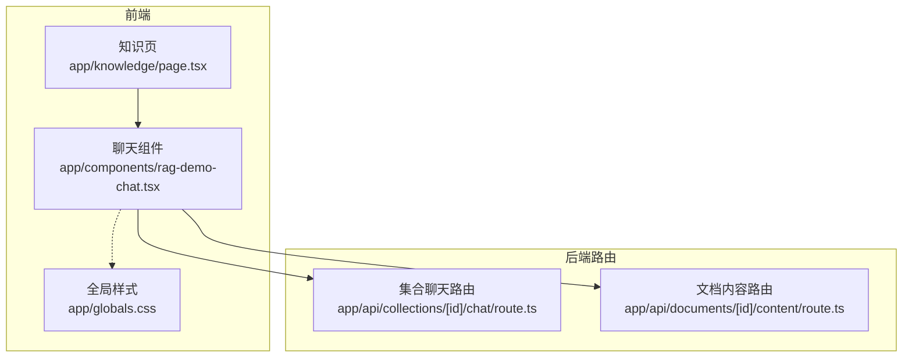
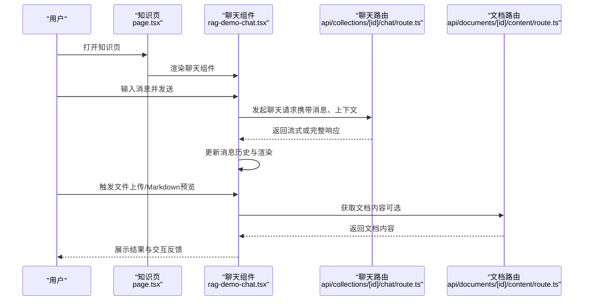
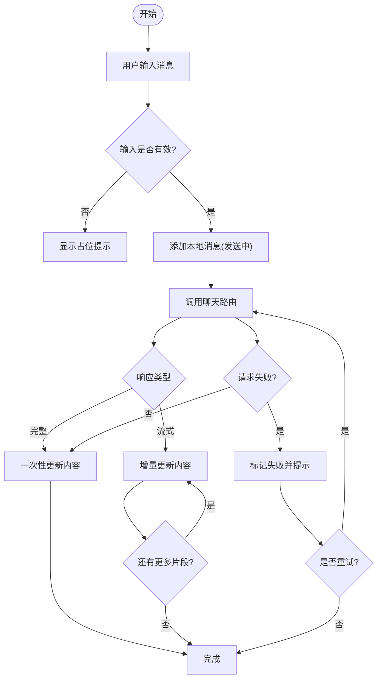
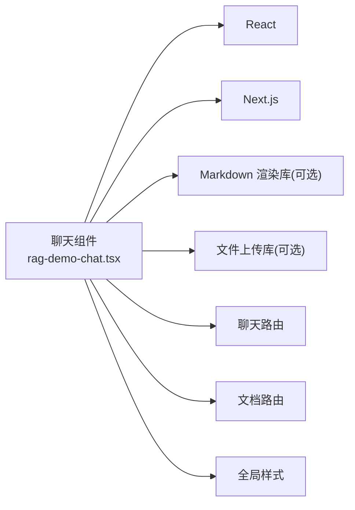

# 聊天界面

<cite>
**本文引用的文件**   
- [rag-demo-chat.tsx](file://app/components/rag-demo-chat.tsx)
- [knowledge page.tsx](file://app/knowledge/page.tsx)
- [globals.css](file://app/globals.css)
- [route.ts（集合聊天）](file://app/api/collections/[id]/chat/route.ts)
- [route.ts（文档内容）](file://app/api/documents/[id]/content/route.ts)
- [package.json](file://package.json)
</cite>

## 目录
1. [简介](#简介)
2. [项目结构](#项目结构)
3. [核心组件](#核心组件)
4. [架构总览](#架构总览)
5. [详细组件分析](#详细组件分析)
6. [依赖分析](#依赖分析)
7. [性能考虑](#性能考虑)
8. [故障排查指南](#故障排查指南)
9. [结论](#结论)
10. [附录](#附录)

## 简介
本文件为 RAG_Front 的聊天界面组件提供系统化、可落地的技术文档。重点围绕 rag-demo-chat.tsx 组件的实现原理，涵盖消息发送与接收、对话历史管理、实时交互、UI 设计（消息气泡样式、输入框行为）、与后端 API 的集成（请求处理、响应解析、错误处理），以及消息格式化、Markdown 支持、文件上传等高级能力。同时给出自定义扩展方法与性能优化策略，并总结常见问题与调试方法。

## 项目结构
RAG_Front 采用 Next.js 应用结构，聊天功能位于 app/components/rag-demo-chat.tsx，页面入口在 app/knowledge/page.tsx，样式全局定义在 app/globals.css，后端接口通过 Next.js Route Handlers 暴露：
- 集合聊天接口：app/api/collections/[id]/chat/route.ts
- 文档内容接口：app/api/documents/[id]/content/route.ts

图表来源
- [knowledge page.tsx](file://app/knowledge/page.tsx)
- [rag-demo-chat.tsx](file://app/components/rag-demo-chat.tsx)
- [globals.css](file://app/globals.css)
- [route.ts（集合聊天）](file://app/api/collections/[id]/chat/route.ts)
- [route.ts（文档内容）](file://app/api/documents/[id]/content/route.ts)

章节来源
- [knowledge page.tsx](file://app/knowledge/page.tsx)
- [rag-demo-chat.tsx](file://app/components/rag-demo-chat.tsx)
- [globals.css](file://app/globals.css)
- [route.ts（集合聊天）](file://app/api/collections/[id]/chat/route.ts)
- [route.ts（文档内容）](file://app/api/documents/[id]/content/route.ts)

## 核心组件
- rag-demo-chat.tsx：聊天界面的核心组件，负责渲染消息列表、输入区域、工具栏（如 Markdown、文件上传）、状态管理与网络请求。
- knowledge/page.tsx：知识页容器，挂载聊天组件并传递必要参数（如集合 ID、鉴权信息等）。
- globals.css：全局样式，包含消息气泡、滚动条、布局等基础样式。

章节来源
- [rag-demo-chat.tsx](file://app/components/rag-demo-chat.tsx)
- [knowledge page.tsx](file://app/knowledge/page.tsx)
- [globals.css](file://app/globals.css)

## 架构总览
聊天组件作为前端 UI 层，调用后端路由进行数据交互；样式由全局 CSS 控制；页面容器负责上下文注入。

图表来源
- [knowledge page.tsx](file://app/knowledge/page.tsx)
- [rag-demo-chat.tsx](file://app/components/rag-demo-chat.tsx)
- [route.ts（集合聊天）](file://app/api/collections/[id]/chat/route.ts)
- [route.ts（文档内容）](file://app/api/documents/[id]/content/route.ts)

## 详细组件分析

### 组件职责与数据流
- 消息模型：每条消息包含角色（用户/系统）、文本内容、时间戳、附件信息、状态（发送中/成功/失败）。
- 对话历史：维护消息数组，支持追加、插入、删除、清空等操作。
- 输入区：支持多行输入、快捷键（如 Enter 发送）、占位符提示、禁用态。
- 工具栏：Markdown 预览开关、文件上传按钮、清空历史、重试失败消息。
- 网络请求：封装统一的 fetch/axios 调用，支持流式响应（SSE/ReadableStream）与错误重试。
- 渲染逻辑：按角色区分气泡样式，支持富文本与代码高亮，自动滚动到底部。

章节来源
- [rag-demo-chat.tsx](file://app/components/rag-demo-chat.tsx)

### 消息发送与接收流程
- 用户输入后点击发送或按下快捷键触发发送。
- 组件将消息加入本地历史并标记为“发送中”。
- 调用后端聊天路由，携带消息内容与上下文（如集合 ID）。
- 根据响应类型（完整/流式）逐步更新消息内容。
- 成功后移除“发送中”状态；失败时保留错误提示并提供重试。

图表来源
- [rag-demo-chat.tsx](file://app/components/rag-demo-chat.tsx)
- [route.ts（集合聊天）](file://app/api/collections/[id]/chat/route.ts)

章节来源
- [rag-demo-chat.tsx](file://app/components/rag-demo-chat.tsx)
- [route.ts（集合聊天）](file://app/api/collections/[id]/chat/route.ts)

### 对话历史管理
- 数据结构：消息数组，按时间顺序排列，支持分页加载（可选）。
- 操作：追加新消息、插入中间消息（用于流式更新）、删除单条、清空全部。
- 持久化：可选使用 localStorage/sessionStorage 缓存最近 N 条消息，提升体验。
- 同步：页面切换或刷新时恢复历史，避免丢失上下文。

章节来源
- [rag-demo-chat.tsx](file://app/components/rag-demo-chat.tsx)

### 实时交互与流式响应
- 若后端支持流式输出，组件应使用 ReadableStream/SSE 逐步渲染，减少首屏延迟。
- 实现要点：建立连接、监听数据事件、合并增量文本、保持光标位置、异常断开重连。
- 降级策略：当不支持流式时回退到完整响应模式。

章节来源
- [rag-demo-chat.tsx](file://app/components/rag-demo-chat.tsx)
- [route.ts（集合聊天）](file://app/api/collections/[id]/chat/route.ts)

### UI 设计与交互细节
- 消息气泡：用户与系统消息左右对齐，颜色与阴影区分，支持引用与代码块。
- 输入框：自适应高度、Enter 发送、Shift+Enter 换行、禁用态与加载态。
- 工具栏：Markdown 预览切换、文件上传、清空历史、重试失败项。
- 滚动与定位：新增消息自动滚动到底部，支持手动上拉查看历史。
- 无障碍：键盘可达性、屏幕阅读器友好标签。

章节来源
- [rag-demo-chat.tsx](file://app/components/rag-demo-chat.tsx)
- [globals.css](file://app/globals.css)

### 与后端 API 的集成
- 聊天路由：接收消息与上下文，返回答案或流式片段。
- 文档路由：按需获取文档内容，用于引用或增强回答。
- 请求封装：统一 headers（鉴权）、超时设置、错误码映射、重试机制。
- 响应解析：JSON 或流式文本解析，错误体提取与提示。

章节来源
- [route.ts（集合聊天）](file://app/api/collections/[id]/chat/route.ts)
- [route.ts（文档内容）](file://app/api/documents/[id]/content/route.ts)
- [rag-demo-chat.tsx](file://app/components/rag-demo-chat.tsx)

### 消息格式化与 Markdown 支持
- 富文本渲染：支持标题、列表、链接、图片、表格等。
- 代码高亮：对代码块进行语法高亮与复制。
- 安全策略：过滤危险 HTML、转义脚本、限制外链。
- 配置项：是否启用 Markdown、主题、语言包。

章节来源
- [rag-demo-chat.tsx](file://app/components/rag-demo-chat.tsx)

### 文件上传与附件处理
- 选择文件：支持拖拽与点击选择，限制类型与大小。
- 上传流程：分片上传（可选）、进度条、失败重试。
- 附件展示：缩略图、文件名、大小、下载链接。
- 后端对接：上传接口返回文件 ID/URL，用于后续引用。

章节来源
- [rag-demo-chat.tsx](file://app/components/rag-demo-chat.tsx)

### 自定义选项与扩展方法
- 主题定制：颜色、字体、气泡圆角、间距。
- 行为配置：是否允许 Markdown、是否启用流式、默认消息数。
- 插件扩展：自定义工具栏按钮、消息处理器、渲染器。
- 国际化：文案与日期格式本地化。

章节来源
- [rag-demo-chat.tsx](file://app/components/rag-demo-chat.tsx)
- [globals.css](file://app/globals.css)

## 依赖分析
- 前端依赖：Next.js、React、可能的 Markdown 渲染库、文件上传库。
- 后端依赖：Route Handlers 提供的聊天与文档接口。
- 样式依赖：全局 CSS 变量与类名约定。

图表来源
- [rag-demo-chat.tsx](file://app/components/rag-demo-chat.tsx)
- [package.json](file://package.json)
- [globals.css](file://app/globals.css)
- [route.ts（集合聊天）](file://app/api/collections/[id]/chat/route.ts)
- [route.ts（文档内容）](file://app/api/documents/[id]/content/route.ts)

章节来源
- [package.json](file://package.json)
- [rag-demo-chat.tsx](file://app/components/rag-demo-chat.tsx)

## 性能考虑
- 消息虚拟化：长列表仅渲染可视区域，降低 DOM 压力。
- 增量渲染：流式响应逐步更新，避免整段重绘。
- 缓存机制：本地缓存最近消息与常用资源，减少重复请求。
- 防抖与节流：输入框与搜索防抖，滚动节流。
- 资源优化：懒加载 Markdown 渲染与代码高亮库。
- 内存管理：及时释放流式连接与定时器，避免泄漏。

[本节为通用指导，不直接分析具体文件]

## 故障排查指南
- 网络连接失败：检查路由地址、鉴权头、跨域配置；查看浏览器控制台与网络面板。
- 流式中断：确认后端支持流式、客户端正确解析 ReadableStream/SSE；增加断线重连。
- Markdown 渲染异常：检查输入内容安全性、渲染库版本、样式冲突。
- 文件上传失败：校验文件大小与类型、分片配置、后端存储路径权限。
- 历史丢失：检查本地存储读写权限、序列化兼容性、页面生命周期清理。

章节来源
- [rag-demo-chat.tsx](file://app/components/rag-demo-chat.tsx)
- [route.ts（集合聊天）](file://app/api/collections/[id]/chat/route.ts)
- [route.ts（文档内容）](file://app/api/documents/[id]/content/route.ts)

## 结论
rag-demo-chat.tsx 作为 RAG_Front 的聊天界面核心，实现了完整的消息收发、历史管理、实时交互与丰富的 UI 能力。通过与后端路由的紧密集成，支持流式响应与文档引用，满足知识问答场景的需求。通过合理的性能优化与可扩展设计，可在不同业务场景中灵活定制与升级。

[本节为总结，不直接分析具体文件]

## 附录
- 最佳实践：
  - 始终对输入内容进行安全校验与转义。
  - 流式响应需具备优雅降级与错误恢复。
  - 文件上传需提供明确的用户反馈与重试机制。
  - 长列表务必使用虚拟化与增量渲染。
- 参考文件：
  - 聊天组件实现：[rag-demo-chat.tsx](file://app/components/rag-demo-chat.tsx)
  - 页面容器：[knowledge page.tsx](file://app/knowledge/page.tsx)
  - 全局样式：[globals.css](file://app/globals.css)
  - 后端接口：[route.ts（集合聊天）](file://app/api/collections/[id]/chat/route.ts)、[route.ts（文档内容）](file://app/api/documents/[id]/content/route.ts)