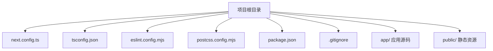
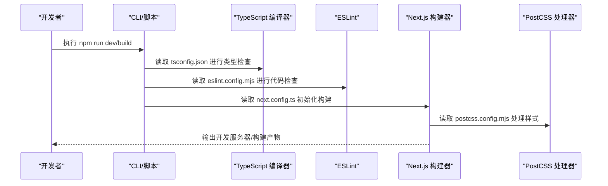
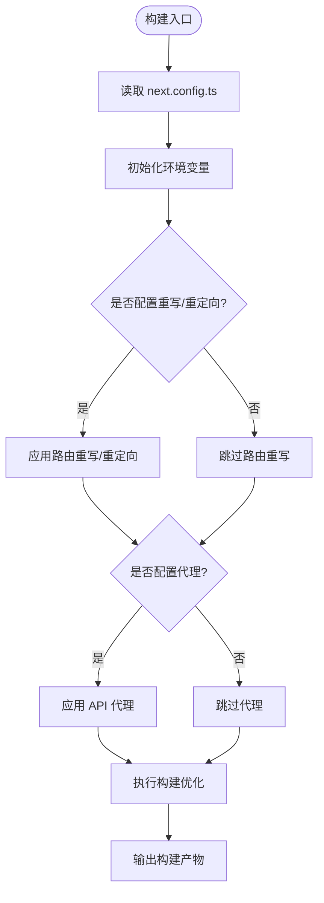
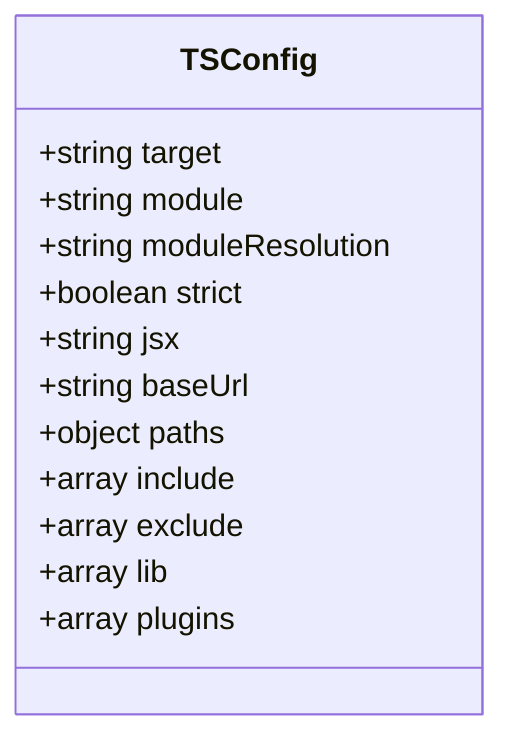
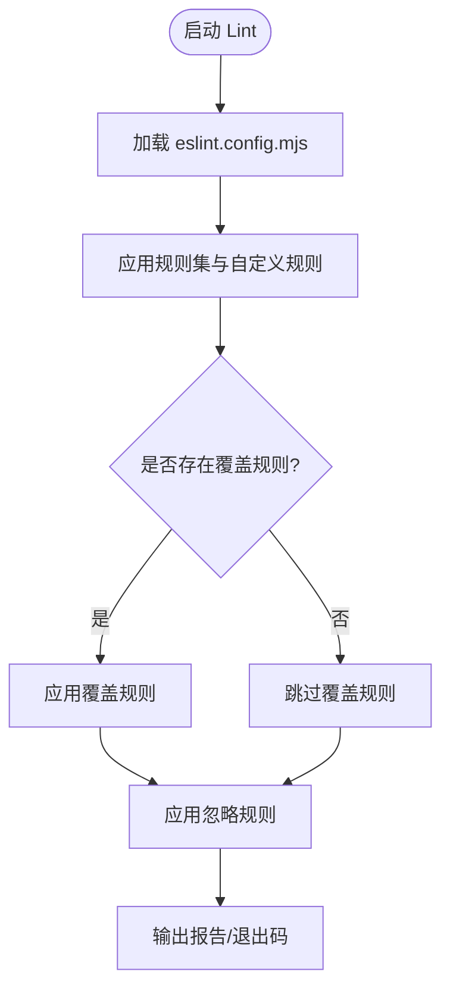
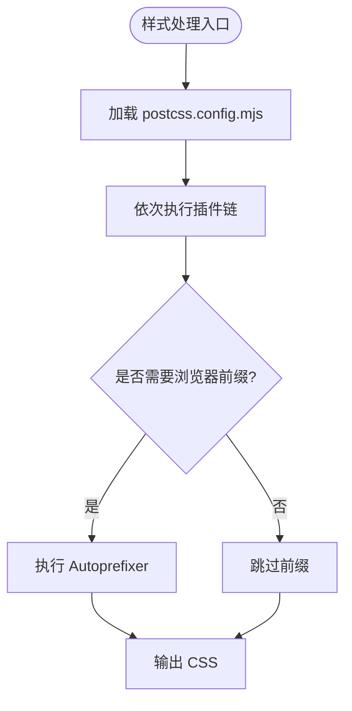
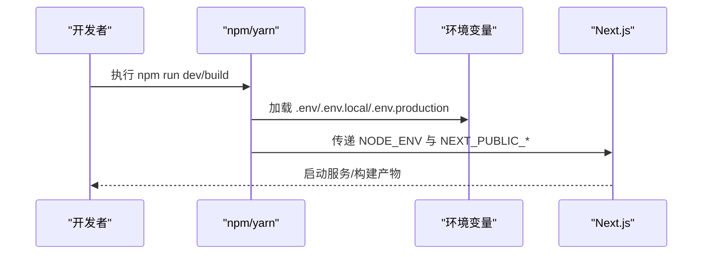
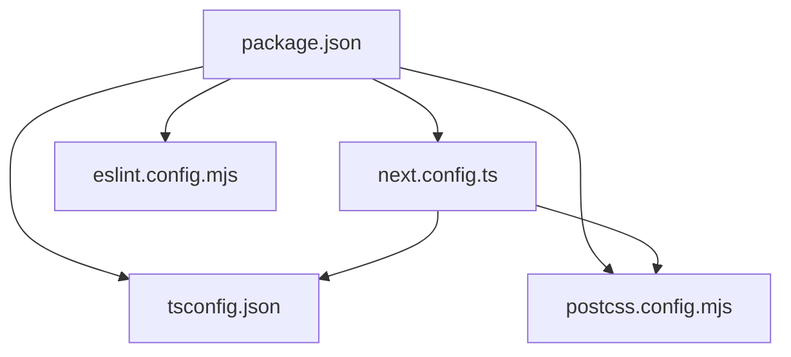

# 配置管理

<cite>
**本文引用的文件**   
- [next.config.ts](file://next.config.ts)
- [tsconfig.json](file://tsconfig.json)
- [eslint.config.mjs](file://eslint.config.mjs)
- [postcss.config.mjs](file://postcss.config.mjs)
- [package.json](file://package.json)
- [.gitignore](file://.gitignore)
</cite>

## 目录
1. [简介](#简介)
2. [项目结构](#项目结构)
3. [核心组件](#核心组件)
4. [架构总览](#架构总览)
5. [详细组件分析](#详细组件分析)
6. [依赖分析](#依赖分析)
7. [性能考虑](#性能考虑)
8. [故障排查指南](#故障排查指南)
9. [结论](#结论)
10. [附录](#附录)

## 简介
本文件为 RAG_Front 项目的配置管理提供系统化说明，覆盖 Next.js、TypeScript、ESLint、PostCSS、环境变量与开发/生产差异、优化建议、扩展方式以及版本管理与迁移指南。目标是帮助开发者快速理解并安全地调整各项配置，确保构建质量与运行性能。

## 项目结构
RAG_Front 采用 Next.js App Router 组织前端代码，根目录包含关键配置文件：
- next.config.ts：Next.js 运行时与构建期配置
- tsconfig.json：TypeScript 编译与类型检查规则
- eslint.config.mjs：代码质量与风格校验
- postcss.config.mjs：CSS 预处理与插件链
- package.json：脚本命令与依赖声明
- .gitignore：忽略规则（如 node_modules、环境变量等）

**图表来源** 
- [next.config.ts](file://next.config.ts)
- [tsconfig.json](file://tsconfig.json)
- [eslint.config.mjs](file://eslint.config.mjs)
- [postcss.config.mjs](file://postcss.config.mjs)
- [package.json](file://package.json)
- [.gitignore](file://.gitignore)

**章节来源**
- [next.config.ts](file://next.config.ts)
- [tsconfig.json](file://tsconfig.json)
- [eslint.config.mjs](file://eslint.config.mjs)
- [postcss.config.mjs](file://postcss.config.mjs)
- [package.json](file://package.json)
- [.gitignore](file://.gitignore)

## 核心组件
本节概述各配置文件的作用与关键设置项，便于快速定位与理解。

- Next.js 配置（next.config.ts）
  - 作用：控制构建行为、路由、中间件、API 代理、图片处理、实验特性开关等
  - 常见选项：基础路径、重写/重定向、代理、压缩、缓存、Webpack/Bundler 定制、环境变量注入、SSR/ISR 策略、安全头、日志级别等
  - 适用场景：部署到不同域名或子路径、跨域 API 调用、静态资源优化、构建产物体积控制

- TypeScript 配置（tsconfig.json）
  - 作用：定义编译器目标、模块系统、严格模式、路径别名、类型检查范围与排除
  - 常见选项：target、module、moduleResolution、strict、jsx、baseUrl、paths、include/exclude、lib、plugins
  - 适用场景：统一编码规范、提升类型安全、简化导入路径、限制不安全的 JS 用法

- ESLint 配置（eslint.config.mjs）
  - 作用：启用规则集、自定义规则、忽略文件、集成 Prettier/React/Next 生态
  - 常见选项：extends、rules、overrides、env、parserOptions、plugins、ignorePatterns
  - 适用场景：强制代码风格、捕获潜在错误、统一团队规范、CI 门禁

- PostCSS 配置（postcss.config.mjs）
  - 作用：CSS 转换流水线、插件顺序、浏览器兼容、Tailwind/autoprefixer 集成
  - 常见选项：plugins、importFrom、map、sourceMap、环境区分
  - 适用场景：自动补全 CSS 特性、按需生成前缀、样式模块化、构建产物优化

- 环境变量与脚本（package.json、.gitignore）
  - 作用：定义开发/测试/生产脚本、暴露环境变量、忽略敏感文件
  - 常见项：scripts、dependencies/devDependencies、NODE_ENV、NEXT_PUBLIC_*、*.env* 忽略

**章节来源**
- [next.config.ts](file://next.config.ts)
- [tsconfig.json](file://tsconfig.json)
- [eslint.config.mjs](file://eslint.config.mjs)
- [postcss.config.mjs](file://postcss.config.mjs)
- [package.json](file://package.json)
- [.gitignore](file://.gitignore)

## 架构总览
下图展示配置在开发与构建流程中的协作关系：

**图表来源** 
- [tsconfig.json](file://tsconfig.json)
- [eslint.config.mjs](file://eslint.config.mjs)
- [next.config.ts](file://next.config.ts)
- [postcss.config.mjs](file://postcss.config.mjs)
- [package.json](file://package.json)

**章节来源**
- [package.json](file://package.json)

## 详细组件分析

### Next.js 配置（next.config.ts）
- 作用与职责
  - 定义应用的基础路径、路由重写与重定向
  - 配置 API 代理与跨域策略
  - 控制构建优化（压缩、Tree Shaking、代码分割）
  - 注入环境变量至客户端（NEXT_PUBLIC_*）
  - 开启/关闭实验特性与安全头
- 典型工作流
  - 开发时：热更新、Source Map、调试信息
  - 构建时：静态资源优化、服务端渲染策略、产物体积控制
- 常见问题
  - 路径别名未生效、代理失效、环境变量未注入、构建失败
- 优化建议
  - 合理拆分页面与组件以减小包体
  - 使用 CDN 托管静态资源
  - 谨慎开启实验特性，避免不稳定影响

**图表来源** 
- [next.config.ts](file://next.config.ts)

**章节来源**
- [next.config.ts](file://next.config.ts)

### TypeScript 配置（tsconfig.json）
- 作用与职责
  - 指定编译目标与模块系统
  - 启用严格类型检查与 JSX 支持
  - 配置路径别名与库引用
  - 控制 include/exclude 范围
- 典型设置项
  - target、module、moduleResolution、strict、jsx、baseUrl、paths、include/exclude、lib、plugins
- 常见问题
  - 路径别名解析失败、类型缺失、JSX 报错、模块找不到
- 优化建议
  - 启用 strict 提升类型安全
  - 使用 paths 简化导入
  - 合理设置 lib 与 target 平衡兼容性

**图表来源** 
- [tsconfig.json](file://tsconfig.json)

**章节来源**
- [tsconfig.json](file://tsconfig.json)

### ESLint 配置（eslint.config.mjs）
- 作用与职责
  - 启用官方与社区规则集
  - 自定义规则与覆盖特定文件
  - 集成 React/Next 生态
  - 忽略无关文件与目录
- 典型设置项
  - extends、rules、overrides、env、parserOptions、plugins、ignorePatterns
- 常见问题
  - 规则冲突、忽略文件误判、插件未安装
- 优化建议
  - 逐步收紧规则，保持团队一致性
  - 在 CI 中强制执行 lint 检查

**图表来源** 
- [eslint.config.mjs](file://eslint.config.mjs)

**章节来源**
- [eslint.config.mjs](file://eslint.config.mjs)

### PostCSS 配置（postcss.config.mjs）
- 作用与职责
  - 定义 CSS 转换插件链与顺序
  - 集成 Tailwind/Autoprefixer
  - 控制 Source Map 与兼容性
- 典型设置项
  - plugins、importFrom、map、sourceMap、环境区分
- 常见问题
  - 插件顺序错误导致样式异常、前缀缺失、Source Map 不可用
- 优化建议
  - 按依赖顺序排列插件
  - 生产环境禁用 Source Map 以提升构建速度

**图表来源** 
- [postcss.config.mjs](file://postcss.config.mjs)

**章节来源**
- [postcss.config.mjs](file://postcss.config.mjs)

### 环境变量与脚本（package.json、.gitignore）
- 作用与职责
  - 定义开发/测试/生产脚本命令
  - 暴露环境变量给应用（如 NEXT_PUBLIC_*）
  - 忽略敏感文件与环境变量模板
- 典型设置项
  - scripts、dependencies/devDependencies、NODE_ENV、NEXT_PUBLIC_*、*.env* 忽略
- 常见问题
  - 环境变量未注入、脚本执行失败、敏感文件泄露
- 优化建议
  - 使用 .env.local 本地覆盖，.env.production 生产专用
  - 在 CI 中注入必要的环境变量

**图表来源** 
- [package.json](file://package.json)
- [.gitignore](file://.gitignore)

**章节来源**
- [package.json](file://package.json)
- [.gitignore](file://.gitignore)

## 依赖分析
- 内部依赖
  - Next.js 构建器依赖 tsconfig.json、next.config.ts、postcss.config.mjs
  - ESLint 通过 eslint.config.mjs 管理规则与插件
  - 脚本命令通过 package.json 串联各工具
- 外部依赖
  - TypeScript、ESLint、PostCSS、Tailwind/Autoprefixer（若使用）
- 耦合与内聚
  - 配置文件相互独立，耦合度低，便于维护与替换
- 循环依赖
  - 配置文件之间无循环依赖

**图表来源** 
- [package.json](file://package.json)
- [next.config.ts](file://next.config.ts)
- [tsconfig.json](file://tsconfig.json)
- [eslint.config.mjs](file://eslint.config.mjs)
- [postcss.config.mjs](file://postcss.config.mjs)

**章节来源**
- [package.json](file://package.json)

## 性能考虑
- 构建优化
  - 启用代码分割与 Tree Shaking
  - 减少不必要的依赖与插件
  - 生产环境禁用 Source Map
- 运行时优化
  - 合理使用 SSR/CSR/ISR
  - 静态资源 CDN 化
  - 图片与字体按需加载
- 开发体验
  - 增量构建与缓存
  - 合理的忽略规则减少扫描开销

[本节为通用指导，无需具体文件来源]

## 故障排查指南
- Next.js 构建失败
  - 检查 next.config.ts 语法与选项合法性
  - 确认环境变量已正确注入
  - 查看控制台错误堆栈定位问题
- TypeScript 类型错误
  - 检查 tsconfig.json 的 include/exclude 与 paths
  - 确认依赖类型声明已安装
- ESLint 报错
  - 检查 eslint.config.mjs 的规则与插件
  - 使用 --fix 自动修复可修复问题
- PostCSS 样式异常
  - 检查插件顺序与兼容性设置
  - 临时禁用插件定位问题

**章节来源**
- [next.config.ts](file://next.config.ts)
- [tsconfig.json](file://tsconfig.json)
- [eslint.config.mjs](file://eslint.config.mjs)
- [postcss.config.mjs](file://postcss.config.mjs)

## 结论
通过系统化配置 Next.js、TypeScript、ESLint、PostCSS 与环境变量，RAG_Front 项目在开发效率、代码质量与构建性能上达到良好平衡。建议遵循本文档的最佳实践，持续优化配置以适应业务增长与技术演进。

[本节为总结性内容，无需具体文件来源]

## 附录
- 添加新配置项
  - 在对应配置文件中新增键值对，确保语义与默认行为一致
  - 在 package.json 中添加脚本或依赖
- 扩展框架功能
  - 通过 next.config.ts 的 webpack/bundler 钩子定制构建
  - 使用 ESLint 插件扩展规则
  - 通过 PostCSS 插件链增强样式处理
- 版本管理与迁移
  - 升级依赖前阅读变更日志
  - 逐步迁移配置项，保留向后兼容
  - 在 CI 中验证构建与测试

[本节为操作指南，无需具体文件来源]