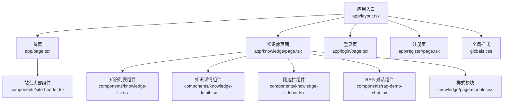
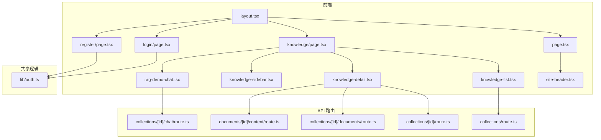
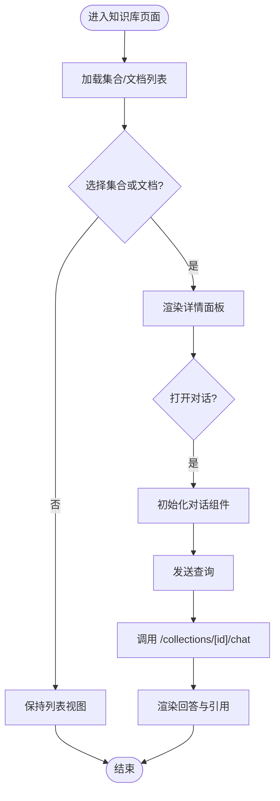
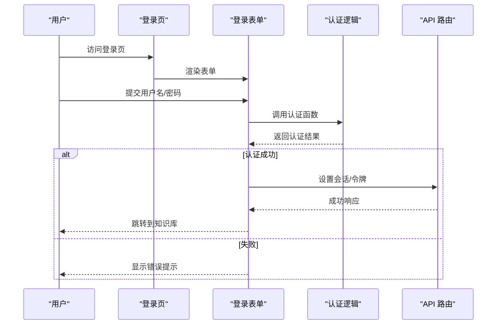
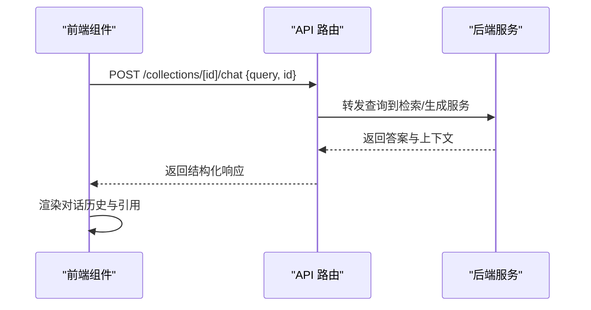
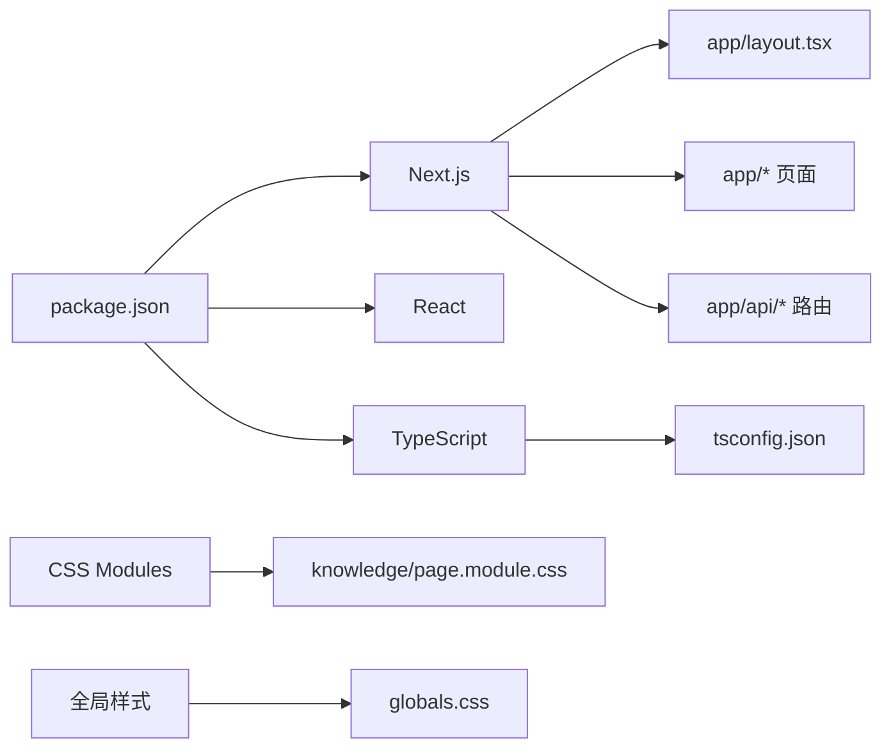

# 项目概览

<cite>
**本文引用的文件**   
- [README.md](file://README.md)
- [package.json](file://package.json)
- [next.config.ts](file://next.config.ts)
- [tsconfig.json](file://tsconfig.json)
- [app/layout.tsx](file://app/layout.tsx)
- [app/page.tsx](file://app/page.tsx)
- [app/globals.css](file://app/globals.css)
- [app/components/site-header.tsx](file://app/components/site-header.tsx)
- [app/knowledge/page.tsx](file://app/knowledge/page.tsx)
- [app/knowledge/page.module.css](file://app/knowledge/page.module.css)
- [app/components/knowledge-list.tsx](file://app/components/knowledge-list.tsx)
- [app/components/knowledge-detail.tsx](file://app/components/knowledge-detail.tsx)
- [app/components/knowledge-sidebar.tsx](file://app/components/knowledge-sidebar.tsx)
- [app/components/rag-demo-chat.tsx](file://app/components/rag-demo-chat.tsx)
- [app/api/collections/route.ts](file://app/api/collections/route.ts)
- [app/api/collections/[id]/route.ts](file://app/api/collections/[id]/route.ts)
- [app/api/collections/[id]/documents/route.ts](file://app/api/collections/[id]/documents/route.ts)
- [app/api/collections/[id]/chat/route.ts](file://app/api/collections/[id]/chat/route.ts)
- [app/api/documents/[id]/content/route.ts](file://app/api/documents/[id]/content/route.ts)
- [app/lib/auth.ts](file://app/lib/auth.ts)
- [app/login/page.tsx](file://app/login/page.tsx)
- [app/login/login-form.tsx](file://app/login/login-form.tsx)
- [app/register/page.tsx](file://app/register/page.tsx)
- [app/register/register-form.tsx](file://app/register/register-form.tsx)
</cite>

## 目录
1. [简介](#简介)
2. [项目结构](#项目结构)
3. [核心组件](#核心组件)
4. [架构总览](#架构总览)
5. [详细组件分析](#详细组件分析)
6. [依赖关系分析](#依赖关系分析)
7. [性能考量](#性能考量)
8. [故障排查指南](#故障排查指南)
9. [结论](#结论)
10. [附录](#附录)

## 简介
RAG_Front 是一个基于 Next.js 的检索增强生成（RAG）前端应用，提供知识库管理、用户认证与聊天界面等核心能力。项目采用 App Router 组织页面与 API 路由，通过组件化拆分实现知识列表、详情、侧边栏与对话演示等功能；API 层暴露集合与文档的增删改查以及按集合发起 RAG 对话的能力。整体设计强调前后端职责清晰、可扩展性与可维护性，便于快速集成后端向量库或大模型服务。

适用场景：企业或个人知识库问答、智能客服、文档检索与摘要、内部知识助手等。目标用户：需要构建 RAG 能力的开发者与产品团队。

## 项目结构
项目遵循 Next.js App Router 约定：
- app/ 下按功能划分页面与组件，api/ 子目录定义服务端路由
- components/ 存放可复用 UI 组件
- lib/ 存放通用逻辑（如认证工具）
- public/ 静态资源
- 根目录包含配置与脚本（Next.js、TypeScript、ESLint、PostCSS 等）

图表来源
- [app/layout.tsx](file://app/layout.tsx)
- [app/page.tsx](file://app/page.tsx)
- [app/knowledge/page.tsx](file://app/knowledge/page.tsx)
- [app/login/page.tsx](file://app/login/page.tsx)
- [app/register/page.tsx](file://app/register/page.tsx)
- [app/components/site-header.tsx](file://app/components/site-header.tsx)
- [app/components/knowledge-list.tsx](file://app/components/knowledge-list.tsx)
- [app/components/knowledge-detail.tsx](file://app/components/knowledge-detail.tsx)
- [app/components/knowledge-sidebar.tsx](file://app/components/knowledge-sidebar.tsx)
- [app/components/rag-demo-chat.tsx](file://app/components/rag-demo-chat.tsx)
- [app/knowledge/page.module.css](file://app/knowledge/page.module.css)
- [app/globals.css](file://app/globals.css)

章节来源
- [README.md](file://README.md)
- [package.json](file://package.json)
- [next.config.ts](file://next.config.ts)
- [tsconfig.json](file://tsconfig.json)

## 核心组件
- 站点头部 site-header：统一导航与品牌展示，贯穿各页面
- 知识列表 knowledge-list：展示集合/文档列表，支持选择与分页
- 知识详情 knowledge-detail：展示选中集合或文档的详细信息与操作
- 侧边栏 knowledge-sidebar：提供集合导航与快捷操作
- RAG 对话 rag-demo-chat：输入问题，调用后端接口进行检索增强生成并流式/非流式渲染结果

这些组件围绕“知识库”主题协作，形成“列表-详情-对话”的主流程。

章节来源
- [app/components/site-header.tsx](file://app/components/site-header.tsx)
- [app/components/knowledge-list.tsx](file://app/components/knowledge-list.tsx)
- [app/components/knowledge-detail.tsx](file://app/components/knowledge-detail.tsx)
- [app/components/knowledge-sidebar.tsx](file://app/components/knowledge-sidebar.tsx)
- [app/components/rag-demo-chat.tsx](file://app/components/rag-demo-chat.tsx)

## 架构总览
前端以 Next.js App Router 为核心，页面组件负责视图与交互，API 路由作为前后端契约，封装对后端的请求。认证逻辑集中在 lib/auth.ts，供受保护页面与 API 使用。

图表来源
- [app/layout.tsx](file://app/layout.tsx)
- [app/page.tsx](file://app/page.tsx)
- [app/knowledge/page.tsx](file://app/knowledge/page.tsx)
- [app/login/page.tsx](file://app/login/page.tsx)
- [app/register/page.tsx](file://app/register/page.tsx)
- [app/components/site-header.tsx](file://app/components/site-header.tsx)
- [app/components/knowledge-list.tsx](file://app/components/knowledge-list.tsx)
- [app/components/knowledge-detail.tsx](file://app/components/knowledge-detail.tsx)
- [app/components/knowledge-sidebar.tsx](file://app/components/knowledge-sidebar.tsx)
- [app/components/rag-demo-chat.tsx](file://app/components/rag-demo-chat.tsx)
- [app/api/collections/route.ts](file://app/api/collections/route.ts)
- [app/api/collections/[id]/route.ts](file://app/api/collections/[id]/route.ts)
- [app/api/collections/[id]/documents/route.ts](file://app/api/collections/[id]/documents/route.ts)
- [app/api/collections/[id]/chat/route.ts](file://app/api/collections/[id]/chat/route.ts)
- [app/api/documents/[id]/content/route.ts](file://app/api/documents/[id]/content/route.ts)
- [app/lib/auth.ts](file://app/lib/auth.ts)

## 详细组件分析

### 页面与布局
- layout.tsx：应用级布局，注入全局样式与元信息，承载站点头部与路由容器
- page.tsx：首页入口，通常用于引导至知识库或演示对话
- globals.css：全局样式变量与基础重置

章节来源
- [app/layout.tsx](file://app/layout.tsx)
- [app/page.tsx](file://app/page.tsx)
- [app/globals.css](file://app/globals.css)

### 知识库页面与组件
- knowledge/page.tsx：聚合知识列表、详情与侧边栏，协调状态与路由参数
- knowledge-list.tsx：渲染集合/文档列表，处理选择与跳转
- knowledge-detail.tsx：展示选中项详情，触发文档内容获取与对话入口
- knowledge-sidebar.tsx：集合导航与筛选，提升浏览效率

图表来源
- [app/knowledge/page.tsx](file://app/knowledge/page.tsx)
- [app/components/knowledge-list.tsx](file://app/components/knowledge-list.tsx)
- [app/components/knowledge-detail.tsx](file://app/components/knowledge-detail.tsx)
- [app/components/knowledge-sidebar.tsx](file://app/components/knowledge-sidebar.tsx)
- [app/api/collections/[id]/chat/route.ts](file://app/api/collections/[id]/chat/route.ts)

章节来源
- [app/knowledge/page.tsx](file://app/knowledge/page.tsx)
- [app/knowledge/page.module.css](file://app/knowledge/page.module.css)
- [app/components/knowledge-list.tsx](file://app/components/knowledge-list.tsx)
- [app/components/knowledge-detail.tsx](file://app/components/knowledge-detail.tsx)
- [app/components/knowledge-sidebar.tsx](file://app/components/knowledge-sidebar.tsx)

### 认证模块
- login/page.tsx 与 register/page.tsx：登录与注册页面，分别由 login-form.tsx 与 register-form.tsx 驱动表单交互
- lib/auth.ts：封装认证相关逻辑（如令牌获取、鉴权判断），供页面与 API 使用

图表来源
- [app/login/page.tsx](file://app/login/page.tsx)
- [app/login/login-form.tsx](file://app/login/login-form.tsx)
- [app/register/page.tsx](file://app/register/page.tsx)
- [app/register/register-form.tsx](file://app/register/register-form.tsx)
- [app/lib/auth.ts](file://app/lib/auth.ts)

章节来源
- [app/login/page.tsx](file://app/login/page.tsx)
- [app/login/login-form.tsx](file://app/login/login-form.tsx)
- [app/register/page.tsx](file://app/register/page.tsx)
- [app/register/register-form.tsx](file://app/register/register-form.tsx)
- [app/lib/auth.ts](file://app/lib/auth.ts)

### API 路由
- collections/route.ts：集合的列表与创建
- collections/[id]/route.ts：单个集合的更新与删除
- collections/[id]/documents/route.ts：集合下的文档列表与上传
- documents/[id]/content/route.ts：获取文档内容
- collections/[id]/chat/route.ts：按集合发起 RAG 对话，返回答案与引用片段

图表来源
- [app/api/collections/[id]/chat/route.ts](file://app/api/collections/[id]/chat/route.ts)
- [app/components/rag-demo-chat.tsx](file://app/components/rag-demo-chat.tsx)

章节来源
- [app/api/collections/route.ts](file://app/api/collections/route.ts)
- [app/api/collections/[id]/route.ts](file://app/api/collections/[id]/route.ts)
- [app/api/collections/[id]/documents/route.ts](file://app/api/collections/[id]/documents/route.ts)
- [app/api/documents/[id]/content/route.ts](file://app/api/documents/[id]/content/route.ts)
- [app/api/collections/[id]/chat/route.ts](file://app/api/collections/[id]/chat/route.ts)

## 依赖关系分析
- 框架与运行时：Next.js（App Router）、React、TypeScript
- 样式：CSS Modules（knowledge/page.module.css）、全局样式（globals.css）
- 工具链：ESLint、PostCSS、TSConfig
- 第三方依赖：见 package.json 的 dependencies/devDependencies

图表来源
- [package.json](file://package.json)
- [next.config.ts](file://next.config.ts)
- [tsconfig.json](file://tsconfig.json)
- [app/layout.tsx](file://app/layout.tsx)
- [app/knowledge/page.module.css](file://app/knowledge/page.module.css)
- [app/globals.css](file://app/globals.css)

章节来源
- [package.json](file://package.json)
- [next.config.ts](file://next.config.ts)
- [tsconfig.json](file://tsconfig.json)

## 性能考量
- 组件粒度与懒加载：将对话与详情按需渲染，避免首屏过重
- 数据获取策略：优先使用服务端渲染或缓存减少重复请求
- 网络优化：对长对话结果采用增量渲染或流式输出（若后端支持）
- 样式与资源：合理使用 CSS Modules 与静态资源缓存

[本节为通用建议，不直接分析具体文件]

## 故障排查指南
- 认证失败：检查 lib/auth.ts 的校验逻辑与后端返回码，确认令牌存储与传递正确
- 对话无结果：核对 /collections/[id]/chat 的请求体是否包含必要字段，查看后端日志
- 文档内容无法加载：确认 /documents/[id]/content 的 ID 有效且权限正确
- 样式异常：检查 CSS Modules 命名冲突与全局样式覆盖顺序

章节来源
- [app/lib/auth.ts](file://app/lib/auth.ts)
- [app/api/collections/[id]/chat/route.ts](file://app/api/collections/[id]/chat/route.ts)
- [app/api/documents/[id]/content/route.ts](file://app/api/documents/[id]/content/route.ts)

## 结论
RAG_Front 以 Next.js 为基础，结合模块化组件与清晰的 API 边界，构建了知识库管理与 RAG 对话的前端体验。其结构易于扩展，适合快速集成各类后端检索与生成服务。通过合理的认证与错误处理机制，可在生产环境中稳定运行。

[本节为总结性内容，不直接分析具体文件]

## 附录
- 技术选型原因
  - Next.js App Router：天然支持服务端渲染、API 路由与现代化开发体验
  - TypeScript：类型安全与更好的可维护性
  - CSS Modules：局部样式隔离，避免全局污染
- 主要特性
  - 知识库集合与文档管理
  - 用户注册/登录与鉴权
  - RAG 对话演示与引用展示
- 与其他组件的关系
  - 页面组件组合多个业务组件，API 路由作为统一对外契约
  - 认证逻辑集中管理，跨页面与 API 复用

[本节为补充说明，不直接分析具体文件]